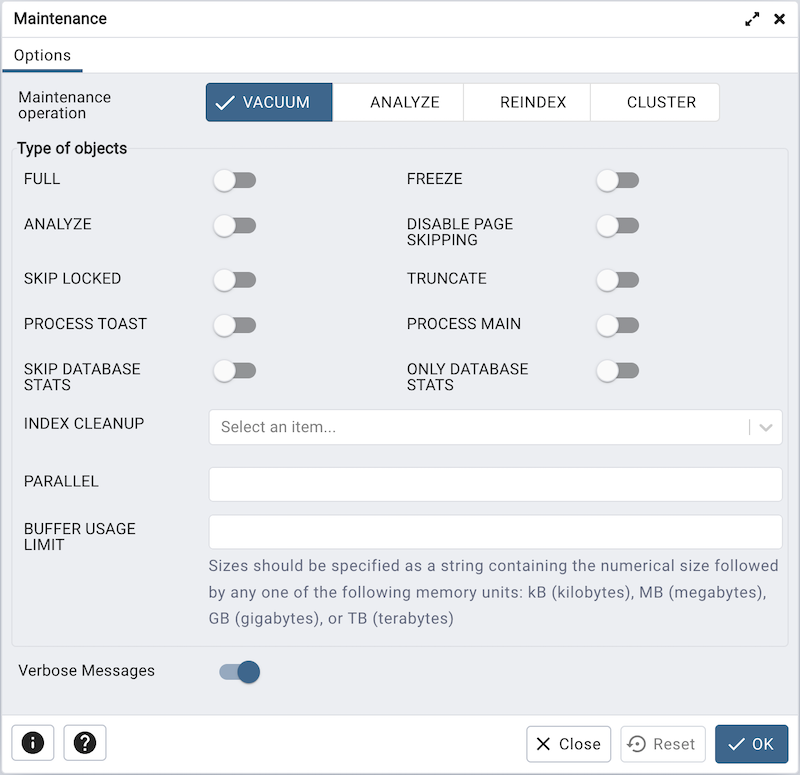
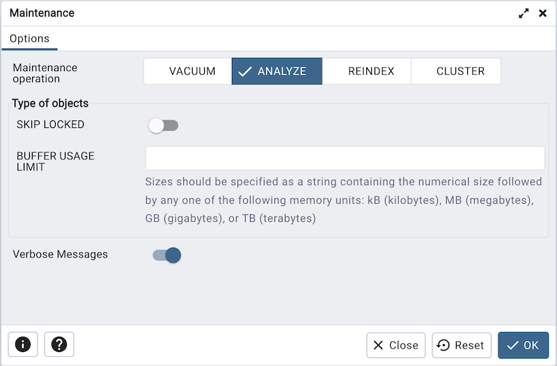
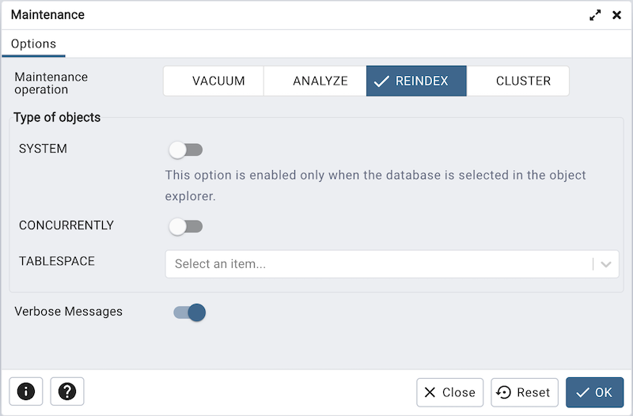
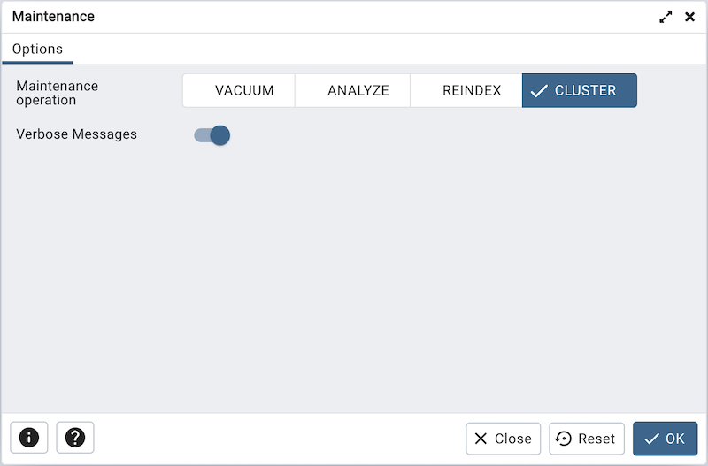

.. _maintenance_dialog:

***************************
`Maintenance Dialog`:index:
***************************

Use the *Maintenance* dialog to VACUUM, ANALYZE, REINDEX or CLUSTER a database
or selected database objects.

While this utility is useful for ad-hoc maintenance purposes, you are encouraged
to perform automatic VACUUM jobs on a regular schedule.

Select a button next to *Maintenance operation* to specify the type of
maintenance:

* Click *VACUUM* to scan the selected database or table to reclaim storage used
  by dead tuples.

   * Move the *FULL* switch to the *Yes* position to compact tables by writing
     a completely new version of the table file without dead space.

   * Move the *FREEZE* switch to the *Yes* position to freeze data in a table
     when it will have no further updates.

   * Move the *ANALYZE* switch to the *Yes* position to issue ANALYZE commands
     whenever the content of a table has changed sufficiently.

   * Move the *DISABLE PAGE SKIPPING* switch to the *Yes* position to disables
     all page-skipping behavior.

   * Move the *SKIP LOCKED* switch to the *Yes* position to specifies that
     VACUUM should not wait for any conflicting locks to be released when
     beginning work on a relation. This option is available from v12 onwards.

   * Move the *TRUNCATE* switch to the *Yes* position to specifies that VACUUM
     should attempt to truncate off any empty pages at the end of the table and
     allow the disk space for the truncated pages to be returned to the operating
     system. This option is available from v12 onwards.

   * Move the *PROCESS TOAST* switch to the *Yes* position to specifies that
     VACUUM should attempt to process the corresponding TOAST table for each
     relation, if one exists. This option is available from v14 onwards.

   * Move the *PROCESS MAIN* switch to the *Yes* position to specifies that
     VACUUM should attempt to process the main relation. This option is available
     from v16 onwards.

   * Move the *SKIP DATABASE STATS* switch to the *Yes* position to specifies
     that VACUUM should skip updating the database-wide statistics about oldest
     unfrozen XIDs. This option is available from v16 onwards.

   * Move the *ONLY DATABASE STATS* switch to the *Yes* position to specifies
     that VACUUM should do nothing except update the database-wide statistics
     about oldest unfrozen XIDs . This option is available from v16 onwards.

   * Use the *INDEX CLEANUP* field to force VACUUM to process indexes when there
     are more than zero dead tuples.

   * Use the *PARALLEL* field to specify index vacuum and index cleanup phases
     of VACUUM in parallel using integer background workers. This option is
     available from v13 onwards.

   * Use the *BUFFER USAGE LIMIT* field to specifies the Buffer Access Strategy
     ring buffer size for VACUUM. This size is used to calculate the number of
     shared buffers which will be reused as part of this strategy. This option
     is available from v16 onwards

* Click *ANALYZE* to update the stored statistics used by the query planner.
  This enables the query optimizer to select the fastest query plan for optimal
  performance.

   * Move the *SKIP LOCKED* switch to the *Yes* position to specifies that
     ANALYZE should not wait for any conflicting locks to be released when
     beginning work on a relation. This option is available from v12 onwards.

   * Use the *BUFFER USAGE LIMIT* field to specifies the Buffer Access Strategy
     ring buffer size for ANALYZE. This size is used to calculate the number of
     shared buffers which will be reused as part of this strategy. This option
     is available from v16 onwards

* Click *REINDEX* to rebuild any index in case it has degenerated due to the
  insertion of unusual data patterns. This happens, for example, if you insert
  rows with increasing index values, and delete low index values.

   * Move the *SYSTEM* switch to the *Yes* position to recreate all indexes
     on system catalogs within the current database. This option is enabled
     only when database object is selected.

   * Move the *CONCURRENTLY* switch to the *Yes* position to rebuild the index
     without taking any locks that prevent concurrent inserts, updates, or
     deletes on the table. This option is available from v12 onwards.

   * Use the *TABLESPACE* field to specifies that indexes will be rebuilt on
     a new tablespace. This option is available from v14 onwards.

* Click *CLUSTER* to instruct PostgreSQL to cluster the selected table.

To exclude status messages from the process output, move the *Verbose Messages*
switch to the *No* position; by default, status messages are included.

When you've completed the dialog, click *OK* to start the background process;
to exit the dialog without performing maintenance operations, click *Cancel*.

pgAdmin will run the maintenance process in background. You can view all the background
process with there running status and logs on the :ref:`Processes <processes>`
tab.
