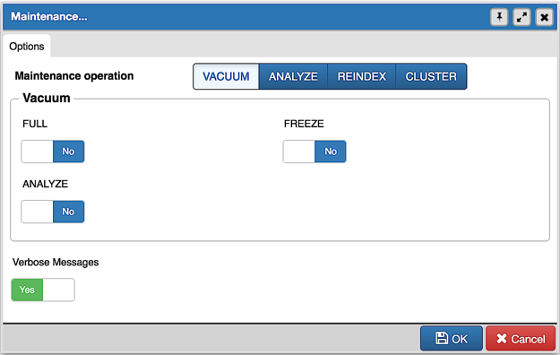

.. _maintenance_dialog:

***************************
`Maintenance Dialog`:index:
***************************

Use the *Maintenance* dialog to VACUUM, ANALYZE, REINDEX or CLUSTER a database
or selected database objects.

While this utility is useful for ad-hoc maintenance purposes, you are encouraged
to perform automatic VACUUM jobs on a regular schedule.

Select a button next to *Maintenance operation* to specify the type of
maintenance:

* Click *VACUUM* to scan the selected database or table to reclaim storage used
  by dead tuples.

   * Move the *FULL* switch to the *Yes* position to compact tables by writing
     a completely new version of the table file without dead space. The default
     is *No*.

   * Move the *FREEZE* switch to the *Yes* position to freeze data in a table
     when it will have no further updates. The default is *No*.

   * Move the *ANALYZE* switch to the *Yes* position to issue ANALYZE commands
     whenever the content of a table has changed sufficiently. The default is
     *No*.

* Click *ANALYZE* to update the stored statistics used by the query planner.
  This enables the query optimizer to select the fastest query plan for optimal
  performance.
* Click *REINDEX* to rebuild any index in case it has degenerated due to the
  insertion of unusual data patterns. This happens, for example, if you insert
  rows with increasing index values, and delete low index values.
* Click *CLUSTER* to instruct PostgreSQL to cluster the selected table.

To exclude status messages from the process output, move the *Verbose Messages*
switch to the *No* position; by default, status messages are included.

When you've completed the dialog, click *OK* to start the background process;
to exit the dialog without performing maintenance operations, click *Cancel*.

pgAdmin will run the maintenance process in background. You can view all the background
process with there running status and logs on the :ref:`Processes <processes>`
tab