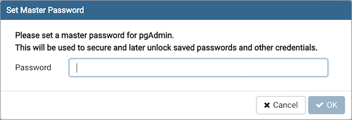
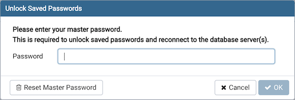
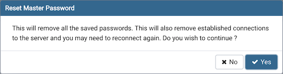

.. _master_password:

************************
`Master Password`:index:
************************

A master password is required to secure and later unlock the saved server passwords. This is applicable only for desktop mode users.

* You are prompted to enter the master password when you open the window for the first time after starting the application.
* Once you set the master password, all the existing saved passwords will be re-encrypted using the master password.
* The server passwords which are saved in the SQLite DB file are encrypted and decrypted using the master password.

* You can disable the master password by setting the configuration parameter *MASTER_PASSWORD_REQUIRED=False*
* Note that, if master password is disabled, then all the saved passwords will be removed.

.. warning:: If master password is disabled, then the saved passwords will be encrypted using a key
    which may not be as secure as master password. It is strongly recommended to use master password if you use "Save password" option.

* The master password is not stored anywhere on the physical storage. It is temporarily stored in the application memory and it does not get saved in case the application gets restarted.
* You are prompted to enter the master password when pgAdmin server is restarted.

* If you forget the master password, you can use the "Reset Master Password" button to reset the password.

.. warning:: Resetting the master password will also remove all the saved passwords and close all the existing established
  connections.
