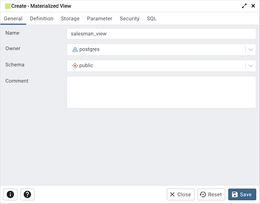
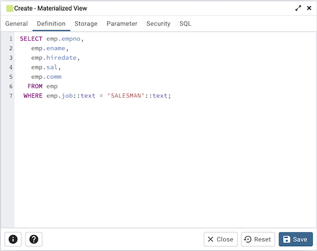
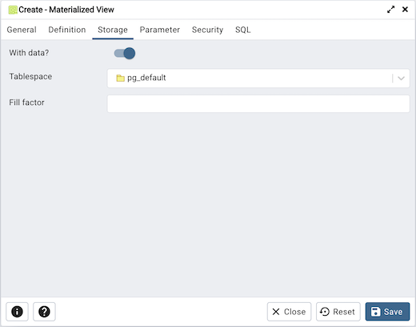
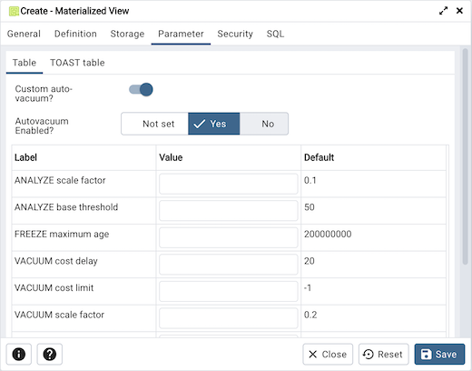
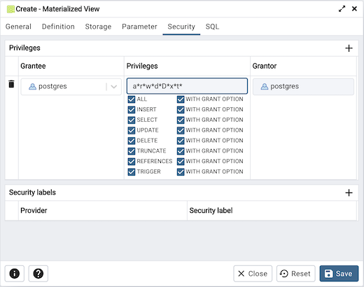
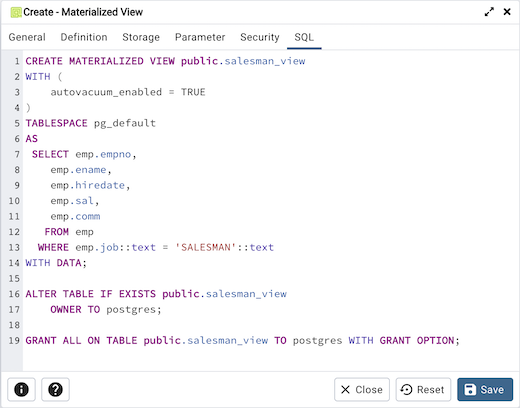

.. _materialized_view_dialog:

*********************************
`Materialized View Dialog`:index:
*********************************

Use the *Materialized View* dialog to define a materialized view. A materialized view is a stored or cached view that contains the result set of a query. Use the REFRESH MATERIALIZED VIEW command to update the content of a materialized view.

The *Materialized View* dialog organizes the development of a materialized_view through the following dialog tabs: *General*, *Definition*, *Storage*, *Parameter*, and *Security*. The *SQL* tab displays the SQL code generated by dialog selections.

Use the fields in the *General* tab to identify the materialized view:

* Use the *Name* field to add a descriptive name for the materialized view. The name will be displayed in the *pgAdmin* tree control.
* Use the drop-down listbox next to *Owner* to select the role that will own the materialized view.
* Select the name of the schema in which the materialized view will reside from the drop-down listbox in the *Schema* field.
* Store notes about the materialized view in the *Comment* field.

Click the *Definition* tab to continue.

Use the text editor field in the *Definition* tab to provide the query that will populate the materialized view.

Click the *Storage* tab to continue.

Use the fields in the *Storage* tab to maintain the materialized view:

* Move the *With Data* switch to the *Yes* position to specify the materialized view should be populated at creation time. If not, the materialized view cannot be queried until you invoke REFRESH MATERIALIZED VIEW.
* Use the drop-down listbox next to *Tablespace* to select a location for the materialized view.
* Use the *Fill Factor* field to specify a fill factor for the materialized view. The fill factor for a table is a percentage between 10 and 100. 100 (complete packing) is the default.

Click the *Parameter* tab to continue.

Use the tabs nested inside the *Parameter* tab to specify VACUUM and ANALYZE thresholds; use the *Table* tab and the *Toast Table* tab to customize values for the table and the associated toast table. To change the default values:

* Move the *Custom auto-vacuum?* switch to the *Yes* position to perform custom maintenance on the materialized view.
* Move the *Enabled?* switch to the *Yes* position to select values in the *Vacuum table*. Provide values for each row in the *Value* column.

Click the *Security* tab to continue.

Use the *Security* tab to assign privileges and define security labels.

Use the *Privileges* panel to assign privileges to a role. Click the *Add* icon (+) to set privileges for the materialized view:

* Select the name of the role from the drop-down listbox in the *Grantee* field.
* Click inside the *Privileges* field. Check the boxes to the left of one or more privileges to grant the selected privilege to the specified user.
* Select the name of the role from the drop-down listbox in the *Grantor* field. The default grantor is the owner of the database.

Click the *Add* icon (+) to assign additional privileges; to discard a privilege, click the trash icon to the left of the row and confirm deletion in the *Delete Row* popup.

Use the *Security Labels* panel to define security labels applied to the materialized view. Click the *Add* icon (+) to add each security label selection:

* Specify a security label provider in the *Provider* field. The named provider must be loaded and must consent to the proposed labeling operation.
* Specify a a security label in the *Security Label* field. The meaning of a given label is at the discretion of the label provider. PostgreSQL places no restrictions on whether or how a label provider must interpret security labels; it merely provides a mechanism for storing them.

Click the *Add* icon (+) to assign additional security labels; to discard a security label, click the trash icon to the left of the row and confirm deletion in the *Delete Row* popup.

Click the *SQL* tab to continue.

Your entries in the *Materialized View* dialog generate a SQL command (see an example below). Use the *SQL* tab for review; revisit or switch tabs to make any changes to the SQL command.

**Example**

The following is an example of the sql command generated by user selections in the *Materialized View* dialog:

The example shown creates a query named *new_hires* that stores the result of the displayed query in the *pg_default* tablespace.

* Click the *Info* button (i) to access online help. View context-sensitive help in the *Tabbed browser*, where a new tab displays the PostgreSQL core documentation.
* Click the *Save* button to save work.
* Click the *Cancel* button to exit without saving work.
* Click the *Reset* button to restore configuration parameters.
