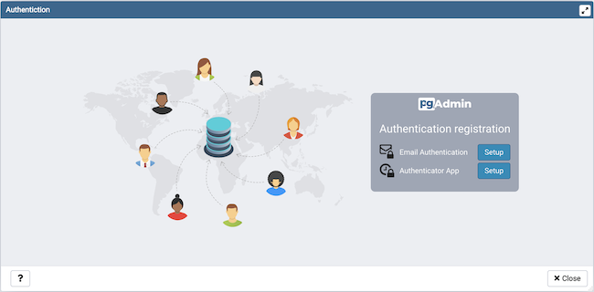

.. _mfa:

*************************************************
`Enabling two-factor authentication (2FA)`:index:
*************************************************

About two-factor authentication
===============================
Two-factor authentication (2FA) is an extra layer of security used when logging
into websites or apps. With 2FA, you have to log in with your username and
password and provide another form of authentication that only you know or have
access to.

Setup two-factor authentication
===============================
To set up 2FA for pgAdmin 4, you must configure the Two-factor Authentication
settings in *config_local.py* or *config_system.py* (see the
:ref:`config.py <config_py>` documentation) on the system where pgAdmin is
installed in Server mode. You can copy these settings from *config.py* file and
modify the values for the following parameters.

.. csv-table::
   :header: "**Parameter**", "**Description**"
   :class: longtable
   :widths: 35, 55

   "MFA_ENABLED","The default value for this parameter is True.
   To disable 2FA, set the value to *False*"
   "SUPPORTED_MFA_LIST", "Set the authentication methods to be supported "
   "MFA_EMAIL_SUBJECT", "<APP_NAME> - Verification Code e.g. pgAdmin 4 -
   Verification Code"
   "MFA_FORCE_REGISTRATION", "Force the user to configure the authentication
   method on login (if no authentication is already configured)."

*NOTE: You must set the 'Mail server settings' in config_local.py or
config_system.py in order to use 'email' as two-factor authentication method
(see the* :ref:`config.py <config_py>` *documentation).*

Configure two-factor authentication
===================================
To configure 2FA for a user, you must click on 'Two-factor Authentication'
in the `User` menu in right-top corner. It will list down all the supported
multi factor authentication methods. Click on 'Setup' of one of those methods
and follow the steps for each authentication method. You will see the `Delete`
button for the authentication method, which is already been configured.
Clicking on `Delete` button will deregister the authentication method for the
current user.

You can also force users to configure the two-factor
authentication methods on login by setting *MFA_FORCE_REGISTRATION* parameter
to *True*.
