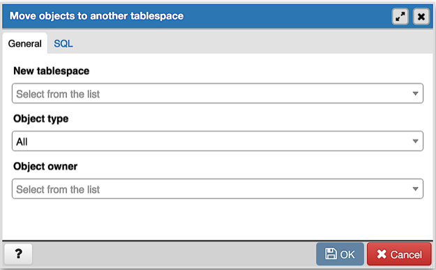
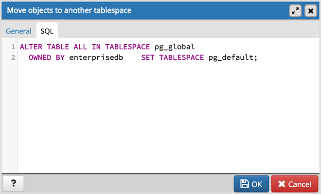

.. _move_objects:

****************************
`Move Objects Dialog`:index:
****************************

Use the *Move Objects* dialog to to move database objects from one tablespace to
another tablespace.

The *Move Objects* dialog organizes the movement of database objects with the
*General* tab; the *SQL* tab displays the SQL code generated by dialog
selections.

Use the fields in the *General* tab to identify the items that will be moved and
the tablespace to which they will be moved:

* Use the *New tablespace* drop-down listbox to select a pre-existing
  tablespace to which the object will be moved. (To create a tablespace, use the
  *Tablespace* dialog; access the dialog by right clicking *Tablespaces* in the
  *pgAdmin* tree control and selecting *Create Tablespace...* from the
  context-menu.)
* Use the *Object type* drop-down listbox to select from the following:

   * Select *All* to move all tables, indexes, and materialized views from the
     current tablespace (currently selected in the *pgAdmin* tree control) to
     the new tablespace.
   * Select *Tables* to move tables from the current tablespace to the new
     tablespace.
   * Select *Indexes* to move indexes from the current tablespace to the new
     tablespace.
   * Select *Materialized views* to move materialized views from the current
     tablespace to the new tablespace.

* Use the *Object owner* drop-down listbox to select the role that owns the
  objects selected in the *Object type* field. This field is optional.

Click the *SQL* tab to continue.

Your entries in the *Move Objects* dialog generate a SQL command (see an example
below). Use the *SQL* tab for review; revisit the *General* tab to modify the
SQL command.

Example
*******

The following is an example of the sql command generated by user selections in
the *Move Objects* dialog:

The example shown demonstrates moving materialized views owned by Alice from
tablespace *tbspace_01* to *tbspace_02*.

* Click the *Help* button (?) to access online help.
* Click the *OK* button to save work.
* Click the *Cancel* button to exit without saving work.

