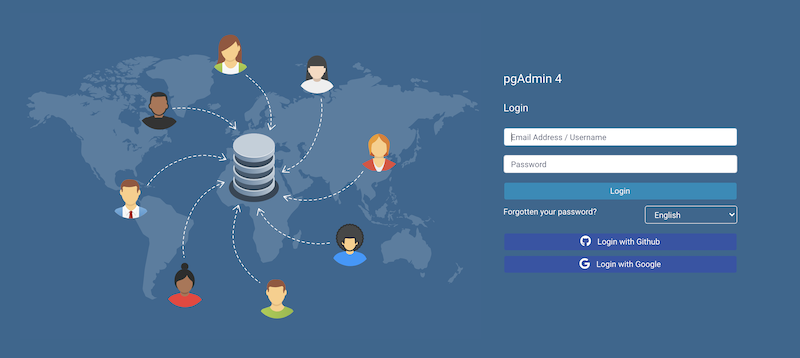

.. _oauth2:

*****************************************
`Enabling OAUTH2 Authentication`:index:
*****************************************

To enable OAUTH2 authentication for pgAdmin, you must configure the OAUTH2
settings in the *config_local.py* or *config_system.py* file (see the
:ref:`config.py <config_py>` documentation) on the system where pgAdmin is
installed in Server mode. You can copy these settings from *config.py* file
and modify the values for the following parameters:

.. csv-table::
   :header: "**Parameter**", "**Description**"
   :class: longtable
   :widths: 35, 55

   "AUTHENTICATION_SOURCES", "The default value for this parameter is *internal*.
   To enable OAUTH2 authentication, you must include *oauth2* in the list of values
   for this parameter. you can modify the value as follows:

   * [‘oauth2’, ‘internal’]: pgAdmin will display an additional button for authenticating with oauth2"
    "OAUTH2_NAME", "The name of the Oauth2 provider, ex: Google, Github"
    "OAUTH2_DISPLAY_NAME", "Oauth2 display name in pgAdmin"
    "OAUTH2_CLIENT_ID", "Oauth2 Client ID"
    "OAUTH2_CLIENT_SECRET", "Oauth2 Client Secret"
    "OAUTH2_TOKEN_URL", "Oauth2 Access Token endpoint"
    "OAUTH2_AUTHORIZATION_URL", "Endpoint for user authorization"
    "OAUTH2_SERVER_METADATA_URL", "Server metadata url for your OAuth2 provider"
    "OAUTH2_API_BASE_URL", "Oauth2 base URL endpoint to make requests simple, ex: *https://api.github.com/*"
    "OAUTH2_USERINFO_ENDPOINT", "User Endpoint, ex: *user* (for github) and *useinfo* (for google)"
    "OAUTH2_SCOPE", "Oauth scope, ex: 'openid email profile'. Note that an 'email' claim is required in the resulting profile."
    "OAUTH2_ICON", "The Font-awesome icon to be placed on the oauth2 button,  ex: fa-github"
    "OAUTH2_BUTTON_COLOR", "Oauth2 button color"
    "OAUTH2_USERNAME_CLAIM", "The claim which is used for the username. If the value is empty
    the email is used as username, but if a value is provided, the claim has to exist. Ex: *oid* (for AzureAD)"
    "OAUTH2_AUTO_CREATE_USER", "Set the value to *True* if you want to automatically
    create a pgAdmin user corresponding to a successfully authenticated Oauth2 user.
    Please note that password is not stored in the pgAdmin database."

Redirect URL
============

The redirect url to configure Oauth2 server is *http://<pgAdmin Server URL>/oauth2/authorize*

Master Password
===============

In the multi user mode, pgAdmin uses user's login password to encrypt/decrypt the PostgreSQL server password.
In the Oauth2 authentication, the pgAdmin does not store the user's password, so we need an encryption key to store
the PostgreSQL server password.
To accomplish this, set the configuration parameter MASTER_PASSWORD to *True*, so upon setting the master password,
it will be used as an encryption key while storing the password. If it is False, the server password can not be stored.

Login Page
============

After configuration, on restart, you can see the login page with the Oauth2 login button(s).

