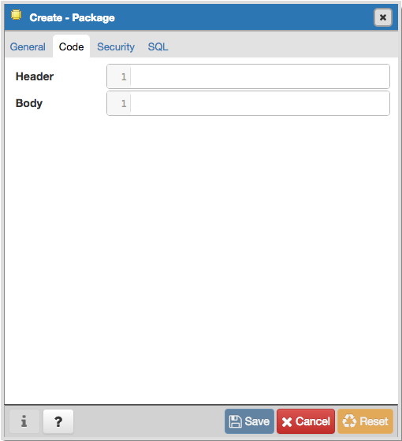
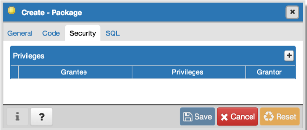
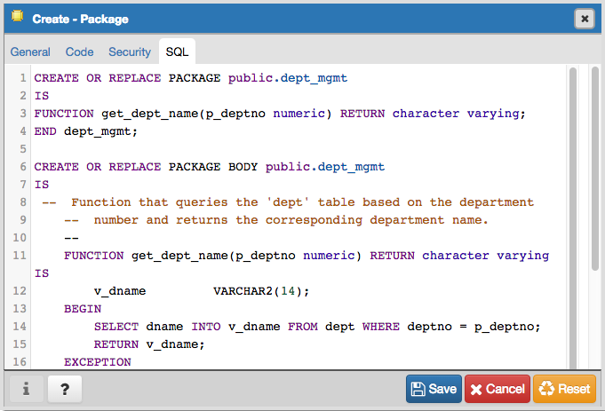

.. _package_dialog:

***********************
`Package Dialog`:index:
***********************

Use the *Package* dialog to create a (user-defined) package specification.

The *Package* dialog organizes the management of a package through the following dialog tabs: *General*, *Code*, and *Security*. The *SQL* tab displays the SQL code generated by dialog selections.

.. image:: images/package_general.png
    :alt: Package dialog general tab

Use the fields in the *General* tab to identify the package:

* Use the *Name* field to add a descriptive name for the package. The name of a new package must not match any existing package in the same schema.
* Select the schema in which the package will reside from the drop-down listbox in the *Schema* field.
* Store notes about the package in the *Comment* field.

Click the *Code* tab to continue.

Use the fields in the *Code* tab to specify the package contents and to provide implementation details:

* Use the *Header* field to define the public interface for the package.
* Use the *Body* field to provide the code that implements each package object.

Click the *Security* tab to continue.

Use the fields in the *Security* tab to to assign EXECUTE privileges for the package to a role. Click the *Add* icon (+) to set privileges for the package:

* Select the name of the role from the drop-down listbox in the *Grantee* field.
* Click inside the *Privileges* field. Check the boxes to the left of a privilege to grant the selected privilege to the specified user.
* Select the name of a role from the drop-down listbox in the *Grantor* field. The default grantor is the owner of the package.

Click the *Add* icon (+) to assign additional privileges; to discard a privilege, click the trash icon to the left of the row, and confirm the deletion in the *Delete Row* popup.

Click the *SQL* tab to continue.

Your entries in the *Package* dialog generate a SQL command that creates or modifies a package definition:

The example shown demonstrates creating a package named *empinfo* that includes one function and one procedure.

* Click the *Save* button to save work.
* Click the *Cancel* button to exit without saving work.
* Click the *Reset* button to delete any changes to the dialog.

