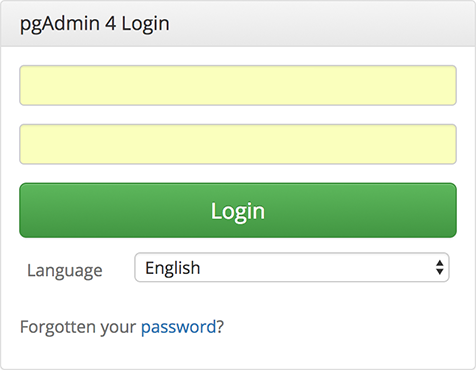
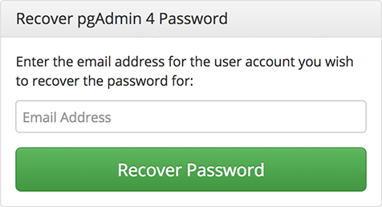

.. _pgadmin_login:

*****************************
`pgAdmin Login Dialog`:index:
*****************************

Use the *pgAdmin Login* dialog to log in to pgAdmin:

Use the fields in the *pgAdmin Login* dialog to authenticate your connection:

#. Provide the email address associated with your account in the *Email Address* field.
#. Provide your password in the *Password* field.
#. Click the *Login* button to securely log into pgAdmin.

**Recovering a Lost Password**

If you cannot supply your password, click the *Forgotten your password?* button to launch a password recovery utility.

#. Provide the email address associated with your account in the *Email Address* field.
#. Click the *Recover Password* button to initiate recovery. An email, with directions on how to reset a password, will be sent to the address entered in the *Email Address* field.

If you have forgotten the email associated with your account, please contact your administrator.

