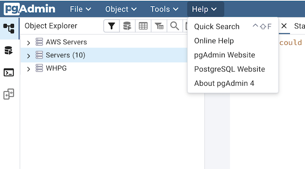

.. _pgadmin_menu_bar:

*************************
`pgAdmin Menu Bar`:index:
*************************

The pgAdmin menu bar provides drop-down menus for access to options, commands, and utilities. The menu bar displays the following selections: *File*, *Object*, Tools*, and *Help*. Selections may be grayed out which indicates they are disabled for the object currently selected in the *pgAdmin* tree control.

**The File Menu**

.. image:: /images/file_menu.png
    :alt: pgAdmin file menu bar

Use the *File* menu to access the following options:

+-------------------------+---------------------------------------------------------------------------------------------------------+
| Option                  | Action                                                                                                  |
+=========================+=========================================================================================================+
| *Preferences*           | Click to open the :ref:`Preferences <preferences>` dialog to to customize your pgAdmin settings.        |
+-------------------------+---------------------------------------------------------------------------------------------------------+
| *Reset Layout*          | If you have modified the workspace, click to restore the default layout.                                |
+-------------------------+---------------------------------------------------------------------------------------------------------+

**The Object Menu**

.. image:: /images/object_menu.png
    :alt: pgAdmin object menu bar

The *Object* menu is context-sensitive. Use the *Object* menu to access the following options (in alphabetical order):

+-----------------------------+--------------------------------------------------------------------------------------------------------------------------+
| Option                      | Action                                                                                                                   |
+=============================+==========================================================================================================================+
| *Change Password...*        | Click to open the :ref:`Change Password... <change_password_dialog>` dialog to change your password.                     |
+-----------------------------+--------------------------------------------------------------------------------------------------------------------------+
| *Clear Saved Password*      | If you have saved the database server password, click to clear the saved password.                                       |
|                             | Enable only when password is already saved.                                                                              |
+-----------------------------+--------------------------------------------------------------------------------------------------------------------------+
| *Clear SSH Tunnel Password* | If you have saved the ssh tunnel password, click to clear the saved password.                                            |
|                             | Enable only when password is already saved.                                                                              |
+-----------------------------+--------------------------------------------------------------------------------------------------------------------------+
| *Connect Server...*         | Click to open the :ref:`Connect to Server <connect_to_server>` dialog to establish a connection with a server.           |
+-----------------------------+--------------------------------------------------------------------------------------------------------------------------+
| *Create*                    | Click *Create* to access a context menu that provides context-sensitive selections.                                      |
|                             | Your selection opens a *Create* dialog for creating a new object.                                                        |
+-----------------------------+--------------------------------------------------------------------------------------------------------------------------+
| *Delete/Drop*               | Click to delete the currently selected object from the server.                                                           |
+-----------------------------+--------------------------------------------------------------------------------------------------------------------------+
| *Disconnect Server...*      | Click to refresh the currently selected object.                                                                          |
+-----------------------------+--------------------------------------------------------------------------------------------------------------------------+
| *Drop Cascade*              | Click to delete the currently selected object and all dependent objects from the server.                                 |
+-----------------------------+--------------------------------------------------------------------------------------------------------------------------+
| *Properties...*             | Click to review or modify the currently selected object's properties.                                                    |
+-----------------------------+--------------------------------------------------------------------------------------------------------------------------+
| *Refresh...*                | Click to refresh the currently selected object.                                                                          |
+-----------------------------+--------------------------------------------------------------------------------------------------------------------------+
| *Scripts*                   | Click to open the :ref:`Query tool <query_tool>` to edit or view the selected script from the flyout menu.               |
+-----------------------------+--------------------------------------------------------------------------------------------------------------------------+
| *Trigger(s)*                | Click to *Disable* or *Enable* trigger(s) for the currently selected table. Options are displayed on the flyout menu.    |
+-----------------------------+--------------------------------------------------------------------------------------------------------------------------+
| *Truncate*                  | Click to remove all rows from a table (*Truncate*) or to remove all rows from a table and its child tables               |
|                             | (*Truncate Cascade*). Options are displayed on the flyout menu.                                                          |
+-----------------------------+--------------------------------------------------------------------------------------------------------------------------+
| *View Data*                 | Click to access a context menu that provides several options for viewing data (see below).                               |
+-----------------------------+--------------------------------------------------------------------------------------------------------------------------+

**The Tools Menu**

.. image:: /images/tool_menu.png
    :alt: pgAdmin tools menu bar

Use the *Tools* menu to access the following options (in alphabetical order):

+---------------------------+-------------------------------------------------------------------------------------------------------------------------------------------+
| Option                    | Action                                                                                                                                    |
+===========================+===========================================================================================================================================+
| *Add named restore point* | Click to open the :ref:`Add named restore point... <add_restore_point_dialog>` dialog to take a point-in-time snapshot of the current     |
|                           | server state.                                                                                                                             |
+---------------------------+-------------------------------------------------------------------------------------------------------------------------------------------+
| *Backup...*               | Click to open the :ref:`Backup... <backup_dialog>` dialog to backup database objects.                                                     |
+---------------------------+-------------------------------------------------------------------------------------------------------------------------------------------+
| *Backup Globals...*       | Click to open the :ref:`Backup Globals... <backup_globals_dialog>` dialog to backup cluster objects.                                      |
+---------------------------+-------------------------------------------------------------------------------------------------------------------------------------------+
| *Backup Server...*        | Click to open the :ref:`Backup Server... <backup_server_dialog>` dialog to backup a server.                                               |
+---------------------------+-------------------------------------------------------------------------------------------------------------------------------------------+
| *Grant Wizard...*         | Click to access the :ref:`Grant Wizard <grant_wizard>` tool.                                                                              |
+---------------------------+-------------------------------------------------------------------------------------------------------------------------------------------+
| *Import/Export...*        | Click to open the :ref:`Import/Export data... <import_export_data>` dialog to import or export data from a table.                         |
+---------------------------+-------------------------------------------------------------------------------------------------------------------------------------------+
| *Maintenance...*          | Click to open the :ref:`Maintenance... <maintenance_dialog>` dialog to VACUUM, ANALYZE, REINDEX, or CLUSTER.                              |
+---------------------------+-------------------------------------------------------------------------------------------------------------------------------------------+
| *Pause replay of WAL*     | Click to pause the replay of the WAL log.                                                                                                 |
+---------------------------+-------------------------------------------------------------------------------------------------------------------------------------------+
| *Query tool*              | Click to open the :ref:`Query tool <query_tool>` for the currently selected object.                                                       |
+---------------------------+-------------------------------------------------------------------------------------------------------------------------------------------+
| *Reload Configuration...* | Click to update configuration files without restarting the server.                                                                        |
+---------------------------+-------------------------------------------------------------------------------------------------------------------------------------------+
| *Restore...*              | Click to access the :ref:`Restore <restore_dialog>` dialog to restore database files from a backup.                                       |
+---------------------------+-------------------------------------------------------------------------------------------------------------------------------------------+
| *Resume replay of WAL*    | Click to resume the replay of the WAL log.                                                                                                |
+---------------------------+-------------------------------------------------------------------------------------------------------------------------------------------+

**The Help Menu**

Use the options on the *Help* menu to access online help documents, or to review information about the pgAdmin installation (in alphabetical order):

+----------------------+-----------------------------------------------------------------------------------------------------------------------------------------+
| Option               | Action                                                                                                                                  |
+======================+=========================================================================================================================================+
| *About pgAdmin 4*    | Click to open a window where you will find information about pgAdmin; this includes the current version and the current user.           |
+----------------------+-----------------------------------------------------------------------------------------------------------------------------------------+
| *Online Help*        | Click to open documentation support for using pgAdmin utilities, tools and dialogs.                                                     |
|                      | Navigate (in the newly opened tab?) help documents in the left browser pane or use the search bar to specify a topic.                   |
+----------------------+-----------------------------------------------------------------------------------------------------------------------------------------+
| *pgAdmin Website*    | Click to open the *pgAdmin.org* website in a browser window.                                                                            |
+----------------------+-----------------------------------------------------------------------------------------------------------------------------------------+
| *PostgreSQL Website* | Click to access the PostgreSQL core documentation hosted at the PostgreSQL site. The site also offers guides, tutorials, and resources. |
+----------------------+-----------------------------------------------------------------------------------------------------------------------------------------+

