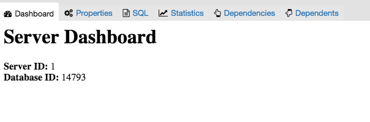
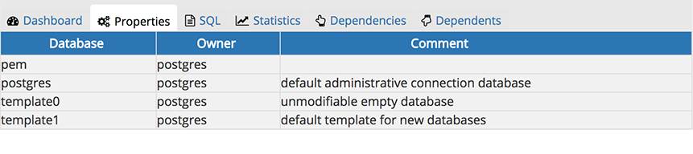
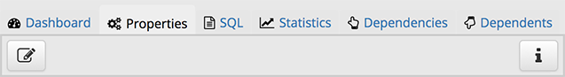
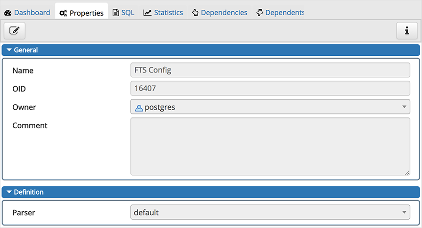
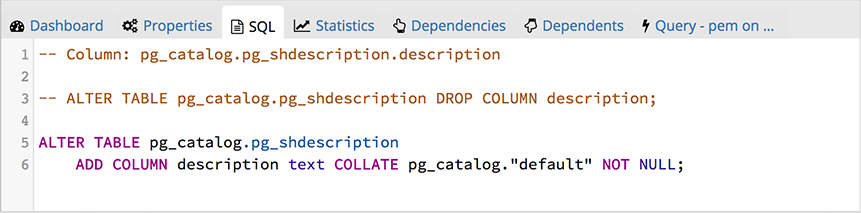
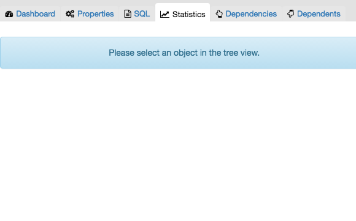
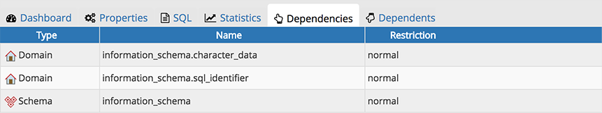
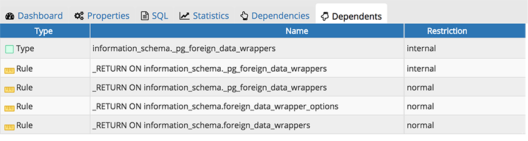
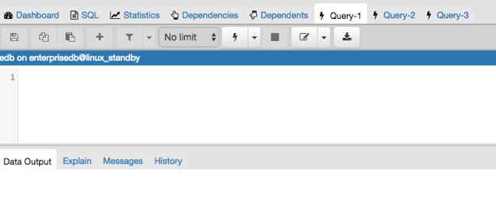

.. _pgadmin_tabbed_browser:

*******************************
`pgAdmin Tabbed Browser`:index:
*******************************

The right pane of the *pgAdmin* window features a collection of tabs that display information about the object currently selected in the *pgAdmin* tree control in the left window.  Select a tab to access information about the highlighted object in the tree control.

The graphs on the *Dashboard* tab provides an active analysis of the usage statistics for the selected server or database:

* The *Server sessions* or *Database sessions* graph displays the interactions with the server or database.
* The *Transactions per second* graph displays the commits, rollbacks, and total transactions per second that are taking place on the server or database.
* The *Tuples in* graph displays the number of tuples inserted, updated, and deleted on the server or database.
* The *Tuples out* graph displays the number of tuples fetched and returned from the server or database.
* The *Block I/O* graph displays the number of blocks read from the filesystem or fetched from the buffer cache (but not the operating system's file system cache) for the server or database.

The *Server activity* panel displays information about sessions, locks, prepared transactions, and server configuration (if applicable). The information is presented in context-sensitive tables.  Use controls located above the table to:

* Click the *Refresh* button to update the information displayed in each table.
* Enter a value in the *Search* box to restrict the table content to one or more sessions that satisfy the search criteria.  For example, you can enter a process ID to locate a specific session, or a session state (such as *idle*) to locate all of the sessions that are in an idle state.

You can use icons in the *Sessions* table to review or control the state of a session:

* Use the *Terminate* icon (located in the first column) to stop a session and remove the session from the table.  Before the server terminates the session, you will be prompted to confirm your selection.
* Use the *Cancel* icon (located in the second column) to terminate an active query without closing the session.  Before canceling the query, the server will prompt you to confirm your selection.  When you cancel a query, the value displayed in the *State* column of the table will be updated from *Active* to *Idle*.  The session will remain in the table until the session is terminated.
* Use the *Details* icon (located in the third column) to open the *Details* tab; the tab displays information about the selected session.

The *Properties* tab displays information about the object selected. Click the *Edit* icon in the toolbar under the browser tabs to launch the *Properties* dialog for the selected object.

To preserve any changes to the *Properties* dialog, click the *Save* icon; your modifications will be displayed in the updated *Properties* tab.

Details about the object highlighted in the tree control are displayed in one or more collapsible panels. You can use the arrow to the left of each panel label to open or close a panel.

The *SQL* tab displays the SQL script that created the highlighted object, and when applicable, a (commented out) SQL statement that will *DROP* the selected object. You can copy the SQL statements to the editor of your choice using cut and paste shortcuts.

The *Statistics* tab displays the statistics gathered for each object on the tree control; the statistics displayed in the table vary by the type of object that is selected. Click a column heading to sort the table by the data displayed in the column; click again to reverse the sort order.  The following table lists some of the statistics that are available:

+----------------------------+------------------------------------------------------------------------------------------------------------+
| Panel                      | Description                                                                                                |
+============================+============================================================================================================+
| *PID*                      | The process ID associated with the row.                                                                    |
+----------------------------+------------------------------------------------------------------------------------------------------------+
| *User*                     | The name of the user that owns the object.                                                                 |
+----------------------------+------------------------------------------------------------------------------------------------------------+
| *Database*                 | displays the database name.                                                                                |
+----------------------------+------------------------------------------------------------------------------------------------------------+
| *Backends*                 | displays the number of current connections to the database.                                                |
+----------------------------+------------------------------------------------------------------------------------------------------------+
| *Backend start*            | The start time of the backend process.                                                                     |
+----------------------------+------------------------------------------------------------------------------------------------------------+
| *Xact Committed*           | displays the number of transactions committed to the database within the last week.                        |
+----------------------------+------------------------------------------------------------------------------------------------------------+
| *Xact Rolled Back*         | displays the number of transactions rolled back within the last week.                                      |
+----------------------------+------------------------------------------------------------------------------------------------------------+
| *Blocks Read*              | displays the number of blocks read from memory (in megabytes) within the last week.                        |
+----------------------------+------------------------------------------------------------------------------------------------------------+
| *Blocks Hit*               | displays the number of blocks hit in the cache (in megabytes) within the last week.                        |
+----------------------------+------------------------------------------------------------------------------------------------------------+
| *Tuples Returned*          | displays the number of tuples returned within the last week.                                               |
+----------------------------+------------------------------------------------------------------------------------------------------------+
| *Tuples Fetched*           | displays the number of tuples fetched within the last week.                                                |
+----------------------------+------------------------------------------------------------------------------------------------------------+
| *Tuples Inserted*          | displays the number of tuples inserted into the database within the last week.                             |
+----------------------------+------------------------------------------------------------------------------------------------------------+
| *Tuples Updated*           | displays the number of tuples updated in the database within the last week.                                |
+----------------------------+------------------------------------------------------------------------------------------------------------+
| *Tuples Deleted*           | displays the number of tuples deleted from the database within the last week.                              |
+----------------------------+------------------------------------------------------------------------------------------------------------+
| *Last statistics reset*    | displays the time of the last statistics reset for the database.                                           |
+----------------------------+------------------------------------------------------------------------------------------------------------+
| *Tablespace conflicts*     | displays the number of queries canceled because of recovery conflict with dropped tablespaces in database. |
+----------------------------+------------------------------------------------------------------------------------------------------------+
| *Lock conflicts*           | displays the number of queries canceled because of recovery conflict with locks in database.               |
+----------------------------+------------------------------------------------------------------------------------------------------------+
| *Snapshot conflicts*       | displays the number of queries canceled because of recovery conflict with old snapshots in database.       |
+----------------------------+------------------------------------------------------------------------------------------------------------+
| *Bufferpin conflicts*      | displays the number of queries canceled because of recovery conflict with pinned buffers in database.      |
+----------------------------+------------------------------------------------------------------------------------------------------------+
| *Temporary files*          | displays the total number of temporary files, including those used by the statistics collector.            |
+----------------------------+------------------------------------------------------------------------------------------------------------+
| *Size of temporary files*  | displays the size of the temporary files.                                                                  |
+----------------------------+------------------------------------------------------------------------------------------------------------+
| *Deadlocks*                | displays the number of queries canceled because of a recovery conflict with deadlocks in database.         |
+----------------------------+------------------------------------------------------------------------------------------------------------+
| *Block read time*          | displays the number of milliseconds required to read the blocks read.                                      |
+----------------------------+------------------------------------------------------------------------------------------------------------+
| *Block write time*         | displays the number of milliseconds required to write the blocks read.                                     |
+----------------------------+------------------------------------------------------------------------------------------------------------+
| *Size*                     | displays the size (in megabytes) of the selected database.                                                 |
+----------------------------+------------------------------------------------------------------------------------------------------------+

The *Dependencies* tab displays the objects on which the currently selected object depends. If a dependency is dropped, the object currently selected in the pgAdmin tree control will be affected. To ensure the integrity of the entire database structure, the database server makes sure that you do not accidentally drop objects that other objects depend on; you must use the DROP CASCADE command to remove an object with a dependency.

The *Dependencies* table displays the following information:

* The *Type* field specifies the parent object type.
* The *Name* field specifies the identifying name of the parent object.
* The *Restriction* field describes the dependency relationship between the currently selected object and the parent.
   * If the field is *auto*, the selected object can be dropped separately from the parent object, and will be dropped if the parent object is dropped.
   * If the field is *internal*, the selected object was created during the creation of the parent object, and will be dropped if the parent object is dropped.
   * If the field is *normal*, the selected object can be dropped without dropping the parent object.
   * If the field is *blank*, the selected object is required by the system, and cannot be dropped.

The *Dependents* tab displays a table of objects that depend on the object currently selected in the *pgAdmin* browser. A dependent object can be dropped without affecting the object currently selected in the *pgAdmin* tree control.

* The *Type* field specifies the dependent object type.
* The *Name* field specifies the identifying name for the dependent object.
* The *Database* field specifies the database in which the object resides.

Additional tabs open when you access the extended functionality offered by pgAdmin tools (such as the Query tool, Debugger, or SQL editor). Use the close icon (X) located in the upper-right corner of each tab to close the tab when you are finished using the tool. Like permanent tabs, these tabs may be repositioned in the pgAdmin client window.

By default, each time you open a tool, pgAdmin will open a new browser tab. You can control this behavior by modifying the *Display* node of the *Preferences* dialog for each tool. To open the *Preferences* dialog, select *Preferences* from the *File* menu.