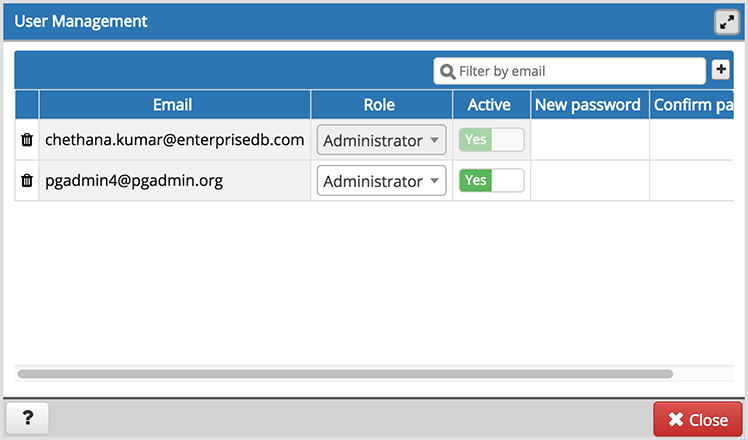
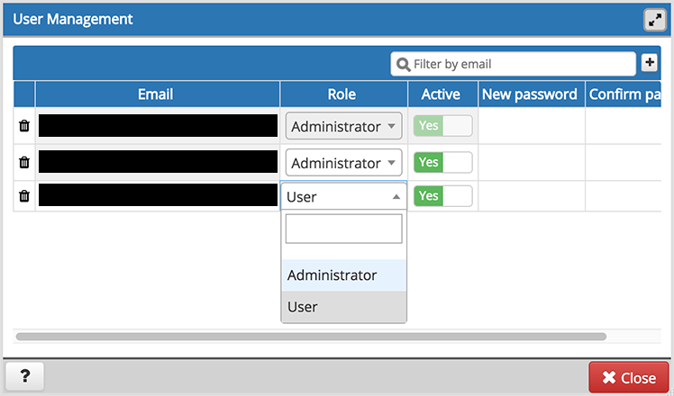

.. _pgadmin_user:

*******************************
`User Management Dialog`:index:
*******************************

When invoking pgAdmin in desktop mode, a password is randomly generated, and then ignored.  If you install pgAdmin in server mode, you will be prompted for an administrator email and password for the pgAdmin client.

When you authenticate with pgAdmin, the server definitions associated with that login role are made available in the tree control.  An administrative user can use the *User Management* dialog to

* add or delete pgAdmin roles
* assign privileges
* manage the password associated with a role

Use the *Filter by email* search field to find a user; enter a user's email address to find a user.  If the user exists, the *User Management* table will display the user's current information.

To add a user, click *Add* to add new role.

Provide information about the new pgAdmin role in the row:

* Click in the *Email* field, and provide an email address for the user; this address will be used to recover the password associated with the role should the password be lost.
* Use the drop-down listbox next to *Role* to select whether a user is an *Administrator* or a *User*.

   * Select *Administrator* if the user will have administrative privileges within the pgAdmin client.
   * Select *User* to create a non-administrative user account.

* Move the *Active* switch to the *No* position if the account is not currently active; the default is *Yes*. Use this switch to disable account activity without deleting an account.
* Use the *New password* field to provide the password associated with the user specified in the *Email* field.
* Re-enter the password in the *Confirm password* field.

To discard a user, and revoke access to pgAdmin, click the trash icon to the left of the row and confirm deletion in the *Delete user?* dialog.

Users with the *Administrator* role are able to add, edit and remove pgAdmin users, but otherwise have the same capabilities as those with the *User* role.

* Click the *Help* button (?) to access online help.
* Click the *Close* button to save work. You will be prompted to return to the dialog if your selections cannot be saved.

