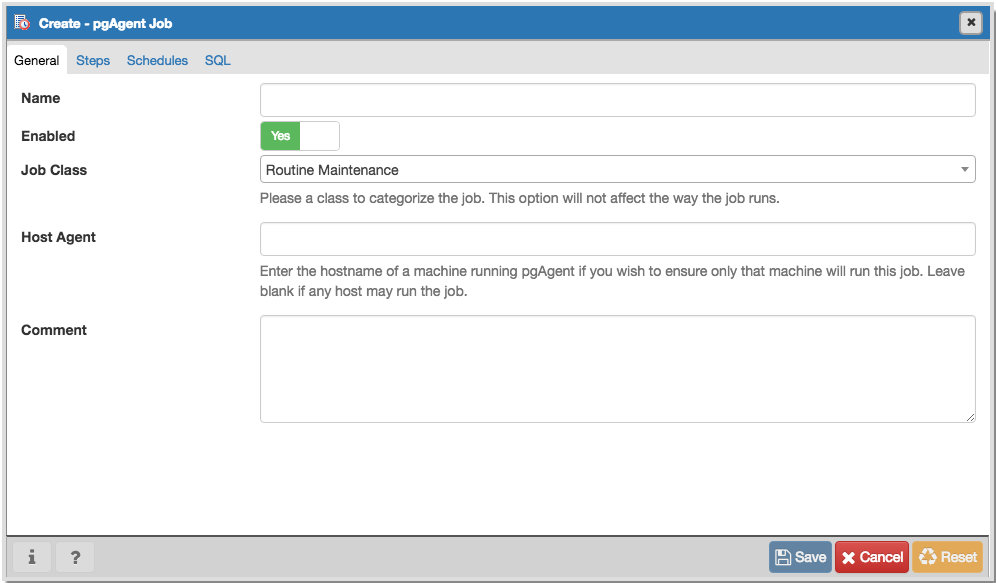
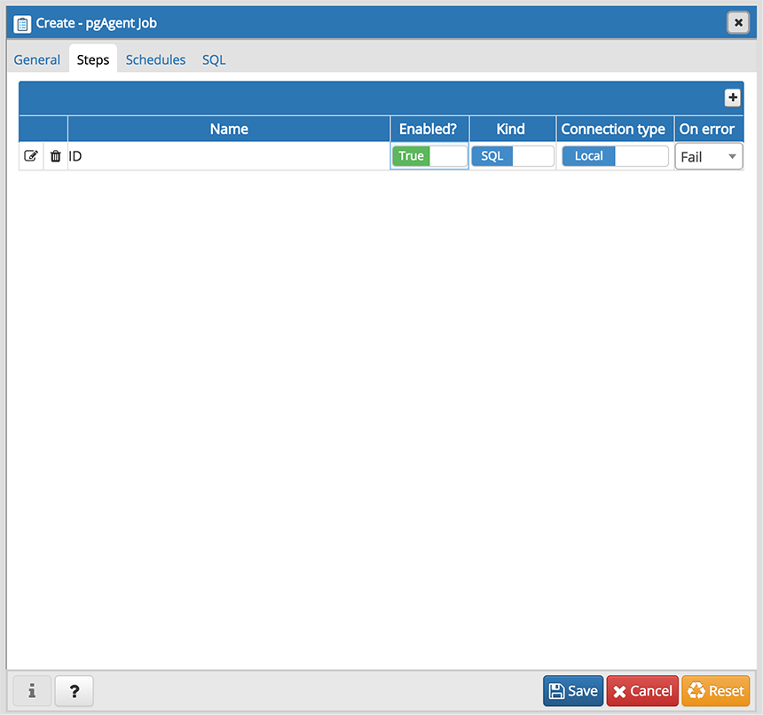
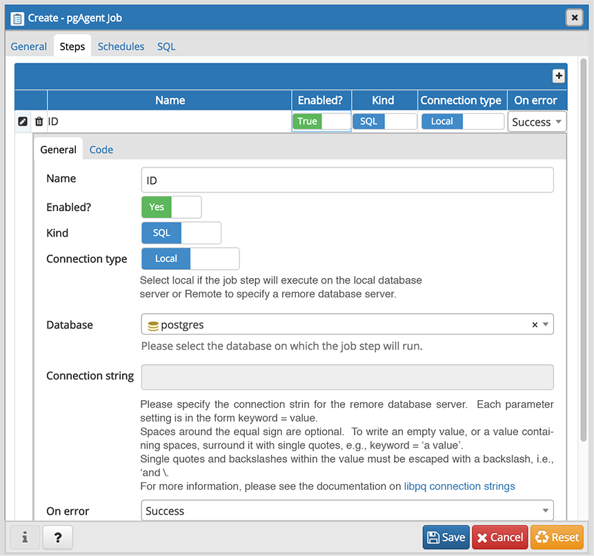
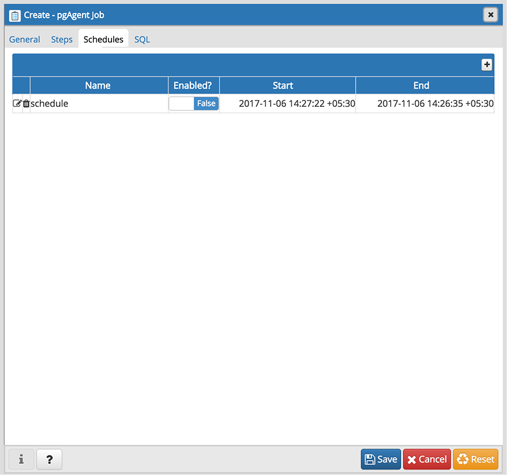
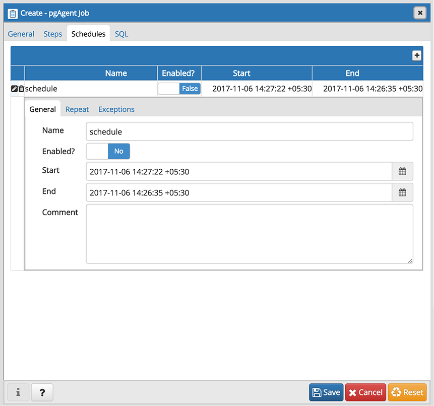
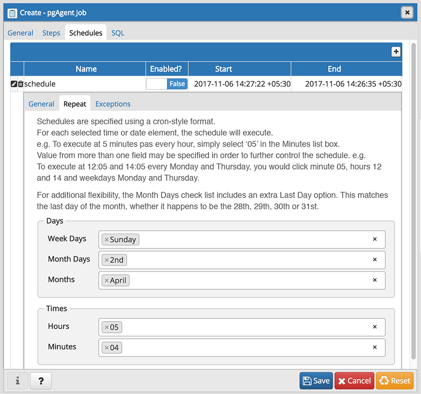
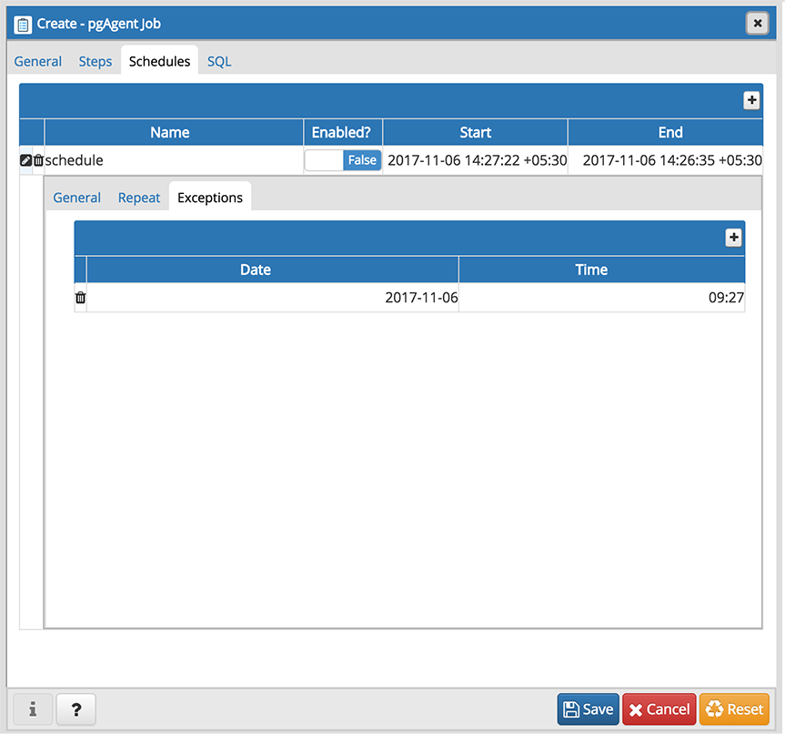
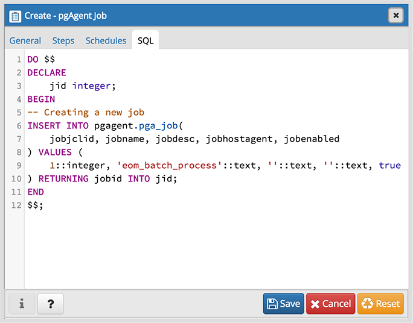
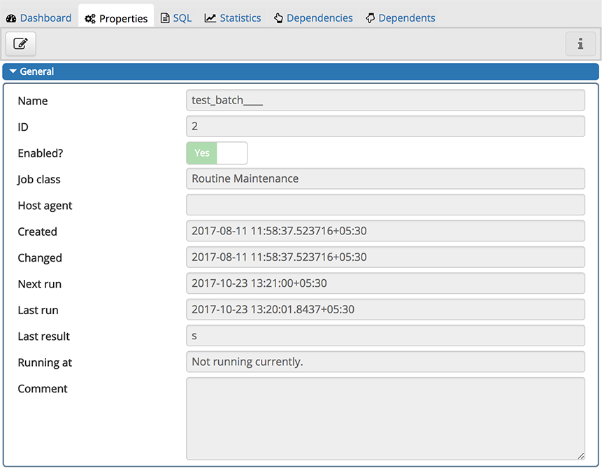

.. _pgagent_jobs:

*******************************
`Creating a pgAgent Job`:index:
*******************************

pgAgent is a scheduling agent that runs and manages jobs; each job consists of steps and schedules.

To create or manage a job, use the pgAdmin tree control to browse to the server on which the pgAgent database objects were created. The tree control will display a *pgAgent Jobs* node, under which currently defined jobs are displayed.  To add a new job, right click on the *pgAgent Jobs* node, and select *Create pgAgent Job...* from the context menu.

When the pgAgent dialog opens, use the tabs on the *pgAgent Job* dialog to define the steps and schedule that make up a pgAgent job.

Use the fields on the *General* tab to provide general information about a job:

 * Provide a name for the job in the *Name* field.
 * Move the *Enabled* switch to the *Yes* position to enable a job, or *No* to disable a job.
 * Use the *Job Class* drop-down to select a class (for job categorization).
 * Use the *Host Agent* field to specify the name of a machine that is running pgAgent to indicate that only that machine may execute the job.  Leave the field blank to specify that any machine may perform the job.

   **Note:** It is not always obvious what value to specify for the Host Agent in order to target a job step to a specific machine. With pgAgent running on the required machines and connected to the scheduler database, you can use the following query to view the hostnames as reported by each agent::

    SELECT jagstation FROM pgagent.pga_jobagent

   Use the hostname exactly as reported by the query in the Host Agent field.

 * Use the *Comment* field to store notes about the job.

Use the *Steps* tab to define and manage the steps that the job will perform.  Click the Add icon (+) to add a new step; then click the compose icon (located at the left side of the header) to open the step definition dialog:

Use fields on the step definition dialog to define the step:

 * Provide a name for the step in the *Name* field; please note that steps will be performed in alphanumeric order by name.
 * Use the *Enabled* switch to include the step when executing the job (*True*) or to disable the step (*False*).
 * Use the *Kind* switch to indicate if the job step invokes SQL code (*SQL*) or a batch script (*Batch*).

  * If you select *SQL*, use the *Code* tab to provide SQL code for the step.
  * If you select *Batch*, use the *Code* tab to provide the batch script that will be executed during the step.

 * Use the *Connection type* switch to indicate if the step is performed on a local server (*Local*) or on a remote host (*Remote*).  If you specify a remote connection should be used for the step, the *Connection string* field will be enabled, and you must provide a libpq-style connection string.
 * Use the *Database* drop-down to select the database on which the job step will be performed.
 * Use the *Connection string* field to specify a libpq-style connection string to the remote server on which the step will be performed. For more information about writing a connection string, please see the `PostgreSQL documentation <http://www.postgresql.org/docs/current/static/libpq.html#libpq-connect>`_.
 * Use the *On error* drop-down to specify the behavior of pgAgent if it encounters an error while executing the step.  Select from:

  * *Fail* - Stop the job if you encounter an error while processing this step.
  * *Success* - Mark the step as completing successfully, and continue.
  * *Ignore* - Ignore the error, and continue.

 * Use the *Comment* field to provide a comment about the step.

Use the context-sensitive field on the step definition dialog's *Code* tab to provide the SQL code or batch script that will be executed during the step:

 * If the step invokes SQL code, provide one or more SQL statements in the *SQL query* field.
 * If the step performs a batch script, provide the script in the *Script* field.  If you are running on a Windows server, standard batch file syntax must be used.  When running on a Linux server, any shell script may be used, provided that a suitable interpreter is specified on the first line (e.g. *#!/bin/sh*).

When you've provided all of the information required by the step, click the compose icon to close the step definition dialog.  Click the add icon (+) to add each additional step, or select the *Schedules* tab to define the job schedule.

Click the Add icon (+) to add a schedule for the job; then click the compose icon (located at the left side of the header) to open the schedule definition dialog:

Use the fields on the schedule definition tab to specify the days and times at which the job will execute.

 * Provide a name for the schedule in the *Name* field.
 * Use the *Enabled* switch to indicate that pgAgent should use the schedule (*Yes*) or to disable the schedule (*No*).
 * Use the calendar selector in the *Start* field to specify the starting date and time for the schedule.
 * Use the calendar selector in the *End* field to specify the ending date and time for the schedule.
 * Use the *Comment* field to provide a comment about the schedule.

Select the *Repeat* tab to define the days on which the schedule will execute.

Use the fields on the *Repeat* tab to specify the details about the schedule in a cron-style format.  The job will execute on each date or time element selected on the *Repeat* tab.

Click within a field to open a list of valid values for that field; click on a specific value to add that value to the list of selected values for the field.  To clear the values from a field, click the X located at the right-side of the field.

Use the fields within the *Days* box to specify the days on which the job will execute:

 * Use the *Week Days* field to select the days on which the job will execute.
 * Use the *Month Days* field to select the numeric days on which the job will execute.  Specify the *Last Day* to indicate that the job should be performed on the last day of the month, irregardless of the date.
 * Use the *Months* field to select the months in which the job will execute.

Use the fields within the *Times* box to specify the times at which the job will execute:

 * Use the *Hours* field to select the hour at which the job will execute.
 * Use the *Minutes* field to select the minute at which the job will execute.

Select the *Exceptions* tab to specify any days on which the schedule will *not* execute.

Use the fields on the *Exceptions* tab to specify days on which you wish the job to not execute; for example, you may wish for jobs to not execute on national holidays.

Click the Add icon (+) to add a row to the exception table, then:

 * Click within the *Date* column to open a calendar selector, and select a date on which the job will not execute.    Specify *<Any>* in the *Date* column to indicate that the job should not execute on any day at the time selected.
 * Click within the *Time* column to open a time selector, and specify a time on which the job will not execute.  Specify *<Any>* in the *Time* column to indicate that the job should not execute at any time on the day selected.

When you've finished defining the schedule, you can use the *SQL* tab to review the code that will create or modify your job.

Click the *Save* button to save the job definition, or *Cancel* to exit the job without saving.  Use the *Reset* button to remove your unsaved entries from the dialog.

After saving a job, the job will be listed under the *pgAgent Jobs* node of the pgAdmin tree control of the server on which it was defined.  The *Properties* tab in the main pgAdmin window will display a high-level overview of the selected job, and the *Statistics* tab will show the details of each run of the job.

To modify an existing job or to review detailed information about a job, right-click on a job name, and select *Properties* from the context menu.

