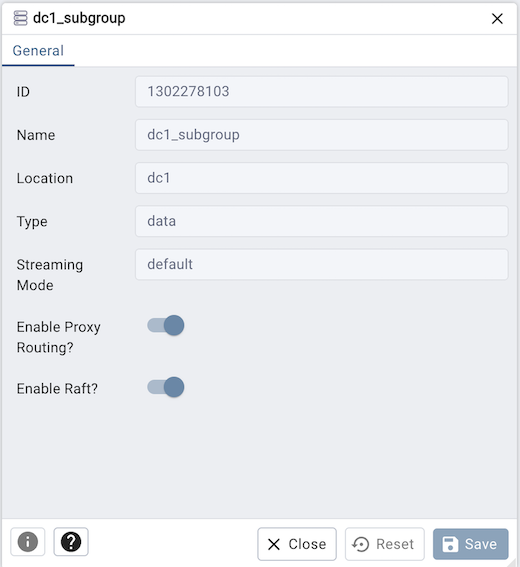

.. _pgd_replication_group_dialog:

******************************************
`PGD Replication Group Node Dialog`:index:
******************************************

Use the *Replication Group Node* dialog to view a PGD group/sub-group.
A PGD cluster's nodes are gathered in groups. A group can also contain zero or more subgroups.
Subgroups can be used to represent data centers or locations allowing commit scopes to refer to
nodes in a particular region as a whole.

The dialog organizes the information through the following tabs:
*General*

* The *ID* field is the ID of the node group.
* The *Name* field is the name of the node group.
* The *Location* field is the name of the location associated with the node group.
* The *Type* field is the type of the node group, one of "global", "data", "shard" or "subscriber-only".
* The *Streaming Mode* field is the transaction streaming setting of the node group, one of "off", "file", "writer",
  "auto" or "default"
* The *Enable Proxy Routing?* field tells whether the node group allows routing from pgd-proxy.
* The *Enable Raft?* field tells whether the node group allows Raft Consensus.

Other buttons:

* Click the *Info* button (i) to access online help.
* Click the *Save* button to save work.
* Click the *Close* button to exit without saving work.
* Click the *Reset* button to restore configuration parameters.

A group can have multiple servers and will be visible in the object explorer tree.

.. toctree::
   pgd_replication_server_dialog