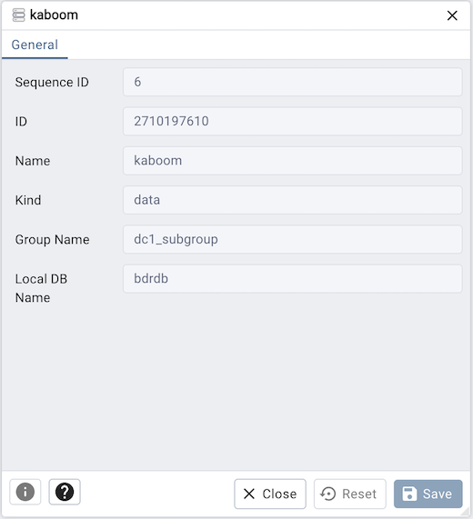

.. _pgd_replication_server_dialog:

*******************************************
`PGD Replication Server Node Dialog`:index:
*******************************************

Use The *Replication Server Node* dialog to view an element that run
databases and participate in the PGD cluster. A typical PGD node runs a Postgres
database, the BDR extension, and optionally a PGD Proxy service.

The dialog organizes the information through the following tabs:
*General*

* The *Sequence ID* field is the identifier of the node used for generating unique sequence numbers.
* The *ID* field is the OID of the node.
* The *Name* field is the name of the node.
* The *Kind* field is the node kind name.
* The *Group Name* field is the PGD group the node is part of.
* The *Local DB Name* field is the database name of the node.

Other buttons:

* Click the *Info* button (i) to access online help.
* Click the *Save* button to save work.
* Click the *Close* button to exit without saving work.
* Click the *Reset* button to restore configuration parameters.
