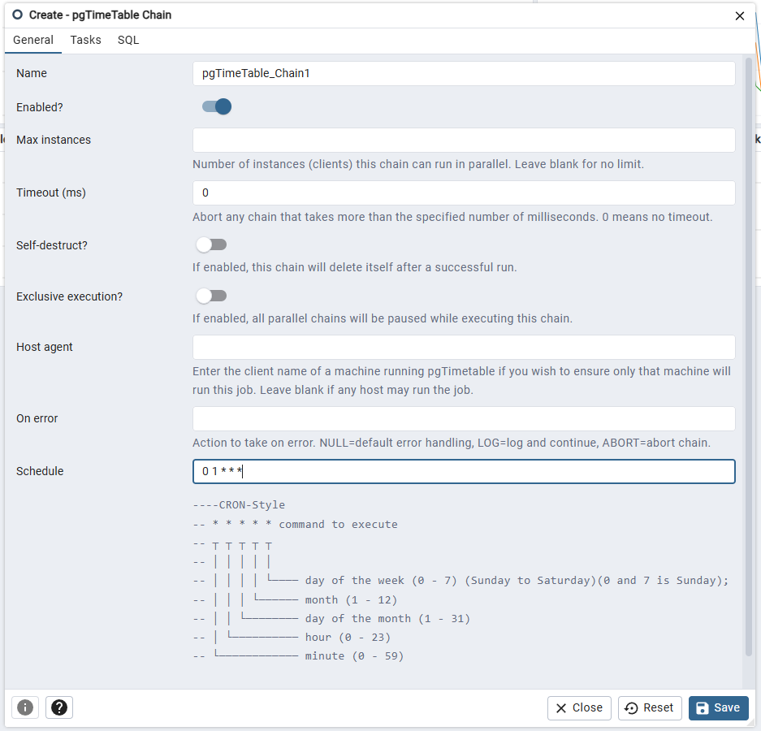
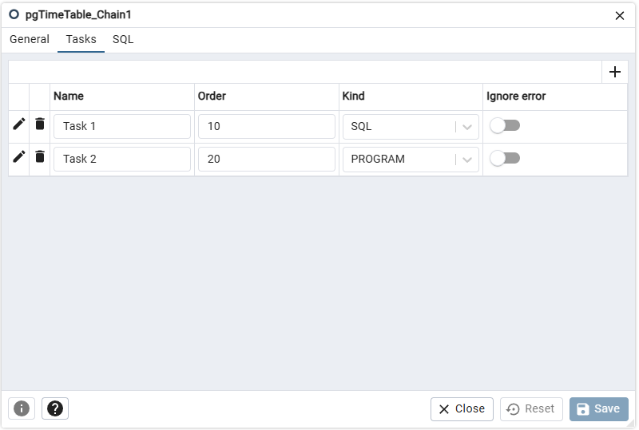
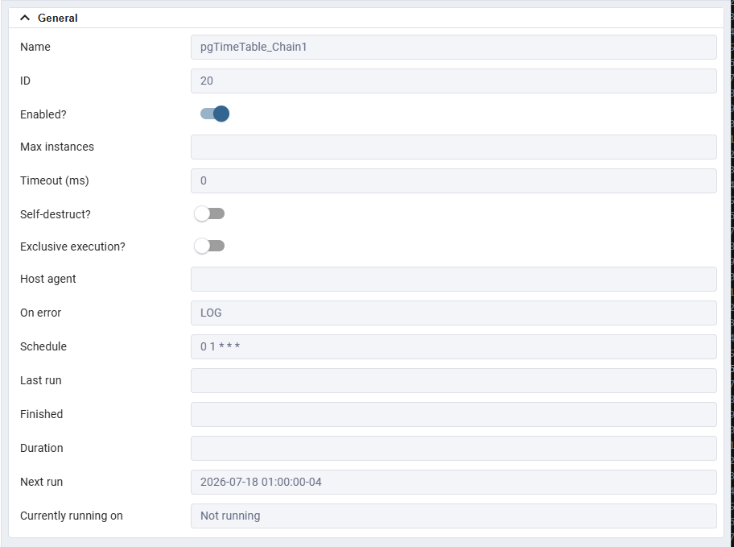
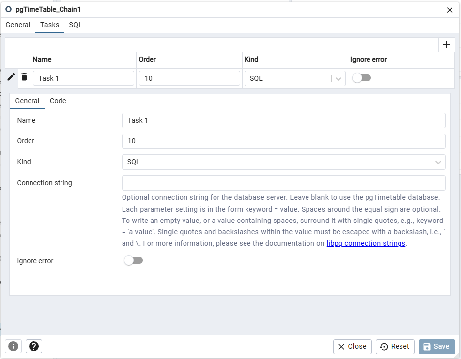
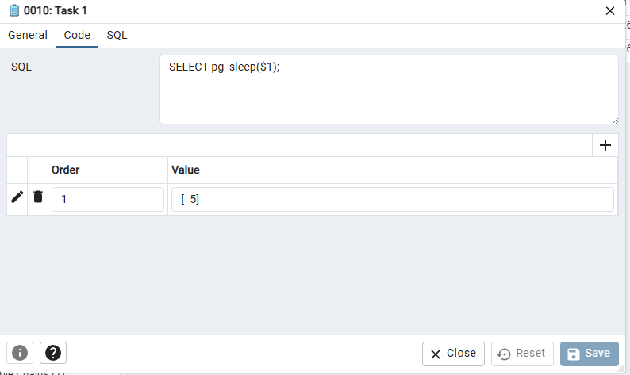
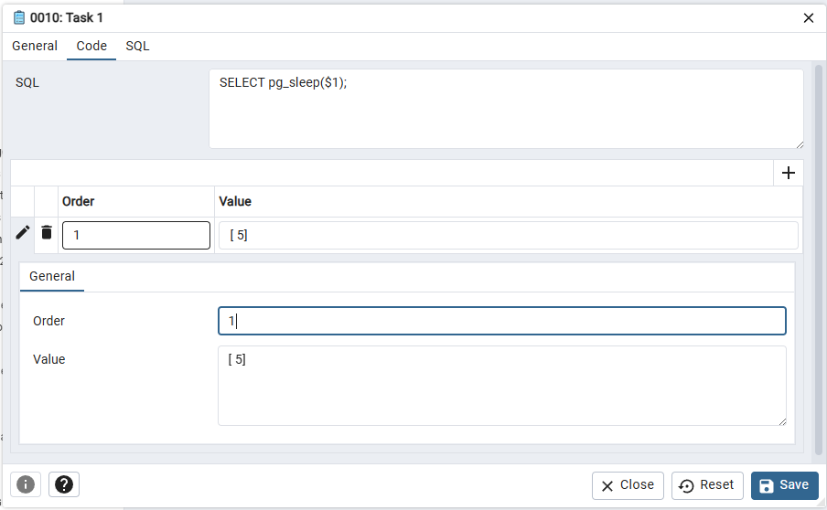
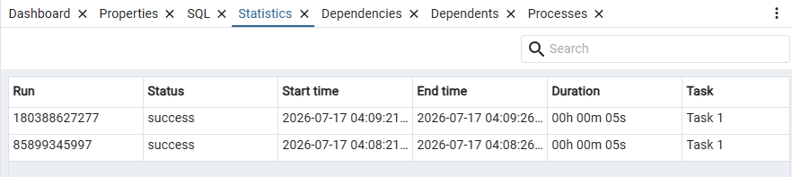

.. _pgtimetable_chains:

***************************************
`pgTimeTable Chains`:index:
***************************************

pgTimeTable is a PostgreSQL-based scheduling agent that runs and manages what are called `Chains`.
Each chain is composed of a set of Tasks to be executed in the order they should run.
A chain is assigned a single schedule using an extended cron-style format.
This UI has been tested with pgTimeTable 6.3.0 and above.

A task may be a series of *SQL* statements, a *BUILTIN* pgTimeTable command (such as sending email)
or an operating system *PROGRAM* program/batch/shell script.

Switches on the *pgTimeTable Chain* dialog (accessed
through the *Properties* context menu) allow you to modify a chain or disable the whole chain,
as well as modify tasks within the chain.

When you highlight the name of a defined chain in the pgAdmin tree control, the
*Properties* tab of the main pgAdmin window will display details about the chain,
and the *Statistics* tab will display details about the chain's execution.
There are also statistics about each task.

pgTimeTable supports the ability to have more than one job agent running at a time.
Job agents can be deployed on various platforms and binaries are readily available to 
deploy on Linux, Windows, and Mac.

For complete installation instructions, configuration options, and command-line
usage, please refer to the
`pgTimeTable documentation <https://cybertec-postgresql.github.io/pg_timetable/>`_.

If you are migrating from pgAgent or another PostgreSQL based scheduler, pgTimeTable provides
migration SQL queries to help in that migration.  See the
`migration tools <https://github.com/cybertec-postgresql/pg_timetable/tree/master/extras>`_
on GitHub for details.

Viewing pgTimeTable
********************
To enable viewing of the *pgTimeTable Chains* node, enable it on the File -> Preferences -> Nodes.
It will only show if the schema *timetable* and associated tables exist in your maintenance database.

Creating a Chain
****************

Note that pgTimeTable is not installed via `CREATE EXTENSION`.
Instead you use a pgTimeTable agent to install the necessary tables.
To create or manage a chain, use the pgAdmin tree control to browse to the
server on which the timetable schema exists.  The tree control will
display a *pgTimeTable Chains* node, under which currently defined chains are
displayed.

To add a new chain, right click on the *pgTimeTable Chains* node,
and select *Create pgTimeTable Chain...* from the context menu.

When the chain dialog opens, use the tabs on the dialog to define the chain
and its tasks.

Use the fields on the *General* tab to provide general information about the
chain:

* Provide a name for the chain in the *Name* field.
* Move the *Enabled* switch to the *Yes* position to enable the chain, or
  *No* to disable it.
* Use the *Max instances* field to specify the number of parallel instances
  (clients) that may execute this chain simultaneously.  Leave the field blank
  to allow unlimited parallel execution.
* Use the *Timeout (ms)* field to specify the maximum number of milliseconds
  the chain may run before it is aborted.  A value of *0* means no timeout.
* Move the *Self-destruct* switch to *Yes* to have the chain delete itself
  after a successful run.
* Move the *Exclusive execution* switch to *Yes* to pause all other parallel
  chains while this chain is executing.
* Use the *Host agent* field to specify the client name of the agent running
  pgTimeTable that should execute this chain.  Leave the field blank to allow
  any available host to run the chain.

  .. note:: You can query the ``timetable.active_session`` view to see the
      client names reported by running pgTimeTable agents:

      .. code-block:: sql

          SELECT DISTINCT client_name FROM timetable.active_session

      Use the client name exactly as reported by the query in the *Host agent*
      field.

* Use the *On error* field to specify the behavior when an error occurs.
  Accepted values are:

  * *NULL* - Use the default error handling.
  * *LOG* - Log the error and continue execution.
  * *ABORT* - Abort the chain on error.

* Use the *Schedule* field to specify a cron-style schedule for the chain.
  The format consists of a single field with 5 slots. As with regular cron,
  you can use a comma (`,`) for multiple values and an asterisk (`*`) as a wildcard for all.
  E.g. `20 1,5 * * *` would run at 1:20 and 5:20 AM.
  The timezone is always the timezone of the server the pgTimeTable database resides on.

  .. code-block:: text

      * * * * *
      ┬ ┬ ┬ ┬ ┬
      │ │ │ │ │
      │ │ │ │ └──── day of the week (0 - 7) (0 and 7 = Sunday)
      │ │ │ └────── month (1 - 12)
      │ │ └──────── day of the month (1 - 31)
      │ └────────── hour (0 - 23)
      └──────────── minute (0 - 59)

  Leave the field blank to disable automatic scheduling.  The chain can still
  be started manually using the *Run now* option.

In addition to cron syntax, pgTimeTable supports additional special case formats.
Namely `@after`, `@every`, `@reboot`.

The `@every` and `@after` should be followed with additional arguments.
For example `@every 2 hours`.

Use the *Tasks* tab to define and manage the tasks that the chain will
execute.  Click the Add icon (+) to add a new task.  Tasks are executed in
order of their *Order* value.

Click the compose icon (located at the left side of the header) to open the
task definition dialog.  See `Chain Task Dialog`_ below for details on
defining a task.

When you have finished defining the chain, you can use the *SQL* tab to review
the SQL that will create or modify your chain.

Click the *Save* button to save the chain, or *Close* to exit without saving.
Use the *Reset* button to remove your unsaved entries from the dialog.

After saving a chain, the chain will be listed under the *pgTimeTable Chains*
node of the pgAdmin tree control.  The *Properties* tab in the main pgAdmin
window will display a high-level overview of the selected chain, and the
*Statistics* tab will show the details of each execution run.

To modify an existing chain or to review detailed information about a chain,
right-click on a chain name, and select *Properties* from the context menu.

Chain Task Dialog
*****************

A chain task defines a single unit of work to be performed as part of a chain.
Each chain can contain one or more tasks, which are executed sequentially in
order.

Use the fields on the *General* tab to define the task:

* Provide a name for the task in the *Name* field.
* Use the *Order* field to specify the execution order of the task within the
  chain.  Tasks are executed in ascending order by this value.
* Use the *Kind* drop-down to select the type of task:

  * *SQL* - The task executes SQL statements.
  * *PROGRAM* - The task executes an operating system command.
  * *BUILTIN* - The task executes one of the built-in pgTimeTable commands.

* When *Kind* is set to *SQL*, use the *Connection string* field to optionally
  specify a libpq-style connection string for a remote database.  Leave the
  field blank to execute against the pgTimeTable database.

  .. note:: The *Connection string* field is only available when the
      pgTimeTable extension version supports it (version 5.x or later).
      It is ignored for *PROGRAM* and *BUILTIN* task kinds.

* Move the *Ignore error* switch to *Yes* to continue chain execution even if
  this task fails.  Set to *No* to stop the chain when an error occurs.

Use the *Code* tab to provide the code or command for the task.  The content
of the *Code* tab depends on the selected *Kind*:

* If *Kind* is *SQL*, provide one or more SQL statements in the *SQL* field.
  Use ``$1``, ``$2``, etc. as parameter placeholders that will be substituted
  from the *Parameters* collection.
* If *Kind* is *PROGRAM*, provide the full path and arguments of the program
  to execute in the *Program* field.
* If *Kind* is *BUILTIN*, select one of the following internal commands from
  the *Internal Command* drop-down:

  * *NoOp* - No operation; the task completes immediately.
  * *Sleep* - Pause execution for a duration specified by a parameter.
  * *Log* - Write a message to the pgTimeTable log.
  * *SendMail* - Send an email (requires parameters for recipient, subject,
    and body).
  * *Download* - Download a file from a URL.
  * *CopyFromFile* - Copy data from a file into a database table.
  * *CopyToFile* - Copy data from a database table to a file.
  * *Shutdown* - Shut down the pgTimeTable service.

Use the *Parameters* sub-collection to define parameter values that will be
substituted into the task command.  Click the Add icon (+) to add a new
parameter row:

* Use the *Order* column to specify the parameter position (``$1``, ``$2``,
  etc.).
* Use the *Value* column to provide the parameter value.  The value may be a
  plain string or a JSON value.

Click the compose icon to close the task definition dialog, then click *Save*
on the chain dialog to save all changes.

Refer to `pgTimeTable samples <https://cybertec-postgresql.github.io/pg_timetable/latest/samples/>`_
for the kind of parameters expected for each type.

Both the Chain and Tasks have a statistics tab, which show the results of past runs of tasks.

