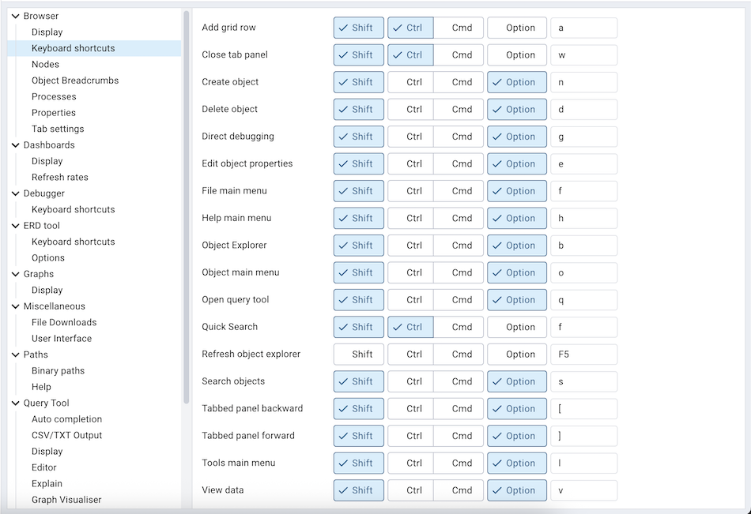
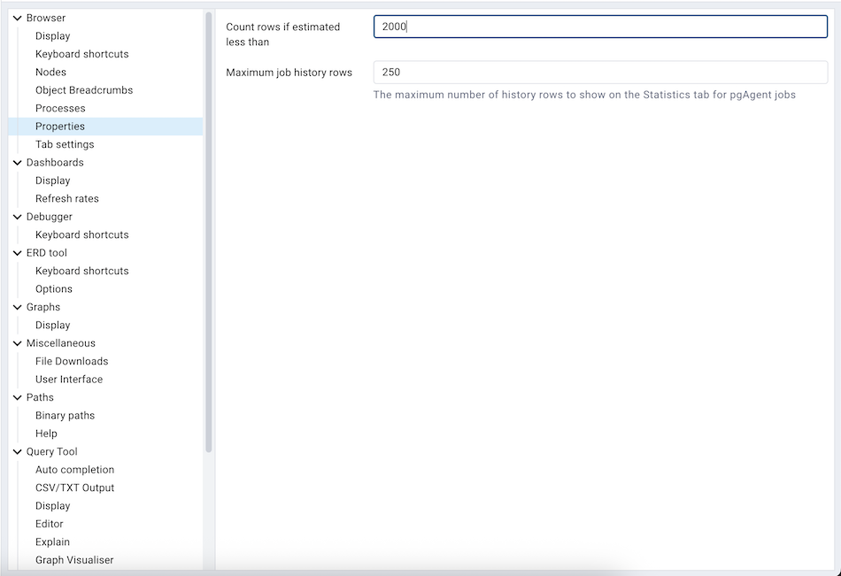
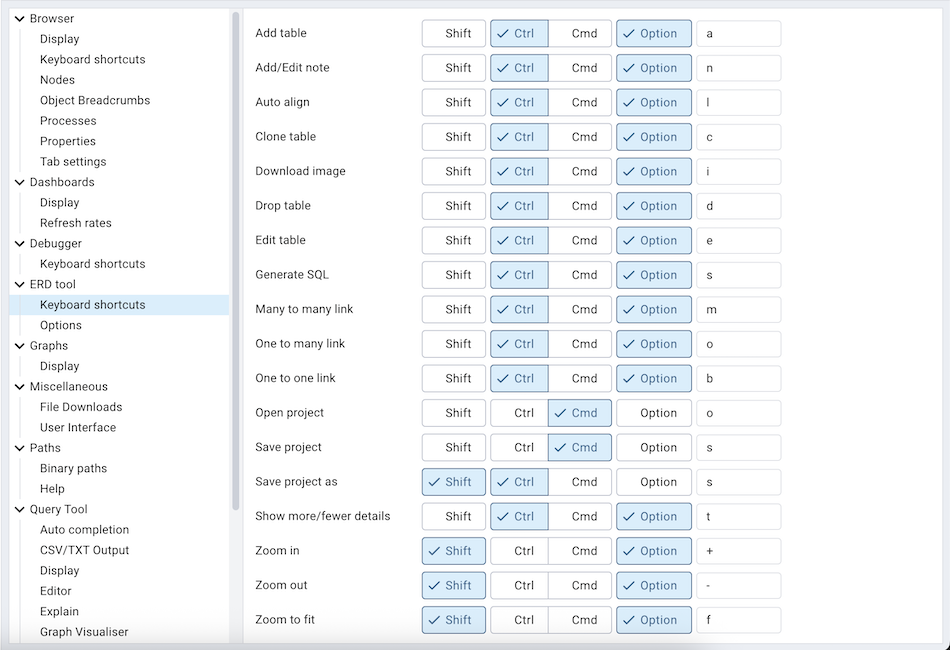
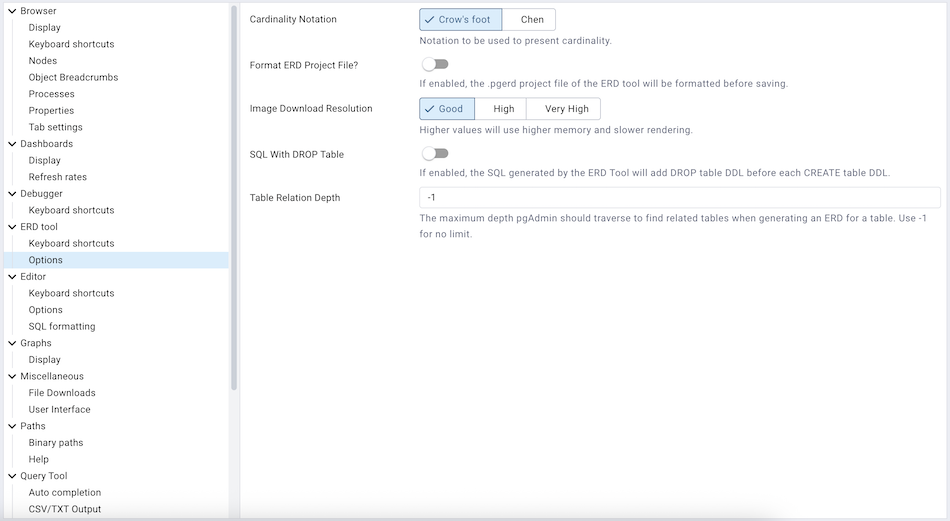
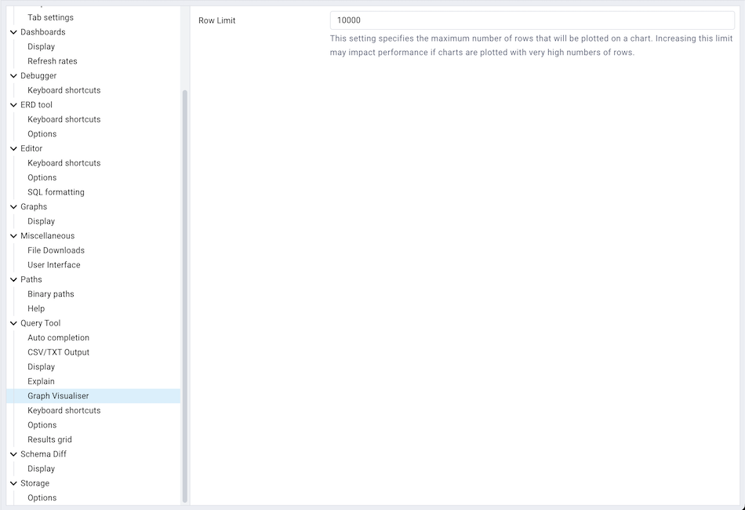
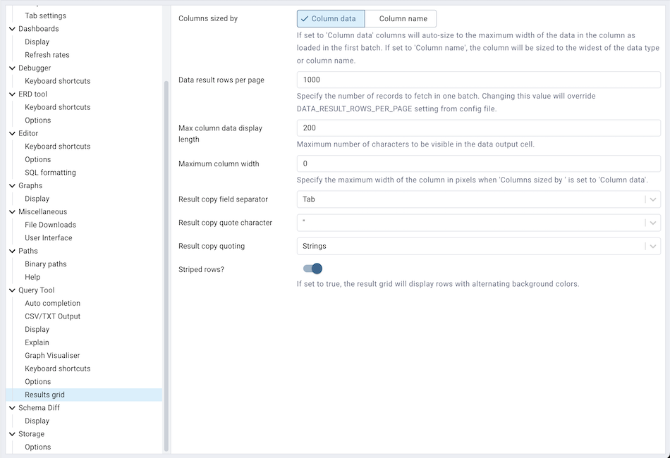
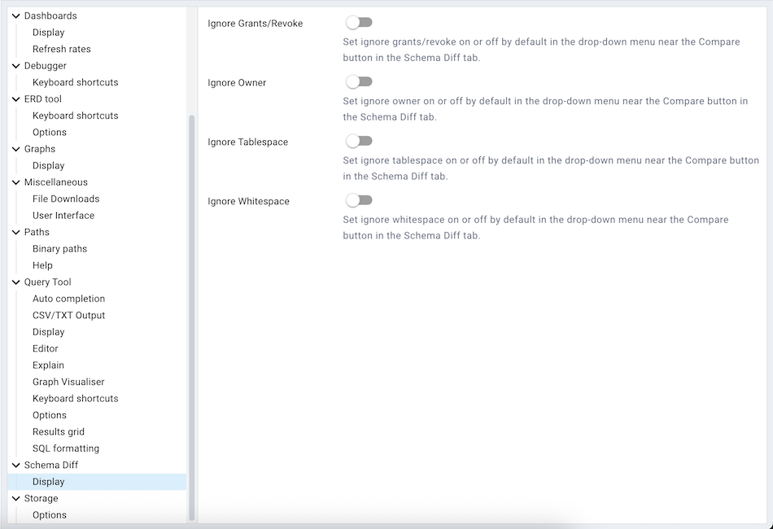

.. _preferences:

***************************
`Preferences Dialog`:index:
***************************

Use options on the *Preferences* dialog to customize the behavior of the client.
To open the *Preferences* dialog, select *Preferences* from the *File* menu.
The left pane of the *Preferences* dialog displays a tree control; each node of
the tree control provides access to options that are related to the node under
which they are displayed.

* Use the plus sign (+) to the left of a node name to expand a segment of the
  tree control.
* Use the minus sign (-) to the left of a node name to close that node.

The Browser Node
****************

Use preferences found in the *Browser* node of the tree control to personalize
your workspace.

.. image:: images/preferences_browser_display.png
    :alt: Preferences dialog browser display options
    :align: center

Use the fields on the *Display* panel to specify general display preferences:

* When the *Auto-expand sole children* switch is set to *True*, child nodes will
  be automatically expanded if a treeview node is expanded and has only a single
  child.

* Use the *Browser tree state saving interval* field to set the treeview state
  saving interval. A value of *-1* will disable the treeview state saving
  functionality.

* When the *Confirm before closing properties with unsaved changes* switch is set to *True*,
  pgAdmin will warn you before closing the properties dialog of an object if there
  are any unsaved changes. On user confirmation, the properties dialog will close.

* When the *Confirm on close or refresh* switch is set to *True*, pgAdmin will
  attempt to catch browser close or refresh events and prompt before allowing
  them to continue.

* When the *Hide shared servers?* switch is set to *True*, the client will hide
  all the shared servers from the browser tree.

* Use the *Lock layout* field to lock the UI layout at different levels. This
  can also be changed from File menu on the :ref:`menu bar <menu_bar>`

+---------------------+-------------------------------------------------------------------+
| Option              | Action                                                            |
+=====================+===================================================================+
| *None*              | No locking. Every panel is resizable and dockable.                |
+---------------------+-------------------------------------------------------------------+
| *Prevent docking*   | This will disable the docking/undocking of the panels             |
+---------------------+-------------------------------------------------------------------+
| *Full*              | This will disable resizing, docking/undocking of the panels       |
+---------------------+-------------------------------------------------------------------+

* When the *Show system objects?* switch is set to *True*, the client will
  display system objects such as system schemas (for example, *pg_temp*) or
  system columns (for example,  *xmin* or *ctid*) in the tree control.
* When the *Show template databases?* switch is set to *True*, the client will
  display template databases.

Use the fields on the *Keyboard shortcuts* panel to configure shortcuts for the
main window navigation:

* The panel displays a list of keyboard shortcuts available for the main window;
  select the combination of the modifier keys along with the key to configure
  each shortcut.

Use the fields on the *Nodes* panel to select the object types that will be
displayed in the *Browser* tree control:

.. image:: images/preferences_browser_nodes.png
    :alt: Preferences dialog browser nodes section
    :align: center

* The panel displays a list of database objects; slide the switch located next
  to each object to *Show* or *Hide* the database object. When querying system
  catalogs, you can reduce the number of object types displayed to increase
  speed.

Use fields on the *Properties* panel to specify browser properties:

* Include a value in the *Count rows if estimated less than* field to perform a
  SELECT count(*) if the estimated number of rows in a table (as read from the
  table statistics) is below the specified limit.  After performing the SELECT
  count(*), pgAdmin will display the row count.  The default is 2000.

* Provide a value in the *Maximum job history rows* field to limit the number of
  rows to show on the statistics tab for pgAgent jobs.  The default is 250.

Use field on *Tab settings* panel to specify the tab related properties.

.. image:: images/preferences_browser_tab_settings.png
    :alt: Preferences dialog browser properties section
    :align: center

* Use *Debugger tab title placeholder* field to customize the Debugger tab title.

* When the *Dynamic tab size* If set to True, the tabs will take full size as per the title, it will also applicable for already opened tabs

* When the *Open in new browser tab* filed is selected for Query tool, Schema Diff or Debugger, it will
  open in a new browser tab when invoked.

* Use the *Query tool tab title placeholder* field to customize the query tool tab title.

* Use *View/Edit tab title placeholder* field to customize the View/Edit Data tab title.

The Dashboards Node
*******************

Expand the *Dashboards* node to specify your dashboard display preferences.

* Set the warning and alert threshold value to highlight the long-running
  queries on the dashboard.

* When the *Show activity?* switch is set to *True*, activity tables will be
  displayed on dashboards.

* When the *Show graphs?* switch is set to *True*, graphs will be displayed on
  dashboards.

Use the fields on the *Refresh rates* panel to specify your refersh rates
preferences for the graphs on the *Dashboard* tab:

* Use the *Block I/O statistics refresh rate* field to specify the number of
  seconds between block I/O statistic samples displayed in graphs.

* Use the *Session statistics refresh rate* field to specify the number of
  seconds between session statistic samples displayed in graphs.

* Use the *Transaction throughput refresh rate* field to specify the number of
  seconds between transaction throughput samples displayed in graphs.

* Use the *Tuples in refresh rate* field to specify the number of seconds
  between tuples-in samples displayed in graphs.

* Use the *Tuples out refresh rate* field to specify the number of seconds
  between tuples-out samples displayed in graphs.

The Debugger Node
*****************

Expand the *Debugger* node to specify your debugger display preferences.

Use the fields on the *Keyboard shortcuts* panel to configure shortcuts for the
debugger window navigation:

.. image:: images/preferences_debugger_keyboard_shortcuts.png
    :alt: Preferences dialog debugger keyboard shortcuts section
    :align: center

The ERD Tool Node
*****************

Expand the *ERD Tool* node to specify your ERD Tool display preferences.

Use the fields on the *Keyboard shortcuts* panel to configure shortcuts for the
ERD Tool window navigation:

Use the fields on the *Options* panel to manage ERD preferences.

* When the *SQL With DROP Table* switch is set to *True*, the SQL
  generated by the ERD Tool will add DROP table DDL before each CREATE
  table DDL.

* *Table Relation Depth* is useful when generating an ERD for a table.
  It allows to set the limit on the depth level pgAdmin should traverse
  to find the relations. Use -1 to set no limit.

The Graphs Node
***************

Expand the *Graphs* node to specify your Graphs display preferences.

.. image:: images/preferences_dashboard_graphs.png
    :alt: Preferences dialog dashboard graph options
    :align: center

* Use the *Chart line width* field to specify the width of the lines on the
  line chart.

* When the *Show graph data points?* switch is set to *True*, data points will
  be visible on graph lines.

* When the *Show mouse hover tooltip?* switch is set to *True*, a tooltip will
  appear on mouse hover on the graph lines giving the data point details.

* When the *Use different data point styles?* switch is set to *True*,
  data points will be visible in a different style on each graph lines.

The Miscellaneous Node
**********************

Expand the *Miscellaneous* node to specify miscellaneous display preferences.

.. image:: images/preferences_misc_user_language.png
    :alt: Preferences dialog user language section
    :align: center

* Use the *User language* drop-down listbox to select the display language for
  the client.

.. image:: images/preferences_misc_themes.png
    :alt: Preferences dialog themes section
    :align: center

* Use the *Themes* drop-down listbox to select the theme for pgAdmin. You'll also get a preview just below the
  drop down. Note that, to apply the theme you need to refresh the pgAdmin page. You can also submit your
  own themes, check `here <https://github.com/pgadmin-org/pgadmin4/blob/master/README.md>`_ how.
  Currently we support Standard, Dark and High Contrast theme.

The Paths Node
**************

Expand the *Paths* node to specify the locations of supporting utility and help
files.

.. image:: images/preferences_paths_binary.png
    :alt: Preferences dialog binary path section
    :align: center

Use the fields on the *Binary paths* panel to specify the path to the directory
that contains the utility programs (pg_dump, pg_dumpall, pg_restore and psql) for
monitored databases:

* Use the *EDB Advanced Server Binary Path* grid to specify the location of the
  EDB Postgres Advanced Server utility programs based on the server version.
  If the respective path is not set, then pgAdmin will pick up the path for which
  'Set as default' is checked else pgAdmin will attempt to find the utilities in
  standard locations used by EnterpriseDB.

* Use the *PostgreSQL Binary Path* grid to specify the location of the
  PostgreSQL utility programs based on the server version. If the respective
  path is not set, then pgAdmin will pick up the path for which 'Set as default'
  is checked else pgAdmin will attempt to find the utilities in standard
  locations used by PostgreSQL.

**Note:** Use the 'Validate path' button to check the existence of the utility
programs (pg_dump, pg_dumpall, pg_restore and psql) and there respective versions.

.. image:: images/preferences_paths_help.png
    :alt: Preferences dialog binary path help section
    :align: center

Use the fields on the *Help* panel to specify the location of help files.

* Use the *EDB Advanced Server Help Path* to specify the path to EDB Postgres
  Advanced Server documentation.

* Use the *PostgreSQL Help Path* to specify the path to PostgreSQL
  documentation.

Please note: the default help paths include the *VERSION* placeholder; the
$VERSION$ placeholder will be replaced by the current database version.

The Query Tool Node
*******************

Expand the *Query Tool* node to access panels that allow you to specify your
preferences for the Query Editor tool.

.. image:: images/preferences_sql_auto_completion.png
    :alt: Preferences dialog sqleditor auto completion option
    :align: center

Use the fields on the *Auto Completion* panel to set the auto completion options.

* When the *Autocomplete on key press* switch is set to *True* then autocomplete
  will be available on key press along with CTRL/CMD + Space. If it is set to
  *False* then autocomplete is only activated when CTRL/CMD + Space is pressed.
* When the *Keywords in uppercase* switch is set to *True* then keywords are
  shown in upper case.

.. image:: images/preferences_sql_csv_output.png
    :alt: Preferences dialog sqleditor csv output option
    :align: center

Use the fields on the *CSV/TXT Output* panel to control the CSV/TXT output.

* Use the *CSV field separator* drop-down listbox to specify the separator
  character that will be used in CSV/TXT output.
* Use the *CSV quote character* drop-down listbox to specify the quote character
  that will be used in CSV/TXT output.
* Use the *CSV quoting* drop-down listbox to select the fields that will be
  quoted in the CSV/TXT output; select *Strings*, *All*, or *None*.
* Use the *Replace null values with* option to replace null values with
  specified string in the output file. Default is set to 'NULL'.

.. image:: images/preferences_sql_display.png
    :alt: Preferences dialog sqleditor display options
    :align: center

Use the fields on the *Display* panel to specify your preferences for the Query
Tool display.

* When the *Connection status* switch is set to *True*, each new instance of the
  Query Tool will display connection and transaction status.

* Use the *Connection status refresh rate* field to specify the number of
  seconds between connection/transaction status updates.

* Use the *Query info notifier timeout* field to control the behaviour of the
  notifier that is displayed when query execution completes. A value of *-1*
  will disable the notifier, and a value of 0 will display it until clicked. If
  a positive value above zero is specified, the notifier will be displayed for
  the specified number of seconds. The default is *5*.

.. image:: images/preferences_sql_editor.png
    :alt: Preferences dialog sqleditor editor settings
    :align: center

Use the fields on the *Editor* panel to change settings of the query editor.

* When the *Brace matching?* switch is set to *True*, the editor will highlight
  pairs of matched braces.

* When the *Code folding?* switch is set to *False*, the editor will disable
  code folding. Disabling will improve editor performance with large files.

* Use the *Font size* field to specify the font size that will be used in text
  boxes and editors.

* When the *Insert bracket pairs?* switch is set to *True*, the editor will
  automatically insert paired brackets.

* When the *Line wrapping* switch is set to *True*, the editor will implement
  line-wrapping behavior.

* When the *Plain text mode?* switch is set to *True*, the editor mode will be
  changed to text/plain. Keyword highlighting and code folding will be disabled.
  This will improve editor performance with large files.

.. image:: images/preferences_sql_explain.png
    :alt: Preferences dialog sqleditor explain options
    :align: center

Use the fields on the *Explain* panel to specify the level of detail included in
a graphical EXPLAIN.

* When the *Show Buffers?* switch is set to *True*, graphical explain details
  will include information about buffer usage.

* When the *Show Costs?* switch is set to *True*, graphical explain details will
  include information about the estimated startup and total cost of each plan,
  as well as the estimated number of rows and the estimated width of each row.

* When the *Show Timing?* switch is set to *True*, graphical explain details
  will include the startup time and time spent in each node in the output.

* When the *Verbose output?* switch is set to *True*, graphical explain details
  will include extended information about the query execution plan.

Use the fields on the *Graph Visualiser* panel to specify the settings
related to graphs.

* Use the *Row Limit* field to specify the maximum number of rows that will
  be plotted on a chart.

.. image:: images/preferences_sql_options.png
    :alt: Preferences dialog sqleditor options section
    :align: center

Use the fields on the *Options* panel to manage editor preferences.

* When the *Auto commit?* switch is set to *True*, each successful query is
  committed after execution.

* When the *Auto rollback on error?* switch is set to *True*, failed queries are rolled
  back.

* When the *Copy SQL from main window to query tool?* switch is set to *True*,
  the CREATE sql of the selected object will be copied to query tool when query tool
  will open.

* When the *Prompt to save unsaved data changes?* switch is set to *True*, the
  editor will prompt the user to saved unsaved data when exiting the data
  editor.

* When the *Prompt to save unsaved query changes?* switch is set to *True*, the
  editor will prompt the user to saved unsaved query modifications when exiting
  the Query Tool.

* When the *Prompt to commit/rollback active transactions?* switch is set to
  *True*, the editor will prompt the user to commit or rollback changes when
  exiting the Query Tool while the current transaction is not committed.

* When the *Sort View Data results by primary key columns?* If set to *True*,
  data returned when using the View/Edit Data - All Rows option will be sorted
  by the Primary Key columns by default. When using the First/Last 100 Rows options,
  data is always sorted.

Use the fields on the *Results grid* panel to specify your formatting
preferences for copied data.

* When the *Columns sized by* is set to *Column data*, then data columns will
  auto-size to the maximum width of the data in the column as loaded in the
  first batch. If set to *Column name*, the column will be sized to the widest
  of the data type or column name.
* Specify the maximum width of the column in pixels when 'Columns sized by' is
  set to *Column data*. If 'Columns sized by' is set to *Column name* then this
  setting won't have any effect.
* Use the *Result copy field separator* drop-down listbox to select the field
  separator for copied data.
* Use the *Result copy quote character* drop-down listbox to select the quote
  character for copied data.
* Use the *Result copy quoting* drop-down listbox to select which type of fields
  require quoting; select *All*, *None*, or *Strings*.

.. image:: images/preferences_sql_keyboard_shortcuts.png
    :alt: Preferences dialog sql keyboard shortcuts section
    :align: center

Use the fields on the *Keyboard shortcuts* panel to configure shortcuts for the
Query Tool window navigation:

.. image:: images/preferences_sql_formatting.png
    :alt: Preferences dialog SQL Formatting section
    :align: center

Use the fields on the *SQL formatting* panel to specify your preferences for
reformatting of SQL.

* Use the *Comma-first notation* option to specify whether to place commas
  before or after column names.
* Use the *Identifier case* option to specify whether to change identifiers
  (object names) into upper, lower, or capitalized case.
* Use the *Keyword case* option to specify whether to change keywords into
  upper, lower, or capitalized case.
* Use the *Re-indent aligned?* option to specify that indentations of statements
  should be changed, aligned by keywords.
* Use the *Re-indent?* option to specify that indentations of statements should
  be changed.
* Use the *Spaces around operators?* option to specify whether or not to include
  spaces on either side of operators.
* Use the *Strip comments?* option to specify whether or not comments should be
  removed.
* Use the *Tab size* option to specify the number of spaces per tab or indent.
* Use the *Use spaces?* option to select whether to use spaces or tabs when
  indenting.
* Use the *Wrap after N characters* option to specify the column limit for
  wrapping column separated lists (e.g. of column names in a table). If set to
  0 (zero), each item will be on it's own line.

The Schema Diff Node
********************

Expand the *Schema Diff* node to specify your display preferences.

Use the *Ignore owner* switch to ignores the owner while comparing the objects.

Use the *Ignore whitespace* switch to ignores the whitespace while comparing
the string objects. Whitespace includes space, tabs, and CRLF.

The Storage Node
****************

Expand the *Storage* node to specify your storage preferences.

.. image:: images/preferences_storage_options.png
    :alt: Preferences dialog storage section
    :align: center

Use the fields on the *Options* panel to specify storage preferences.

* Use the *File dialog view* drop-down listbox to select the style of icons and
  display format that will be displayed when you open the file manager; select
  *List* to display a list view, or *Grid* to display folder icons.

* Use the *Last directory visited* field to specify the name of the folder in
  which the file manager will open.

* Use the *Maximum file upload size(MB)* field on the *Options* panel of the
  **Storage** node to specify the maximum file size for an upload.

* When the *Show hidden files and folders?* switch is set to *True*, the file
  manager will display hidden files and folders.
