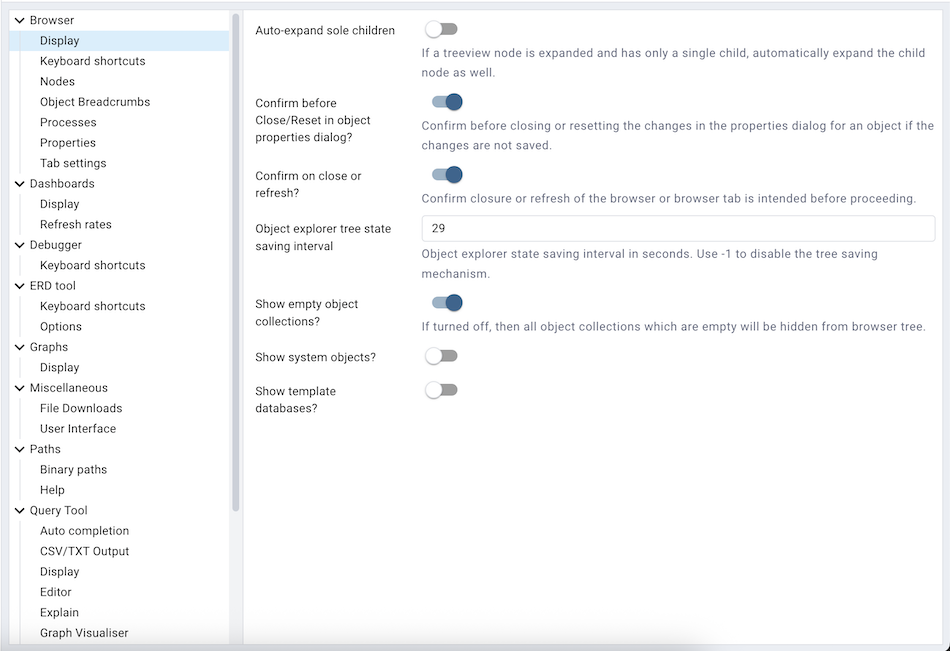
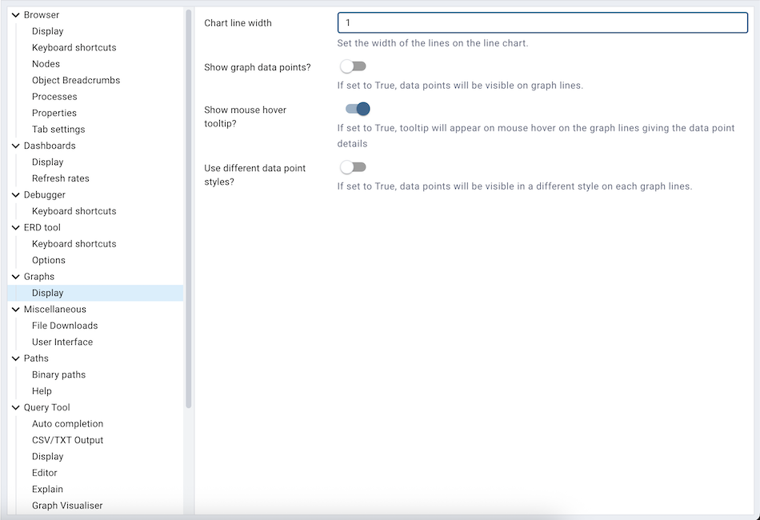
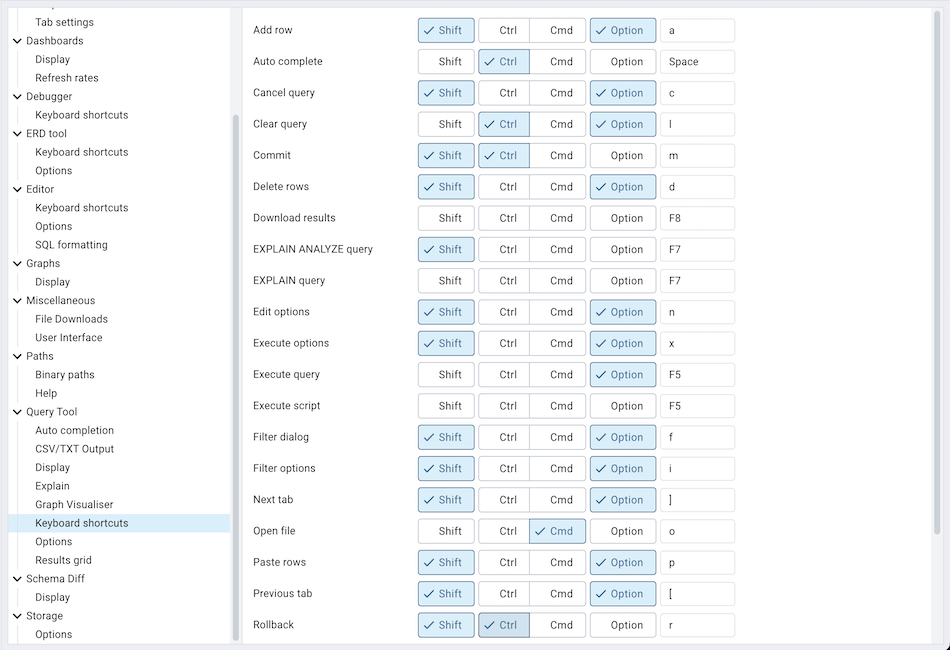

.. _preferences:

***************************
`Preferences Dialog`:index:
***************************

Use options on the *Preferences* dialog to customize the behavior of the client. To open the *Preferences* dialog, select *Preferences* from the *File* menu.  The left pane of the *Preferences* dialog displays a tree control; each node of the tree control provides access to options that are related to the node under which they are displayed.

* Use the plus sign (+) to the left of a node name to expand a segment of the tree control.
* Use the minus sign (-) to the left of a node name to close that node.

**The Browser Node**

Use preferences found in the *Browser* node of the tree control to personalize your workspace.

Use the fields on the *Display* panel to specify general display preferences:

* When the *Show system objects?* switch is set to *True*, the client will display system objects such as system schemas (for example, *pg_temp*) or system columns (for example,  *xmin* or *ctid*) in the tree control.

* When the *Enable browser tree animation?* switch is set to *True*, the client will display the animated tree control otherwise it will be unanimated.

* When the *Enable dialogue/notification animation?* switch is set to *True*, the client will display the animated dialogues/notifications otherwise it will be unanimated.

Use the fields on the *Keyboard shortcuts* panel to configure shortcuts for the main window navigation:

.. image:: images/preferences_browser_keyboard_shortcuts.png
    :alt: Preferences dialog browser keyboard shortcuts section

* The panel displays a list of keyboard shortcuts available for the main window; select the combination of the modifier keys along with the key to configure each shortcut.

Use the fields on the *Nodes* panel to select the object types that will be displayed in the *Browser* tree control:

.. image:: images/preferences_browser_nodes.png
    :alt: Preferences dialog browser nodes section

* The panel displays a list of database objects; slide the switch located next to each object to *Show* or *Hide* the database object. When querying system catalogs, you can reduce the number of object types displayed to increase speed.

Use fields on the *Properties* panel to specify browser properties:

.. image:: images/preferences_browser_properties.png
    :alt: Preferences dialog browser properties section

* Include a value in the *Count rows if estimated less than* field to perform a SELECT count(*) if the estimated number of rows in a table (as read from the table statistics) is below the specified limit.  After performing the SELECT count(*), pgAdmin will display the row count.  The default is 2000.

* Provide a value in the *Maximum job history rows* field to limit the number of rows to show on the statistics tab for pgAgent jobs.  The default is 250.

**The Dashboards Node**

Expand the *Dashboards* node to specify your dashboard display preferences.

Use the fields on the *Graphs* panel to specify your display preferences for the graphs on the *Dashboard* tab:

* Use the *Block I/O statistics refresh rate* field to specify the number of seconds between block I/O statistic samples displayed in graphs.

* Use the *Session statistics refresh rate* field to specify the number of seconds between session statistic samples displayed in graphs.

* Use the *Transaction throughput refresh rate* field to specify the number of seconds between transaction throughput samples displayed in graphs.

* Use the *Tuples in refresh rate* field to specify the number of seconds between tuples-in samples displayed in graphs.

* Use the *Tuples out refresh rate* field to specify the number of seconds between tuples-out samples displayed in graphs.

.. image:: images/preferences_dashboard_display.png
    :alt: Preferences dialog dashboard display options

* When the *Show graphs?* switch is set to *True*, graphs will be displayed on dashboards.

* When the *Show activity?* switch is set to *True*, activity tables will be displayed on dashboards.

**The Debugger Node**

Expand the *Debugger* node to specify your debugger display preferences.

.. image:: images/preferences_debugger_display.png
    :alt: Preferences dialog debugger display options

* When the *Open in new browser tab* switch is set to *True*, the Debugger will open in a new browser tab when invoked.

Use the fields on the *Keyboard shortcuts* panel to configure shortcuts for the debugger window navigation:

**The Miscellaneous Node**

Expand the *Miscellaneous* node to specify miscellaneous display preferences.

.. image:: images/preferences_misc_user_language.png
    :alt: Preferences dialog user language section

* Use the *User language* drop-down listbox to select the display language for the client.

**The Paths Node**

Expand the *Paths* node to specify the locations of supporting utility and help files.

.. image:: images/preferences_paths_binary.png
    :alt: Preferences dialog binary path section

Use the fields on the *Binary paths* panel to specify the path to the directory that contains the utility programs (pg_dump, pg_restore, and pg_dumpall) for monitored databases:

* Use the *EDB Advanced Server Binary Path* field to specify the location of the EDB Postgres Advanced Server utility programs.  If this path is not set, pgAdmin will attempt to find the utilities in standard locations used by EnterpriseDB.

* Use the *Greenplum Database Binary Path* field to specify the location of the Greenplum database utility programs.  If this path is not set, pgAdmin will attempt to find the utilities in standard locations used by Greenplum.

* Use the *PostgreSQL Binary Path* field to specify the location of the PostgreSQL utility programs.  If this path is not set, pgAdmin will attempt to find the utilities in standard locations used by PostgreSQL.

.. image:: images/preferences_paths_help.png
    :alt: Preferences dialog binary path help section

Use the fields on the *Help* panel to specify the location of help files.

* Use the *EDB Advanced Server Help Path* to specify the path to EDB Postgres Advanced Server documentation.

* Use the *PostgreSQL Help Path* to specify the path to PostgreSQL documentation.

Please note: the default help paths include the *VERSION* placeholder; the $VERSION$ placeholder will be replaced by the current database version.

**The SQL Editor Node**

Expand the *SQL Editor* node to access panels that allow you to specify your preferences for the SQL Editor tool.

Use the fields on the *Auto Completion* panel to set the auto completion options.

* When the *Keywords in uppercase* switch is set to *True* then keywords are shown in upper case.

Use the fields on the *CSV Output* panel to control the CSV output.

* Use the *CSV field separator* drop-down listbox to specify the separator character that will be used in CSV output.
* Use the *CSV quote character* drop-down listbox to specify the quote character that will be used in CSV output.
* Use the *CSV quoting* drop-down listbox to select the fields that will be quoted in the CSV output; select *Strings*, *All*, or *None*.

Use the fields on the *Display* panel to specify your preferences for the SQL Editor display.

* When the *Connection status* switch is set to *True*, each new instance of the SQL Editor will display connection and transaction status.

* Use the *Connection status refresh rate* field to specify the number of seconds between connection/transaction status updates.

* When the *Open in new browser tab* switch is set to *True*, each new instance of the SQL Editor will open in a new browser tab.

* Use the *Query info notifier timeout* field to control the behaviour of the notifier that is displayed when query execution completes. A value of *-1* will disable the notifier, and a value of 0 will display it until clicked. If a positive value above zero is specified, the notifier will be displayed for the specified number of seconds. The default is *5*.

Use the fields on the *Explain* panel to specify the level of detail included in a graphical EXPLAIN.

* When the *Show Buffers?* switch is set to *True*, graphical explain details will include information about buffer usage.

* When the *Show Costs?* switch is set to *True*, graphical explain details will include information about the estimated startup and total cost of each plan, as well as the estimated number of rows and the estimated width of each row.

* When the *Show Timing?* switch is set to *True*, graphical explain details will include the startup time and time spent in each node in the output.

* When the *Verbose output?* switch is set to *True*, graphical explain details will include extended information about the query execution plan.

.. image:: images/preferences_sql_options.png
    :alt: Preferences dialog sqleditor options section

Use the fields on the *Options* panel to manage editor preferences.

* When the *Auto-Commit?* switch is set to *True*, each successful query is committed after execution.

* When the *Auto-Rollback?* switch is set to *True*, failed queries are rolled back.

* When the *Brace matching?* switch is set to *True*, the editor will highlight pairs of matched braces.

* Use the *Font size* field to specify the font size that will be used in text boxes and editors.

* When the *Insert bracket pairs?* switch is set to *True*, the editor will automatically insert paired brackets.

* When the *Line wrapping* switch is set to *True*, the editor will implement line-wrapping behavior.

* When the *Prompt to save unsaved data changes?* switch is set to *True*, the editor will prompt the user to saved unsaved data when exiting the data editor.

* When the *Prompt to save unsaved query changes?* switch is set to *True*, the editor will prompt the user to saved unsaved query modifications when exiting the query tool.

* Use the *Tab size* field to specify the number of spaces per tab character in the editor.

* When the *Use spaces* switch is set to *True*, the editor will insert spaces (instead of tab characters) when the tab key or auto-indent are used.

.. image:: images/preferences_sql_results_grid.png
    :alt: Preferences dialog sql results grid section

Use the fields on the *Results grid* panel to specify your formatting preferences for copied data.

* Use the *Result copy field separator* drop-down listbox to select the field separator for copied data.
* Use the *Result copy quote character* drop-down listbox to select the quote character for copied data.
* Use the *Result copy quoting* drop-down listbox to select which type of fields require quoting; select *All*, *None*, or *Strings*.

Use the fields on the *Keyboard shortcuts* panel to configure shortcuts for the sql editor window navigation:

**The Storage Node**

Expand the *Storage* node to specify your storage preferences.

Use the fields on the *Options* panel to specify storage preferences.

* Use the *File dialog view* drop-down listbox to select the style of icons and display format that will be displayed when you open the file manager; select *List* to display a list view, or *Grid* to display folder icons.

* Use the *Last directory visited* field to specify the name of the folder in which the file manager will open.

* Use the *Maximum file upload size(MB)* field on the *Options* panel of the **Storage** node to specify the maximum file size for an upload.

* When the *Show hidden files and folders?* switch is set to *True*, the file manager will display hidden files and folders.

