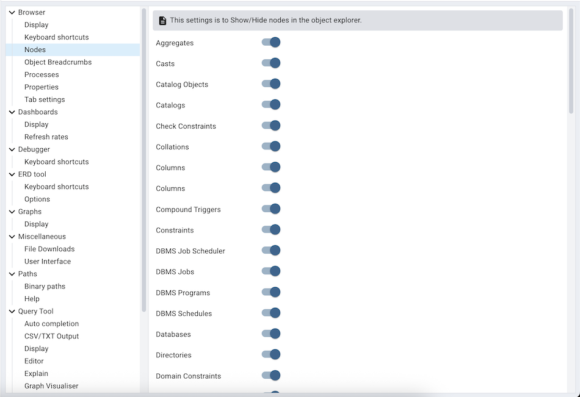
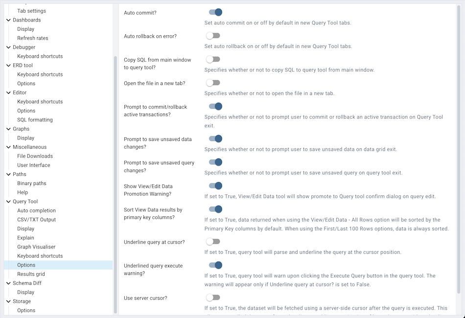

.. _preferences:

*******************
pgAdmin Preferences
*******************

pgAdmin 4 has a selection of configuration options (*Preferences*) that you can use to customize your pgAdmin client. To open the *Preferences* dialog, select *Preferences* from the *File* menu.

.. image:: images/preferences_tree.png

The left pane of the *Preferences* dialog displays a tree control; each node of the tree control provides access to options that are related to the selected node.

* Use the plus sign (+) to the left of a node to expand a segment of the tree control.
* Click the minus sign (-) to the left of a node to close that node.

Expand the **Browser** node of the tree control to personalize your workspace.

.. image:: images/preferences_browser_display.png

Use the options on the *Display* dialog to specify general display preferences:

Move the *Show system objects* switch to the *True* position to display system objects in the *pgAdmin* tree control. This option instructs pgAdmin to display objects such as system schemas (e.g. pg_temp*) and system columns (e.g. xmin, ctid) in the tree control.

Use the options on the *Nodes* dialog to select the object types that will be displayed in the *pgAdmin* tree control.

The right pane of the *Preferences* dialog displays a list of database objects. Slide the switch located next to each object to *Show* or *Hide* the database object. When querying system catalogs, you can reduce the number of object types displayed to increase speed.

Expand the **Dashboards** node to specify your graphing preferences.

.. image:: images/preferences_dashboard_graphs.png

Use the options on the *Graphs* dialog specify a refresh rate for statistics, transaction throughput and tuples. The rate you specify will affect a corresponding graph on the *Dashboard* tab of the *pgAdmin* tabbed browser.

Expand the **Paths** node to specify the locations of supporting files.

Use the fields in the *Binary paths* node to specify paths to the PostgreSQL binary utilities and EnterpriseDB Postgres Advanced Server binary utilities.

Use the *Help* dialog to customize links to support documentation.

* Use the *EDB Advanced Server Help Path* to find a link path for EnterpriseDB Postgres Advanced Server documentation on the company website. This link is editable: substitute the applicable PostgreSQL version number for *$VERSION$*, or provide an alternate link path.
* Use the *PostgreSQL Help Path* to find a link path to the current set of PostgreSQL core documentation. This link is editable: substitute the applicable PostgreSQL version number for *$VERSION$*, or provide an alternate link path.

Expand the **SQL Editor** node to specify your preferences for the SQL Editor tool.

.. image:: images/preferences_sql_display.png

Use the *Display* dialog to specify your preferences for the SQL Editor display.

* Use the *Query info notifier timeout* to control the behaviour of the notifier that is displayed when query execution completes. A value of *-1* will disable the notifier, and a value of 0 will display it until clicked. If a positive value above zero is specified, the notifier will be displayed for the specified number of seconds. The default is *5*.

.. image:: images/preferences_sql_explain_options.png

Use the options on the *Explain Options* dialog to specify the level of detail included in a graphical EXPLAIN.

* Move the *Buffers* switch to the *True* position to include information on buffer usage.
* Move the *Costs* switch to the *True* position to include information on the estimated startup and total cost of each plan, as well as the estimated number of rows and the estimated width of each row.
* Move the *Timing* switch to the *True* position to include actual startup time and time spent in each node in the output.
* Move the *Verbose* switch to the *True* position to display additional information regarding the plan.

Use the options in the *Options* dialog to manage modifications to a SQL statement.

* Move the *Auto-Commit* switch to the *True* position to commit a SQL statement upon completion.
* Move the *Auto-Rollback* switch to the *True* to rollback a SQL statement to the beginning of the statement or to a prior rollback.
* Move the *Brace matching* switch to the *True* to highlight the matched braces in editor.
* Move the *Font size* field to specify the font size.
* Move the *Insert bracket pairs* switch to the *True* to insert pair brackets in the editor.
* Move the *Line wrapping* switch to the *True* to wrap the long lines in the editor.
* Move the *Tab size* field to specify the number of spaces per tab in the editor.
* Move the *Use spaces* switch to the *True* to insert spaces instead of tabs.

Expand the **Storage** node to specify a maximum file size for uploads.

.. image:: images/preferences_storage_options.png

Use the *Maximum file upload size(MB)* in the *Options* node of the **Storage** node to specify the maximum file size for an upload.
