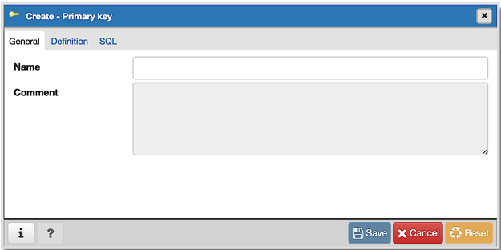
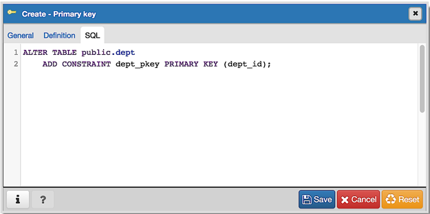

.. _primary_key_dialog:

***************************
`Primary key Dialog`:index:
***************************

Use the *Primary key* dialog to create or modify a primary key constraint. A
primary key constraint indicates that a column, or group of columns, uniquely
identifies rows in a table. This requires that the values in the selected
column(s) be both unique and not null.

The *Primary key* dialog organizes the development of a primary key constraint
through the *General* and *Definition* tabs. The *SQL* tab displays the SQL code
generated by dialog selections.

Use the fields in the *General* tab to identify the primary key:

* Use the *Name* field to add a descriptive name for the primary key constraint.
  The name will be displayed in the *pgAdmin* tree control.

Click the *Definition* tab to continue.

.. image:: images/primary_key_definition.png
    :alt: Primary key dialog definition tab
    :align: center

Use the fields in the *Definition* tab to define the primary key constraint:

* Click inside the *Columns* field and select one or more column names from the
  drop-down listbox. To delete a selection, click the *x* to the left of the
  column name. The primary key constraint should be different from any unique
  constraint defined for the same table; the selected column(s) for the
  constraints must be distinct.
* Use *Include columns* field to specify columns for *INCLUDE* clause of the
  index. This option is available in Postgres 11 and later.
* Select the name of the tablespace in which the primary key constraint will
  reside from the drop-down listbox in the *Tablespace* field.
* Select the name of an index from the drop-down listbox in the *Index* field.
  This field is optional. Adding a primary key will automatically create a
  unique B-tree index on the column or group of columns listed in the primary
  key, and will force the column(s) to be marked NOT NULL.
* Use the *Fill Factor* field to specify a fill factor for the table and index.
  The fill factor for a table is a percentage between 10 and 100. 100 (complete
  packing) is the default.
* Move the *Deferrable?* switch to the *Yes* position to specify the timing of
  the constraint is deferrable and can be postponed until the end of the
  statement. The default is *No*.
* If enabled, move the *Deferred?* switch to the *Yes* position to specify the
  timing of the constraint is deferred to the end of the statement. The default
  is *No*.

Click the *SQL* tab to continue.

Your entries in the *Primary key* dialog generate a SQL command (see an example
below). Use the *SQL* tab for review; revisit or switch tabs to make any changes
to the SQL command.

Example
*******

The following is an example of the sql command generated by user selections in
the *Primary key* dialog:

The example shown demonstrates creating a primary key constraint named
*dept_pkey* on the *dept_id* column of the *dept* table.

* Click the *Info* button (i) to access online help.
* Click the *Save* button to save work.
* Click the *Cancel* button to exit without saving work.
* Click the *Reset* button to restore configuration parameters.