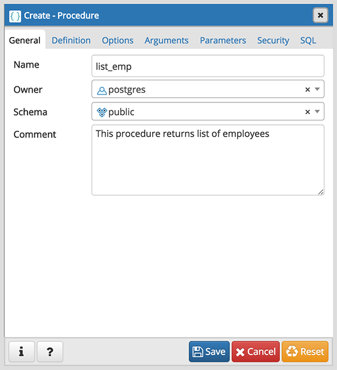
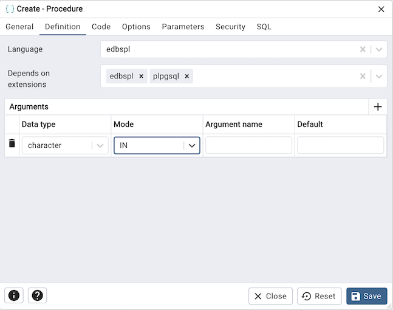
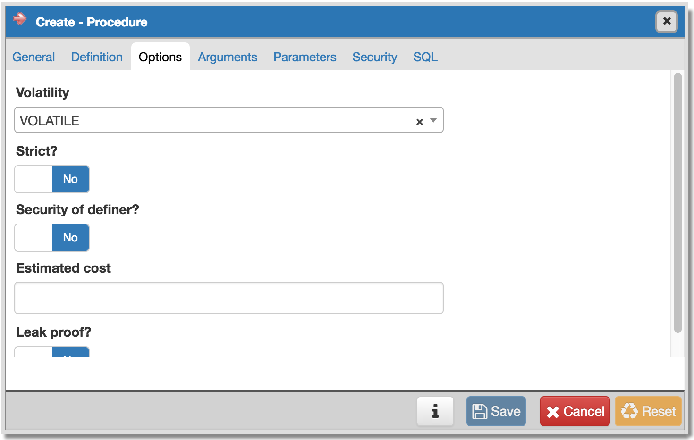
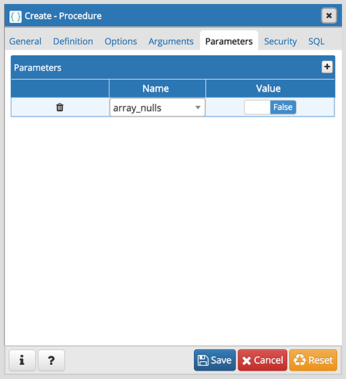
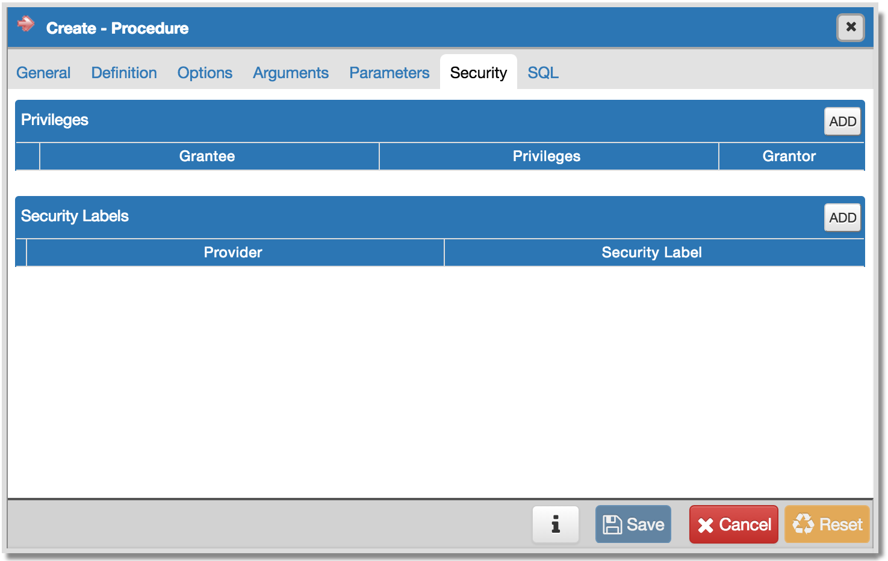
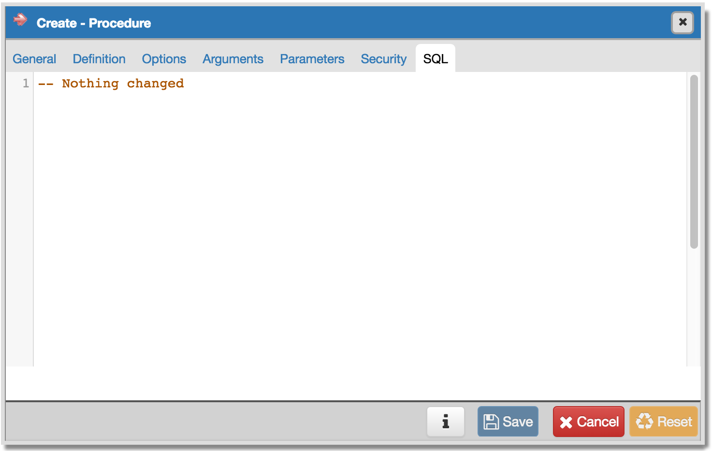

.. _procedure_dialog:

*************************
`Procedure Dialog`:index:
*************************

Use the *Procedure* dialog to create a procedure; procedures are supported by
PostgreSQL v11+ and EDB Postgres Advanced Server. The *Procedure* dialog allows
you to implement options of the CREATE PROCEDURE command.

The *Procedure* dialog organizes the development of a procedure through the
following dialog tabs: *General*, *Definition*, *Options*, *Arguments*,
*Parameters*, and *Security*. The *SQL* tab displays the SQL code generated by
dialog selections.

Use the fields in the *General* tab to identify a procedure:

* Use the *Name* field to add a descriptive name for the procedure. The name
  will be displayed in the *pgAdmin* tree control.
* Use the drop-down listbox next to *Owner* to select a role.
* Select the name of the schema in which the procedure will reside from the
  drop-down listbox in the *Schema* field.
* Store notes about the procedure in the *Comment* field.

Click the *Definition* tab to continue.

Use the fields in the *Definition* tab to define the procedure:

* Use the drop-down listbox next to *Language* to select a language. The default
  is *edbspl*.
* Use the fields in the *Arguments* section to define an argument. Click *Add* to set
  parameters and values for the argument:
* Use the drop-down listbox next to *Data type* to select a data type.
* Use the drop-down listbox next to *Mode* to select a mode. Select *IN* for an
  input parameter; select *OUT* for an output parameter; select *INOUT* for both
  an input and an output parameter; or, select *VARIADIC* to specify a VARIADIC
  parameter.
* Write a name for the argument in the *Argument Name* field.
* Specify a default value for the argument in the *Default Value* field.

Click *Add* to define another argument; to discard an argument, click the trash
icon to the left of the row and confirm deletion in the *Delete Row* popup.

Click the *Code* tab to continue.

* Use the *Code* field to specify the code that will execute when the procedure
  is called.

Click the *Options* tab to continue.

Use the fields in the *Options* tab to describe or modify the behavior of the
procedure:

* Use the drop-down listbox under *Volatility* to select one of the following.
  *VOLATILE* is the default value.

    * *VOLATILE* indicates that the value can change even within a single table
      scan, so no optimizations can be made.
    * *STABLE* indicates that the procedure cannot modify the database, and that
      within a single table scan it will consistently return the same result for
      the same argument values, but that its result could change across SQL
      statements.
    * *IMMUTABLE* indicates that the procedure cannot modify the database and
      always returns the same result when given the same argument values.

* Move the *Strict?* switch to indicate if the procedure always returns NULL
  whenever any of its arguments are NULL. If *Yes*, the procedure is not
  executed when there are NULL arguments; instead a NULL result is assumed
  automatically. The default is *No*.
* Move the *Security of definer?* switch to specify that the procedure is to be
  executed with the privileges of the user that created it. The default is *No*.
* Use the *Estimated cost* field to specify a positive number representing the
  estimated execution cost for the procedure, in units of cpu_operator_cost. If
  the procedure returns a set, this is the cost per returned row.
* Move the *Leak proof?* switch to indicate whether the procedure has side
  effects — it reveals no information about its arguments other than by its
  return value. The default is *No*.

Click the *Parameters* tab to continue.

Use the fields in the *Parameters* tab to specify settings that will be applied
when the procedure is invoked:

* Use the drop-down listbox next to *Parameter Name* in the *Parameters* panel
  to select a parameter.
* Click the *Add* button to add the variable to *Name* field in the table.
* Use the *Value* field to specify the value that will be associated with the
  selected variable. This field is context-sensitive.

Click the *Security* tab to continue.

Use the *Security* tab to assign privileges and define security labels.

Use the *Privileges* panel to assign execute privileges for the procedure to a
role:

* Select the name of the role from the drop-down listbox in the *Grantee* field.
* Click inside the *Privileges* field. Check the boxes to the left of one or
  more privileges to grant the selected privilege to the specified user.
* The current user, who is the default grantor for granting the privilege, is displayed in the *Grantor* field.

Click *Add* to assign additional privileges; to discard a privilege, click the
trash icon to the left of the row and confirm deletion in the *Delete Row*
popup.

Use the *Security Labels* panel to define security labels applied to the
procedure. Click *Add* to add each security label selection:

* Specify a security label provider in the *Provider* field. The named provider
  must be loaded and must consent to the proposed labeling operation.
* Specify a a security label in the *Security Label* field. The meaning of a
  given label is at the discretion of the label provider. PostgreSQL places no
  restrictions on whether or how a label provider must interpret security
  labels; it merely provides a mechanism for storing them.

Click *Add* to assign additional security labels; to discard a security label,
click the trash icon to the left of the row and confirm deletion in the *Delete
Row* popup.

Click the *SQL* tab to continue.

Your entries in the *Procedure* dialog generate a SQL command (see an example
below). Use the *SQL* tab for review; revisit or switch tabs to make any changes
to the SQL command.

Example
*******

The following is an example of the sql command generated by selections made in
the *Procedure* dialog:

The example demonstrates creating a procedure that returns a list of employees
from a table named *emp*.  The procedure is a SECURITY DEFINER, and will execute
with the privileges of the role that defined the procedure.

* Click the *Info* button (i) to access online help.
* Click the *Save* button to save work.
* Click the *Cancel* button to exit without saving work.
* Click the *Reset* button to restore configuration parameters.
