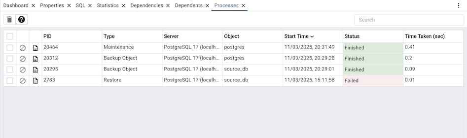
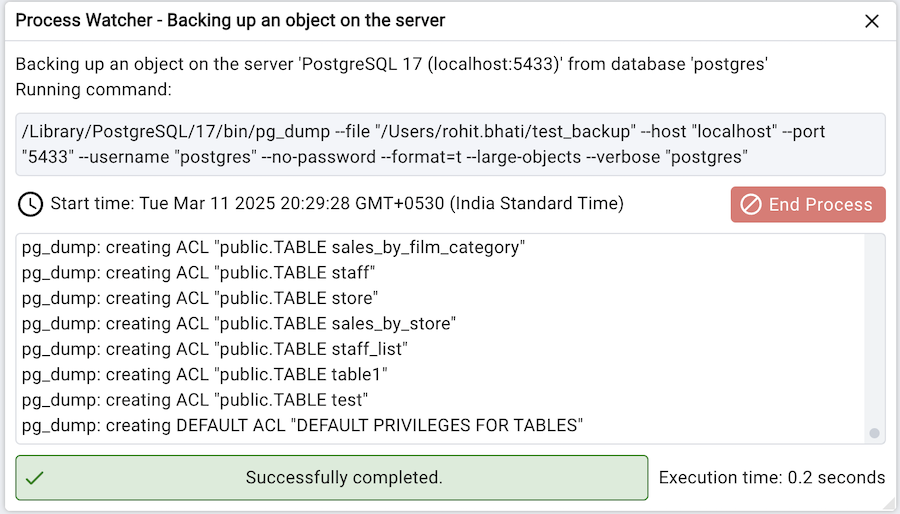

.. _processes:

***********************
`Processes`:index:
***********************

There are certain tasks which pgAdmin runs in the background. The processes
running in the background can be viewed in the processes tab. It shows the
process details of Backup, Restore, Maintenance, Import/Export and Cloud instance
creation.

The columns of the processes table shows:

* The *PID* of the forked OS process.
* The *Type* of the task being performed.
* The *Server* name for which the task is.
* The *Object* can be a database, table, mview or anything which gives more info.
* The *Start Time* of the process, sorted descending by default.
* The current *Status* of the process. It can be Running, Finished, Failed, Terminated.
* The *Time Taken* to complete. It will keep updating if it is running.

There are two action buttons on each row:

* The *Stop Process* button allows you to kill a running process.
* The *More details* button allows you to open the process watcher which shows the
  process logs and other details.

You can also select the checkboxes and click on *Delete and Acknowledge* button
on the top to clear the process info and logs.

Process Watcher
*********************

The Process Watcher logs all the activity associated with the process/task and provides
additional information for troubleshooting
Use the **Stop Process** button to stop the Backup process.

.. note:: If you are running *pgAdmin* in *Server Mode* you can click on the |sm_icon| icon in the process watcher window to open the file location in the Storage Manager. You can use the :ref:`Storage Manager <storage_manager>` to download the backup file on the client machine .

.. |sm_icon| image:: images/sm_icon.png

Watch the demo
*********************
.. youtube:: jjP6O_xuHxE
    :align: center
    :width: 800