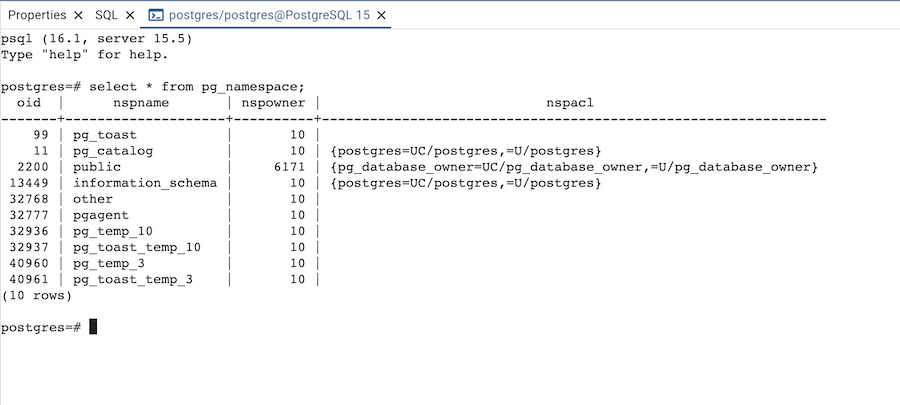

.. _psql_tool:

******************
`PSQL Tool`:index:
******************

The PSQL tool allows users to connect to PostgreSQL or EDB Advanced server using
the psql command line interface through their browser.

* Open the PSQL tool from the Tools or browser tree context menu, or use PSQL
  tool button at the top of the browser tree.

* PSQL will connect to the current connected database from the browser tree.

You can open multiple instances of the PSQL tool in individual tabs simultaneously.
To close the PSQL tool, click the *X* in the upper-right hand corner of the tab bar.

**Note:** On the Windows platform, this feature is available on Windows 10 (1809
version), and Windows Server 2019 and onwards.

**Note:** The PSQL tool is always available when pgAdmin is running in Desktop
mode, but is disabled by default in Server mode. This is because users can run
arbitrary shell commands through psql which may be considered a security risk in
some deployments. System Administrators can enable the use of the PSQL tool in
the pgAdmin configuration by setting the *ENABLE_PSQL* option to *True*; see
:ref:`config_py` for more information.