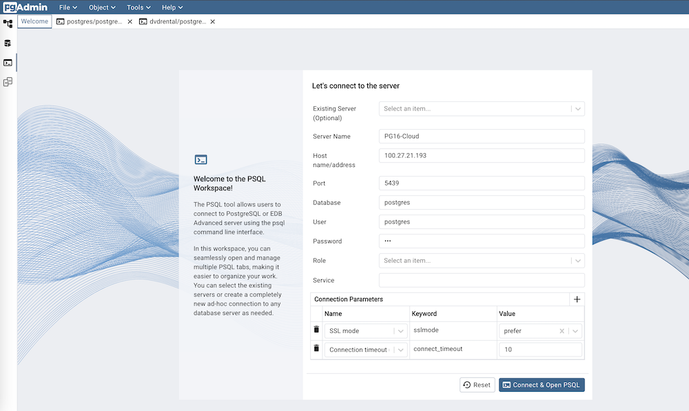

.. _psql_tool:

******************
`PSQL Tool`:index:
******************

The PSQL tool allows users to connect to PostgreSQL or EDB Advanced server using
the psql command line interface through their browser.

* Open the PSQL tool from the Tools or object explorer context menu, or use PSQL
  tool button at the top of the object explorer.

* PSQL will connect to the current connected database from the object explorer.

.. image:: images/psql_tool.png
    :alt: PSQL tool window
    :align: center

You can open multiple instances of the PSQL tool in individual tabs simultaneously.
To close the PSQL tool, click the *X* in the upper-right hand corner of the tab bar.

**Note:** On the Windows platform, this feature is available on Windows 10 (1809
version), and Windows Server 2019 and onwards.

**Note:** The PSQL tool is always available when pgAdmin is running in Desktop
mode, but is disabled by default in Server mode. This is because users can run
arbitrary shell commands through psql which may be considered a security risk in
some deployments. System Administrators can enable the use of the PSQL tool in
the pgAdmin configuration by setting the *ENABLE_PSQL* option to *True*; see
:ref:`config_py` for more information.

PSQL Tool in Workspace Layout
******************************

The workspace layout offers a distraction-free, dedicated area for the PSQL Tool.
When the PSQL Tool workspace is accessed, the Welcome page opens by default.

**Note**: In the Workspace layout, all PSQL tabs open within the PSQL Tool workspace.

In the classic UI, users must connect to a database server and navigate to the
database node before using the PSQL Tool. However, with the introduction of the
Workspace layout and Welcome page, users can seamlessly connect to any ad-hoc
server, even if it is not registered in the Object Explorer.

* Select *Existing Server* from the dropdown to connect to a server already
  listed in the Object Explorer. It is optional.
* Provide the *Server Name* for ad-hoc servers.
* Specify the IP address of the server host, or the fully qualified domain
  name in the *Host name/address* field.
* Enter the listener port number of the server host in the *Port* field.
* Use the *Database* field to specify the name of the database to which
  the client will connect.
* Use the *User* field to specify the name of a user that will be used when
  authenticating with the server.
* Use the *Password* field to provide a password that will be supplied when
  authenticating with the server.
* Use the *Role* field to specify the name of a role that has privileges that
  will be conveyed to the client after authentication with the server.
* Use the *Service* field to specify the service name. For more information,
  see
  `Section 33.16 of the Postgres documentation <https://www.postgresql.org/docs/current/libpq-pgservice.html>`_.
* Use the fields in the *Connection Parameters* to configure the connection parameters.

After filling in all the required fields, click the Connect & Open PSQL Tool
button to launch the PSQL Tool with the provided server details. If the password
is not supplied, you will be prompted to enter it.