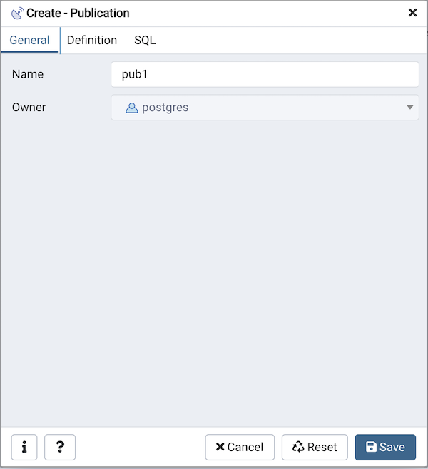
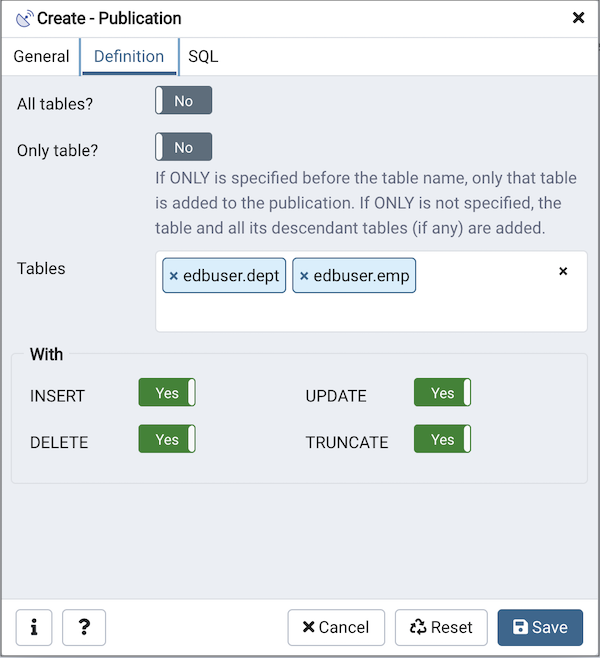
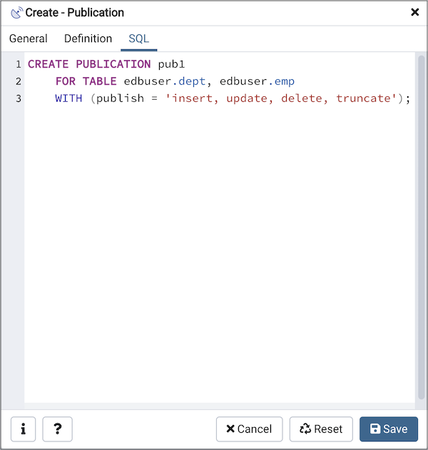

.. _publication_dialog:

***************************
`Publication Dialog`:index:
***************************

`Logical replication <https://www.postgresql.org/docs/13/logical-replication.html>`_ uses a *publish* and *subscribe* model with one or more *subscribers* subscribing to one or more *publications* on a publisher node.

Use the *publication* dialog to create a publication. A publication is a set of changes generated from a table or a group of tables, and might also be described as a change set or replication set.

The *publication* dialog organizes the development of a publication through the following dialog tabs: *General* and *Definition*. The *SQL* tab displays the SQL code generated by dialog selections.

Use the fields in the *General* tab to identify the publication:

* Use the *Name* field to add a descriptive name for the publication. The name will be displayed in the *pgAdmin* tree control.
* The *Owner* field takes the name of the user automatically as current connected user. You can change the owner after creating publication using alter publication.

Click the *Definition* tab to continue.

Use the *Definition* tab to set properties for the publication:

* Move the switch next to *All tables?* to *Yes* to replicate all the tables of the database, including tables created in the future.
* Move the switch next to *Only table?* to *Yes* to replicate only the listed tables excluding all its descendant tables.
* Specify a table or list of tables separated by a comma in *Tables* field to replicate all the listed table.
* Use the *With* section to determine which DML operations will be published by the new publication to the subscribers. Move the switch next to *INSERT*, *UPDATE*, *DELETE*, or *TRUNCATE* to *No* if you do not want to replicate any of these DML operations from Publication to Subscription. By default, all the switches are set to *Yes* allowing all the DML operations.

.. note:: A published table must have a “replica identity” configured in order to be able to replicate UPDATE and DELETE operations. You can change with ALTER TABLE statement. For more information on replica identity see `Logical Replication Publication <https://www.postgresql.org/docs/13/logical-replication-publication.html>`_.

Click the *SQL* tab to continue.

Your entries in the *Publication* dialog generate a SQL command (see an example below). Use the *SQL* tab for review; revisit or switch tabs to make any changes to the SQL command.

**Example**

The following is an example of the sql command generated by user selections in
the *Publication* dialog:

The example creates a publication named *pub1* that is owned by *postgres*. It
allows replication of all the DML operations.

* Click the *Info* button (i) to access online help.
* Click the *Save* button to save work.
* Click the *Close* button to exit without saving work.
* Click the *Reset* button to restore all the default settings.
