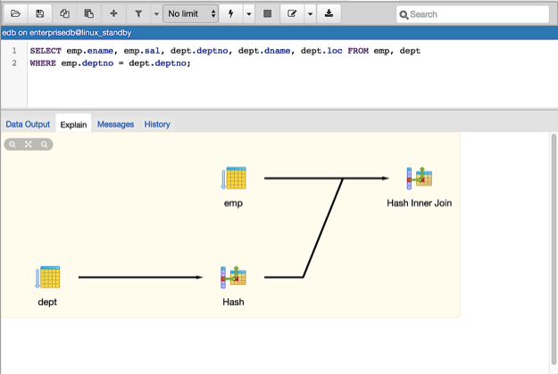

.. _query_tool:

*******************
`Query tool`:index:
*******************

The Query tool is a powerful, feature-rich environment that allows you to execute arbitrary SQL commands and review the result set.  You can access the Query tool via the *Query Tool* menu option on the *Tools* menu, or through the context menu of select nodes of the Browser tree control.  The Query Tool allows you to:

* Issue ad-hoc SQL queries.
* Execute arbitrary SQL commands.
* Displays current connection and transaction status as configured by the user.
* Save the data displayed in the output panel to a CSV file.
* Review the execution plan of a SQL statement in either a text or a graphical format.
* View analytical information about a SQL statement.

.. image:: images/query_tool.png
    :alt: Query tool window

You can open multiple copies of the Query tool in individual tabs simultaneously.  To close a copy of the Query tool, click the *X* in the upper-right hand corner of the tab bar.

The Query Tool features two panels:

* The upper panel displays the *SQL Editor*.  You can use the panel to enter, edit, or execute a query.
* The lower panel displays the *Data Output* panel. The tabbed panel displays the result set returned by a query, information about a query's execution plan, server messages related to the query's execution, and a history of the queries invoked in the SQL Editor.

**The Query Tool Toolbar**

The *Query Tool* toolbar uses context-sensitive icons that provide shortcuts to frequently performed tasks. If an icon is highlighted, the option is enabled; if the icon is grayed-out, the task is disabled.  Please note that disabled icons may support functionality accessed via the :ref:`data editor <editgrid>`.

.. image:: images/query_toolbar.png
    :alt: Query tool toolbar

Hover over an icon to display a tooltip that describes the icon's functionality:

+----------------------+---------------------------------------------------------------------------------------------------+-------------+
| Icon                 | Behavior                                                                                          | Shortcut    |
+======================+===================================================================================================+=============+
| *Open File*          | Click the *Open File* icon to display a previously saved query in the SQL Editor.                 |             |
+----------------------+---------------------------------------------------------------------------------------------------+-------------+
| *Save*     	       | Click the *Save* icon to perform a quick-save of a previously saved query, or to access the       |             |
|                      | *Save* menu:                                                                                      |             |
|                      |                                                                                                   |             |
|                      |  * Select *Save* to save the selected content of the SQL Editor panel in a  file.                 |             |
|                      |                                                                                                   |             |
|                      |  * Select *Save As* to open a new browser dialog and specify a new location to which to save the  |             |
|                      |    selected content of the SQL Editor panel.                                                      |             |
+----------------------+---------------------------------------------------------------------------------------------------+-------------+
| *Find*               | Use the *Find* menu to search, replace, or navigate the code displayed in the SQL Editor:         |             |
|                      |                                                                                                   |             |
|                      |  * Select *Find* to provide a search target, and search the SQL Editor contents.                  | Cmd+F       |
|                      |                                                                                                   |             |
|                      |  * Select *Find next* to locate the next occurrence of the search target.                         | Cmd+G       |
|                      |                                                                                                   |             |
|                      |  * Select *Find previous* to move to the last occurrence of the search target.                    | Cmd+Shift+G |
|                      |                                                                                                   |             |
|                      |  * Select *Pesistent find* to identify all occurrences of the search target within the editor.    |             |
|                      |                                                                                                   |             |
|                      |  * Select *Replace* to locate and replace (with prompting) individual occurrences of the target.  | Cmd+Shift+F |
|                      |                                                                                                   |             |
|                      |  * Select *Replace all* to locate and replace all occurrences of the target within the editor.    |             |
|                      |                                                                                                   |             |
|                      |  * Select *Jump* to navigate to the next occurrence of the search target.                         | Alt+G       |
+----------------------+---------------------------------------------------------------------------------------------------+-------------+
| *Copy*               | Click the *Copy* icon to copy the content that is currently highlighted in the Data Output panel. |             |
+----------------------+---------------------------------------------------------------------------------------------------+-------------+
| *Edit*               | Use options on the *Edit* menu to access text editing tools; the options operate on the text      |             |
|                      | displayed in the SQL Editor panel:                                                                |             |
|                      |                                                                                                   |             |
|                      |  * Select *Indent Selection* to indent the currently selected text.                               | Tab         |
|                      |                                                                                                   |             |
|                      |  * Select *Unindent Selection* to remove indentation from the currently selected text.            | Shift+Tab   |
|                      |                                                                                                   |             |
|                      |  * Select *Inline Comment Selection* to enclose any lines that contain the selection in           | Cmd+/       |
|                      |    SQL style comment notation.                                                                    |             |
|                      |                                                                                                   |             |
|                      |  * Select *Inline Uncomment Selection* to remove SQL style comment notation from the              | Cmd+.       |
|                      |    selected line.                                                                                 |             |
|                      |                                                                                                   |             |
|                      |  * Select *Block Comment* to enclose all lines that contain the selection in C style              | Shift+Cmd+/ |
|                      |    comment notation.  This option acts as a toggle.                                               |             |
+----------------------+---------------------------------------------------------------------------------------------------+-------------+
| *Execute/Refresh*    | Click the *Execute/Refresh* icon to either execute or refresh the query highlighted in the SQL    |             |
|                      | editor panel. Click the down arrow to access other execution options:                             |             |
|                      |                                                                                                   |             |
|                      |  * Select *Execute/Refresh* to invoke the SQL command and refresh the result set.                 | F5          |
|                      |                                                                                                   |             |
|                      |  * Select *Explain* to view an explanation plan for the current query.  The result of the         | F7          |
|                      |    EXPLAIN is displayed graphically on the *Explain* tab of the output panel, and in text         |             |
|                      |    form on the *Data Output* tab.                                                                 |             |
|                      |                                                                                                   |             |
|                      |  * Select *Explain analyze* to invoke an EXPLAIN ANALYZE command on the current query.            | Shift+F7    |
|                      |                                                                                                   |             |
|                      |  * Navigate through the *Explain Options* menu to select options for the EXPLAIN command:         |             |
|                      |                                                                                                   |             |
|                      |       Select *Verbose* to display additional information regarding the query plan.                |             |
|                      |                                                                                                   |             |
|                      |       Select *Costs* to include information on the estimated startup and total cost of each       |             |
|                      |       plan node, as well as the estimated number of rows and the estimated width of each          |             |
|                      |       row.                                                                                        |             |
|                      |                                                                                                   |             |
|                      |       Select *Buffers* to include information on buffer usage.                                    |             |
|                      |                                                                                                   |             |
|                      |       Select *Timing* to include information about the startup time and the amount of time        |             |
|                      |       spent in each node of the query.                                                            |             |
|                      |                                                                                                   |             |
|                      |  * Add a check next to *Auto-Rollback* to instruct the server to automatically roll back a        |             |
|                      |    transaction if an error occurs during the transaction.                                         |             |
|                      |                                                                                                   |             |
|                      |  * Add a check next to *Auto-Commit* to instruct the server to automatically commit each          |             |
|                      |    transaction.  Any changes made by the transaction will be visible to others, and               |             |
|                      |    durable in the event of a crash.                                                               |             |
+----------------------+---------------------------------------------------------------------------------------------------+-------------+
| *Stop*               | Click the *Stop* icon to cancel the execution of the currently running query.                     |             |
+----------------------+---------------------------------------------------------------------------------------------------+-------------+
| *Clear query window* | Use options on the *Clear* drop-down menu to erase display contents:                              |             |
|                      |                                                                                                   |             |
|                      |  * Select *Clear Query Window* to erase the content of the SQL Editor panel.                      |             |
|                      |                                                                                                   |             |
|                      |                                                                                                   |             |
|                      |  * Select *Explain analyze* to invoke an EXPLAIN ANALYZE command on the current query.            | Shift+F7    |
|                      |                                                                                                   |             |
|                      | the SQL editor panel or the *History* tab.                                                        |             |
+----------------------+---------------------------------------------------------------------------------------------------+-------------+
| *Download as CSV*    | Click the *Download as CSV* icon to download the result set of the current query to a             | F8          |
|                      | comma-separated list. You can specify the CSV settings through                                    |             |
|                      | *Preferences -> SQL Editor -> CSV output* dialogue.                                               |             |
+----------------------+---------------------------------------------------------------------------------------------------+-------------+

**The SQL Editor Panel**

The *SQL editor* panel is a workspace where you can manually provide a query, copy a query from another source, or read a query from a file. The SQL editor features syntax coloring and autocompletion.

.. image:: images/query_sql_editor.png
    :alt: Query tool editor

To use autocomplete, begin typing your query; when you would like the Query editor to suggest object names or commands that might be next in your query, press the Control+Space key combination. For example, type "\*SELECT \* FROM\* " (without quotes, but with a trailing space), and then press the Control+Space key combination to select from a popup menu of autocomplete options.

.. image:: images/query_autocomplete.png
    :alt: Query tool autocomplete feature

After entering a query, select the *Execute/Refresh* icon from the toolbar. The complete contents of the SQL editor panel will be sent to the database server for execution. To execute only a section of the code that is displayed in the SQL editor, highlight the text that you want the server to execute, and click the *Execute/Refresh* icon.

.. image:: images/query_execute_section.png
    :alt: Query tool execute query section

The message returned by the server when a command executes is displayed on the *Messages* tab.  If the command is successful, the *Messages* tab displays execution details.

.. image:: images/query_tool_message.png
    :alt: Query tool message panel

Options on the *Edit* menu offer functionality that helps with code formatting and commenting:

* The auto-indent feature will automatically indent text to the same depth as the previous line when you press the Return key.
* Block indent text by selecting two or more lines and pressing the Tab key.
* Implement or remove SQL style or toggle C style comment notation within your code.

**The Data Output Panel**

The *Data Output* panel displays data and statistics generated by the most recently executed query.

.. image:: images/query_output_data.png
    :alt: Query tool output panel

The *Data Output* tab displays the result set of the query in a table format. You can:

* Select and copy from the displayed result set.
* Use the *Execute/Refresh* options to retrieve query execution information and set query execution options.
* Use the *Download as CSV* icon to download the content of the *Data Output* tab as a comma-delimited file.

All rowsets from previous queries or commands that are displayed in the *Data Output* panel will be discarded when you invoke another query; open another query tool browser tab to keep your previous results available.

Use the *Explain* tab to view a graphical representation of a query:

To generate a graphical explain diagram, open the *Explain* tab, and select *Explain*, *Explain Analyze*, or one or more options from the *Explain options* menu on the *Execute/Refresh* drop-down. Please note that *EXPLAIN VERBOSE* cannot be displayed graphically. Hover over an icon on the *Explain* tab to review information about that item; a popup window will display information about the selected object:

.. image:: images/query_output_explain_details.png
    :alt: Query tool graphical explain plan

Note that the query plan that accompanies the *Explain analyze* is available on the *Data Output* tab.

Use the *Messages* tab to view information about the most recently executed query:

.. image:: images/query_output_error.png
    :alt: Query tool output messages

If the server returns an error, the error message will be displayed on the *Messages* tab, and the syntax that caused the error will be underlined in the SQL editor.  If a query succeeds, the *Messages* tab displays how long the query took to complete and how many rows were retrieved:

.. image:: images/query_output_messages.png
    :alt: Query tool output information

Use the *Query History* tab to review activity for the current session:

.. image:: images/query_output_history.png
    :alt: Query tool history panel

The Query History tab displays information about recent commands:

* The date and time that a query was invoked.
* The text of the query.
* The number of rows returned by the query.
* The amount of time it took the server to process the query and return a result set.
* Messages returned by the server (not noted on the *Messages* tab).

To erase the content of the *Query History* tab, select *Clear history* from the *Clear* drop-down menu.

Use the *Connection status* feature to view the current connection and transaction status by clicking on the status icon in query tool:

.. image:: images/query_tool_connection_status.png
    :alt: Query tool connection and transaction statuses