.. _query_tool:

*******************
`Query Tool`:index:
*******************

The Query Tool is a powerful, feature-rich environment that allows you to
execute arbitrary SQL commands and review the result set.  You can access the
Query Tool via the *Query Tool* menu option on the *Tools* menu, or through the
context menu of select nodes of the Object explorer control.  The Query Tool
allows you to:

* Issue ad-hoc SQL queries.
* Execute arbitrary SQL commands.
* Edit the result set of a SELECT query if it is
  :ref:`updatable <updatable-result-set>`.
* Displays current connection and transaction status as configured by the user.
* Save the data displayed in the output panel to a CSV file.
* Review the execution plan of a SQL statement in either a text, a graphical
  format or a table format (similar to https://explain.depesz.com).
* View analytical information about a SQL statement.

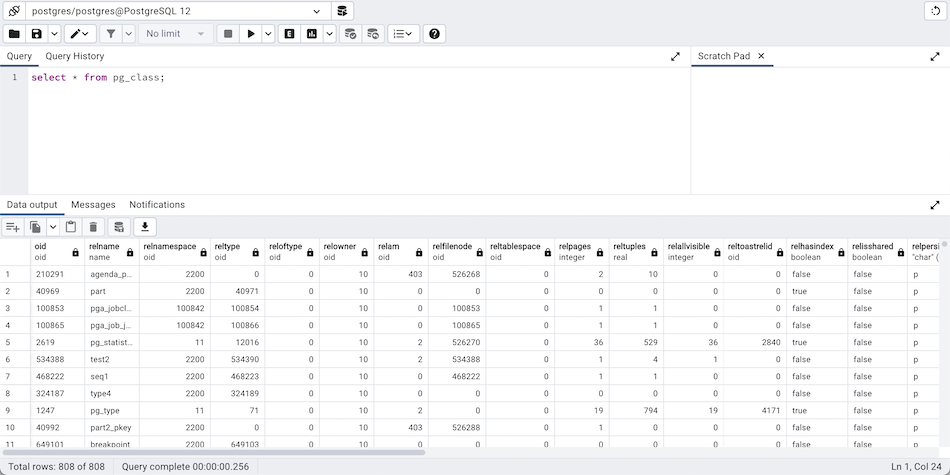

You can open multiple copies of the Query tool in individual tabs
simultaneously.  To close a copy of the Query tool, click the *X* in the
upper-right hand corner of the tab bar.

The Query Tool features two panels:

* The upper panel displays the *SQL Editor*. You can use the panel to enter,
  edit, or execute a query. It also shows the *History* tab which can be used
  to view the queries that have been executed in the session, and a *Scratch Pad*
  which can be used to hold text snippets during editing. If the Scratch Pad is
  closed, it can be re-opened (or additional ones opened) by right-clicking in
  the SQL Editor and other panels and adding a new panel.
* The lower panel displays the *Data Output* panel. The tabbed panel displays
  the result set returned by a query, information about a query's execution plan,
  server messages related to the query's execution and any asynchronous
  notifications received from the server.

Toolbar
*******

The toolbar is described in the following subsections.

.. toctree::
   :maxdepth: 2

   query_tool_toolbar

The SQL Editor Panel
********************

The *SQL editor* panel is a workspace where you can manually provide a query,
copy a query from another source, or read a query from a file. The SQL editor
features syntax coloring and autocompletion.

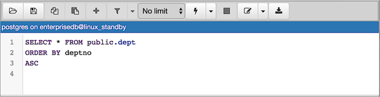

To use autocomplete, begin typing your query; when you would like the Query
editor to suggest object names or commands that might be next in your query,
press the Control+Space key combination. For example, type "*SELECT \* FROM*"
(without quotes, but with a trailing space), and then press the Control+Space
key combination to select from a popup menu of autocomplete options.

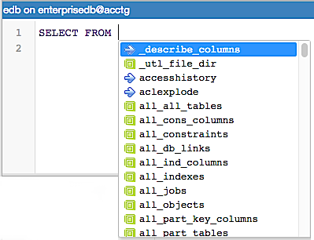

After entering a query, select the *Execute script* icon from the toolbar. The
complete contents of the SQL editor panel will be sent to the database server
for execution. To execute only a section of the code that is displayed in the
SQL editor, highlight the text that you want the server to execute, and click
the *Execute script* icon.

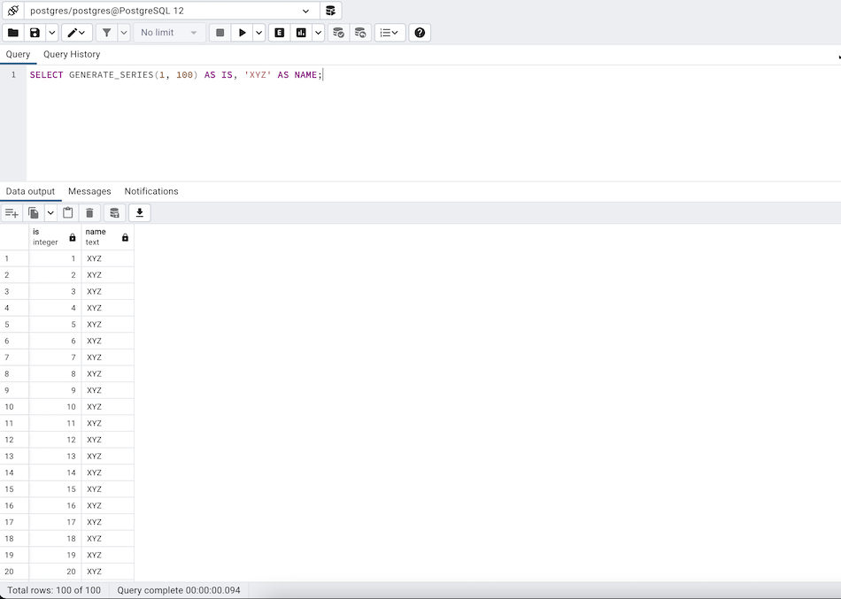

The message returned by the server when a command executes is displayed on the
*Messages* tab.  If the command is successful, the *Messages* tab displays
execution details.

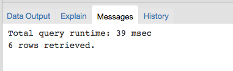

Options on the *Edit* menu offer functionality that helps with code formatting
and commenting:

* The auto-indent feature will automatically indent text to the same depth as
  the previous line when you press the Return key.
* Block indent text by selecting two or more lines and pressing the Tab key.
* Implement or remove SQL style or toggle C style comment notation within your
  code.

You can also **drag and drop** certain objects from the treeview which
can save time in typing long object names. Text containing the object name will be
fully qualified with schema. Double quotes will be added if required.
For functions and procedures, the function name along with parameter names will
be pasted in the Query Tool.

Query History Panel
*******************

Use the *Query History* tab to review activity for the current session:

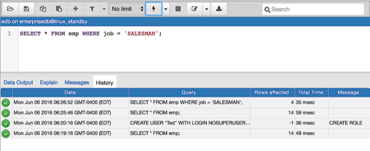

The Query History tab displays information about recent commands:

* The date and time that a query was invoked.
* The text of the query.
* The number of rows returned by the query.
* The amount of time it took the server to process the query and return a
  result set.
* Messages returned by the server (not noted on the *Messages* tab).
* The source of the query (indicated by icons corresponding to the toolbar).

You can show or hide the queries generated internally by pgAdmin (during
'View/Edit Data' or 'Save Data' operations).

You can remove a single query by selecting it and clicking on the *Remove*
button. If you would like to remove all of the histories from the
*Query History* tab, then click on the *Remove All* button.

By using the *Copy* button, you can copy a particular query to the clipboard,
and with the *Copy to Query Editor* button, you can copy a specific query to
the Query Editor tab. During this operation, all existing content in the
Query Editor is erased.

Query History is maintained across sessions for each database on a per-user
basis when running in Query Tool mode. In View/Edit Data mode, history is not
retained. By default, the last 20 queries are stored for each database. This
can be adjusted in ``config_local.py`` or ``config_system.py`` (see the
:ref:`config.py <config_py>` documentation) by overriding the
`MAX_QUERY_HIST_STORED` value. See the :ref:`Deployment <deployment>` section
for more information.

The Data Output Panel
*********************

The *Data Output* panel displays data and statistics generated by the most
recently executed query.

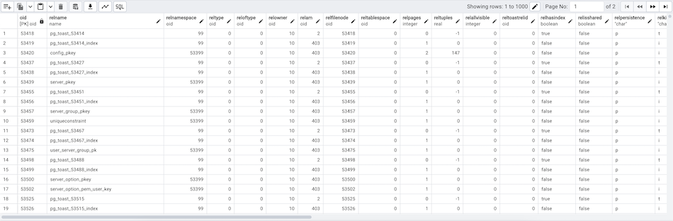

The *Data Output* tab displays the result set of the query in a table format.
You can:

* Select and copy from the displayed result set.
* Use the *Execute script* options to retrieve query execution information and
  set query execution options.
* Use the *Save results to file* icon to save the content of the *Data Output*
  tab as a comma-delimited file.
* Edit the data in the result set of a SELECT query if it is updatable.

.. _updatable-result-set:

A result set is updatable if:

* All columns are either selected directly from a single table, or
  are not table columns at all (e.g. concatenation of 2 columns).
  Only columns that are selected directly from the table are
  editable, other columns are read-only.
* All the primary key columns or OIDs of the table are selected in the
  result set.

Any columns that are renamed or selected more than once are also read-only.

Editable and read-only columns are identified using pencil and lock icons
(respectively) in the column headers.

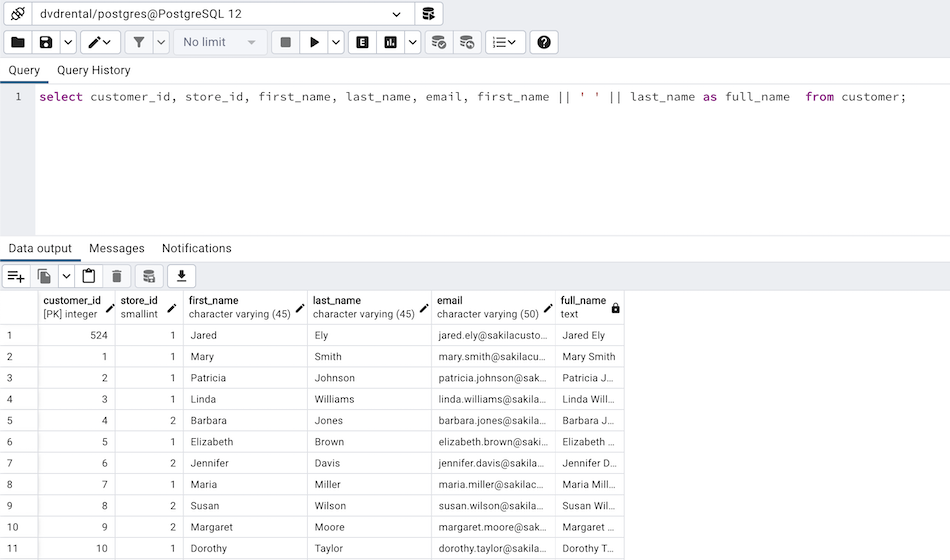

The  psycopg2 driver version should be equal to or above 2.8 for updatable
query result sets to work.

An updatable result set is identical to the :ref:`Data Grid <data-grid>` in
View/Edit Data mode, and can be modified in the same way.

If Auto-commit is off, the data changes are made as part of the ongoing
transaction, if no transaction is ongoing a new one is initiated. The data
changes are not committed to the database unless the transaction is committed.

If any errors occur during saving (for example, trying to save NULL into a
column with NOT NULL constraint) the data changes are rolled back to an
automatically created SAVEPOINT to ensure any previously executed queries in
the ongoing transaction are not rolled back.

All rowsets from previous queries or commands that are displayed in the *Data
Output* panel will be discarded when you invoke another query; open another
Query Tool tab to keep your previous results available.

Explain Panel
*************

To generate the *Explain* or *Explain Analyze* plan of a query, click on
*Explain* or *Explain Analyze* button in the toolbar.

More options related to *Explain* and *Explain Analyze* can be selected from
the drop down on the right side of *Explain Analyze* button in the toolbar.

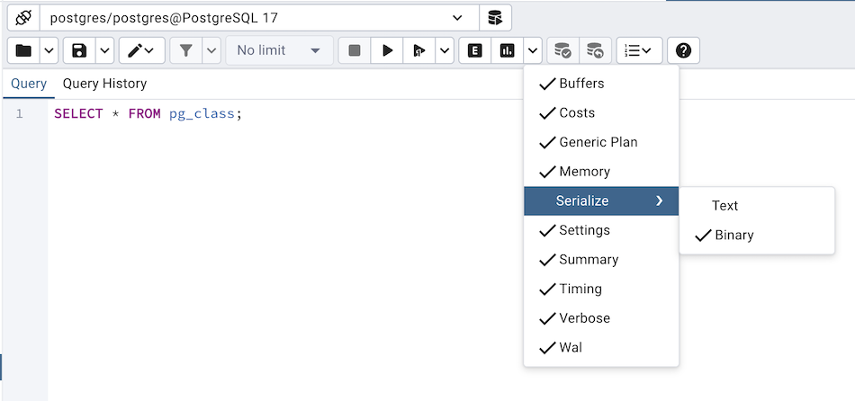

Please note that pgAdmin generates the *Explain [Analyze]* plan in JSON format.

On successful generation of *Explain* plan, it will create three tabs/panels
under the Explain panel.

* Graphical

Please note that *EXPLAIN VERBOSE* cannot be displayed graphically. Click on
a node icon on the *Graphical* tab to review information about that item; a popup
window will display on the right side with the information about the selected
object. For information on JIT statistics, triggers and a summary, click on the
button on top-right corner; a similar popup window will be displayed when appropriate.

Use the download button on top left corner of the *Explain* canvas to download
the plan as an SVG file.

**Note:** Download as SVG is not supported on Internet Explorer.

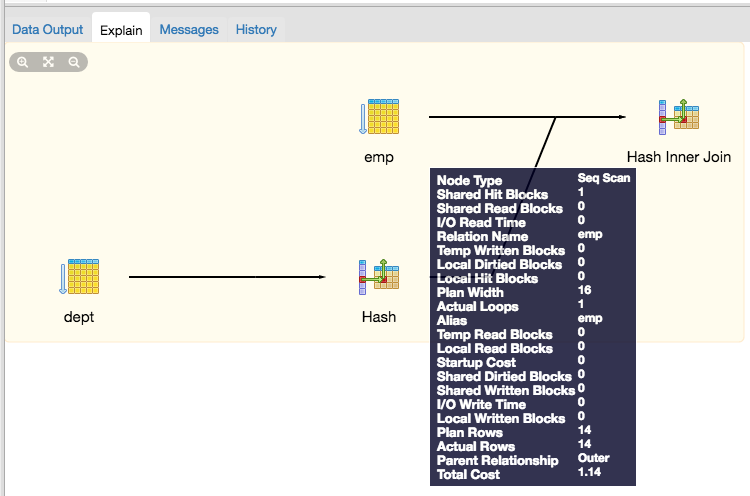

Note that the query plan that accompanies the *Explain analyze* is available on
the *Data Output* tab.

* Table

*Table* tab shows the plan details in table format, it generates table format
similar to *explain.depesz.com*. Each row of the table represent the data for a
*Explain Plan Node*. It may contain the node information, exclusive timing,
inclusive timing, actual vs planned rows differences, actual rows, planned
rows, loops.

background color of the exclusive, inclusive, and Rows X columns may vary based on the
difference between actual vs planned.

If percentage of the exclusive/inclusive timings of the total query time is:
> 90 - Red color
> 50 - Orange (between red and yellow) color
> 10 - Yellow color

If planner mis-estimated number of rows (actual vs planned) by
10 times - Yellow color
100 times - Orange (between Red and Yellow) color
1000 times - Red color

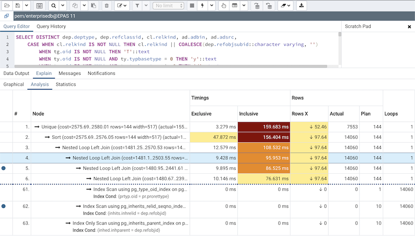

* Statistics

*Statistics* tab shows two tables:
1. Statistics per Plan Node Type
2. Statistics per Table

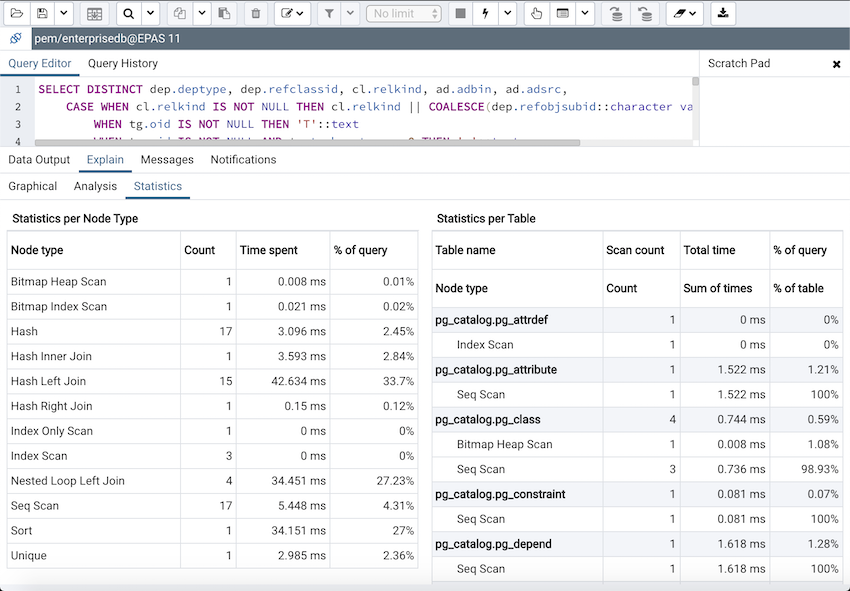

Messages Panel
**************

Use the *Messages* tab to view information about the most recently executed
query:

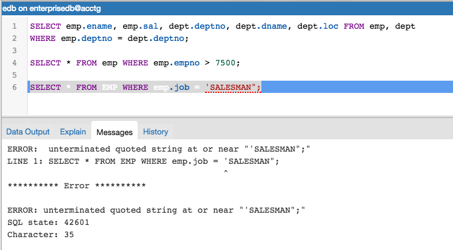

If the server returns an error, the error message will be displayed on the
*Messages* tab, and the syntax that caused the error will be underlined in the
SQL editor.  If a query succeeds, the *Messages* tab displays how long the
query took to complete and how many rows were retrieved:

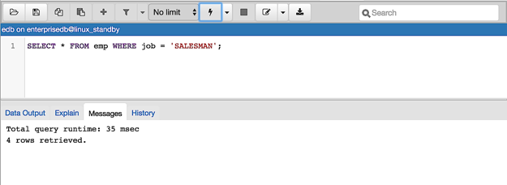

Notifications Panel
*******************

Use the *Notifications* tab to view the notifications using PostgreSQL *Listen/
Notify* feature. For more details see `PostgreSQL documentation <https://
www.postgresql.org/docs/current/sql-listen.html>`_.

Example:

1. Execute *LISTEN "foo"* in first *Query Tool* session

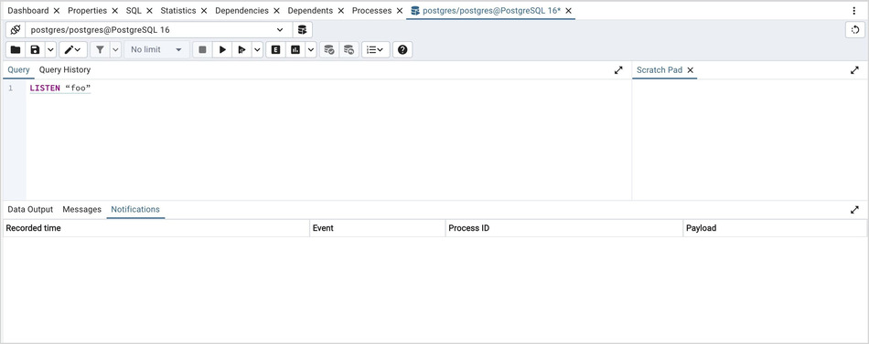

2. In the another *Query Tool* session, execute *Notify* command or *pg_notify*
function to send the notification of the event together with the payload.

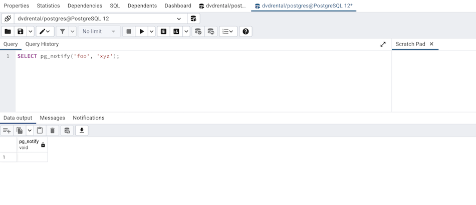

3. You can observe the *Notification* tab in the first *Query Tool* session
where it shows the Recorded time, Event, Process ID, and the Payload of the
particular channel.

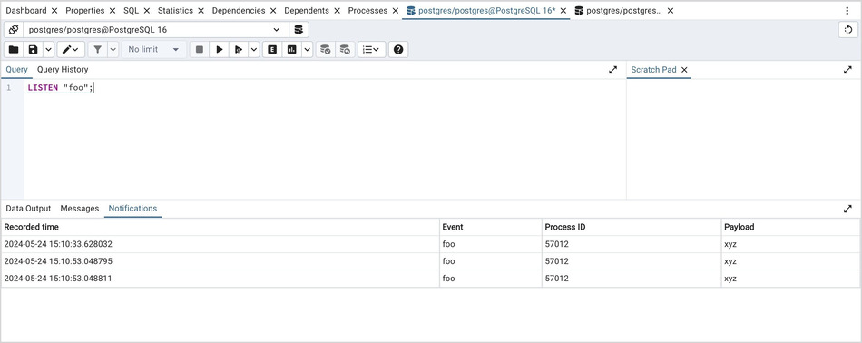

Graph Visualiser Panel
**********************

Click the Graph Visualiser button in the toolbar to generate the *Graphs* of
the query results. The graph visualiser supports Line Charts, Stacked Line Charts,
Bar Charts, Stacked Bar Charts, and Pie Charts.

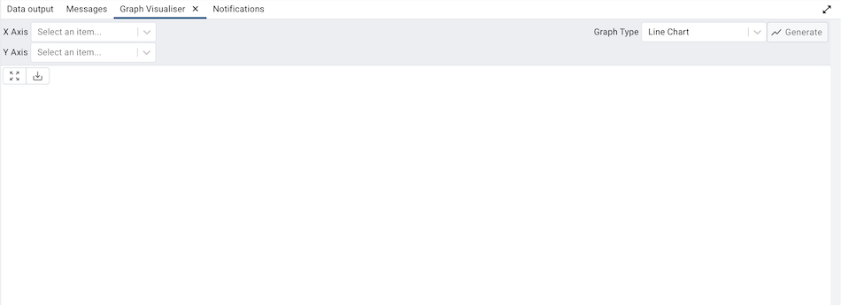

* Graph Type

Choose the type of the graph that you would like to generate.

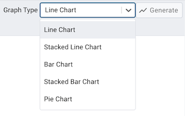

* X Axis

Choose the column whose value you wish to display on X-axis from the *X Axis*
dropdown. Select the *<Row Number>* option to use the number of rows as labels
on the X-axis.

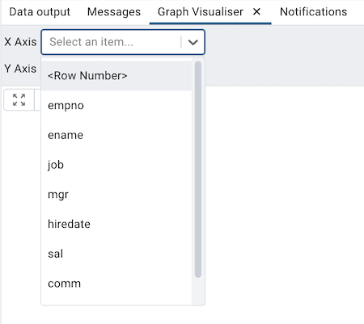

* Y Axis

Choose the columns whose value you wish to display on Y-axis from the *Y Axis*
dropdown. Users can choose multiple columns. Choose the *<Select All>* option
from the drop-down menu to select all the columns.

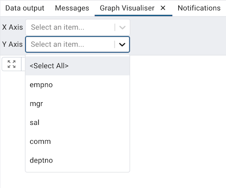

* Download and Zoom button

Zooming is performed by clicking and selecting an area over the chart with the
mouse. The *Zoom to original* button will bring you back to the original zoom
level.

Click the *Download* button on the button bar to download the chart.

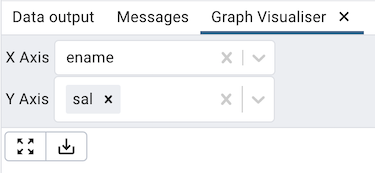

Line Chart
==========

The *Line Chart* can be generated by selecting the 'Line Chart'
from the Graph Type drop-down, selecting the X-axis and the Y-axis, and
clicking on the 'Generate' button. Below is an example of a chart of employee
names and their salaries.

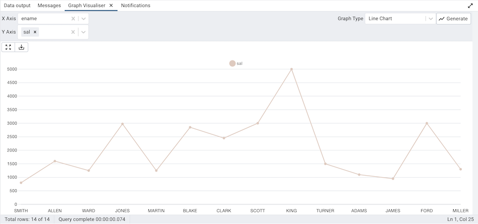

Set *Use different data point styles?* option to true in the :ref:`preferences`,
to show data points in a different style on each graph lines.

Stacked Line Chart
==================

The *Stacked Line Chart* can be generated by selecting the 'Stacked Line Chart'
from the Graph Type drop-down, selecting the X-axis and the Y-axis, and
clicking on the 'Generate' button.

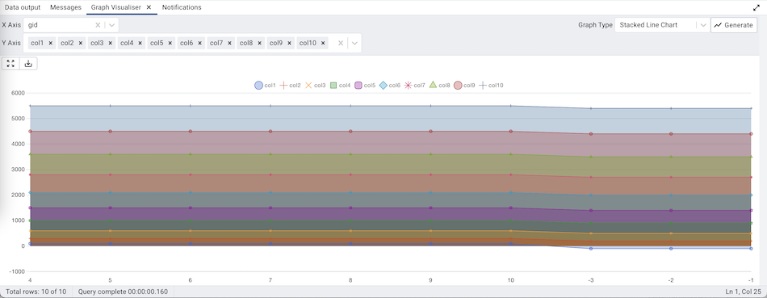

Bar Chart
==========

The *Bar Chart* can be generated by selecting the 'Bar Chart'
from the Graph Type drop-down, selecting the X-axis and the Y-axis, and
clicking on the 'Generate' button.

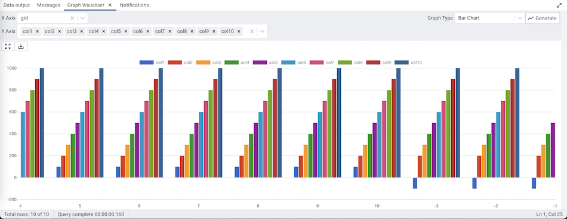

Stacked Bar Chart
=================

The *Stacked Bar Chart* can be generated by selecting the 'Stacked Bar Chart'
from the Graph Type drop-down, selecting the X-axis and the Y-axis, and
clicking on the 'Generate' button.

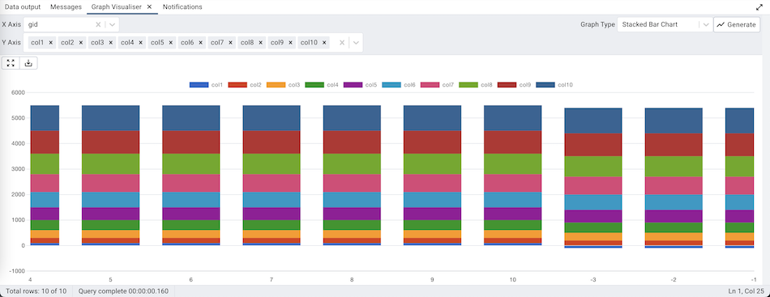

Pie Chart
=========

The *Pie Chart* can be generated by selecting the 'Pie Chart'
from the Graph Type drop-down, selecting the Label and Value, and
clicking on the 'Generate' button.

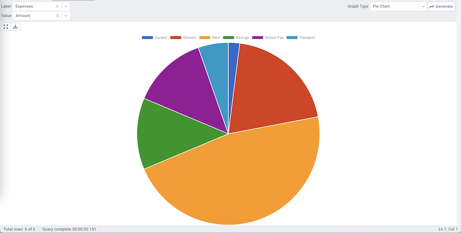

Connection Status
*****************

Use the *Connection status* feature to view the current connection and
transaction status by clicking on the status icon in the Query Tool:

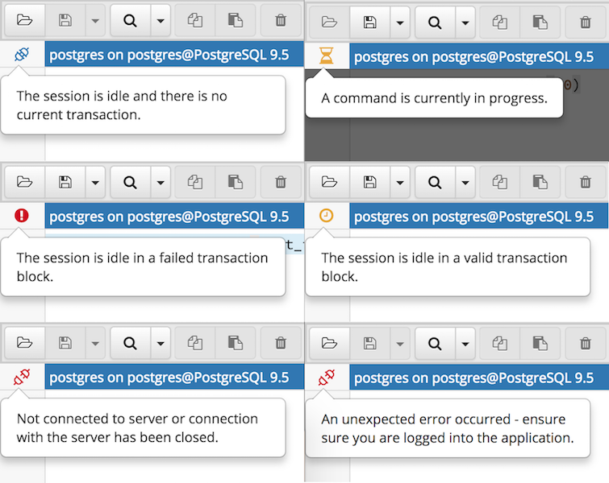

Change connection
*****************

User can connect to another server or database from existing open session of query tool.

* Click on the connection link next to connection status.
* Now click on the *<New Connection>* option from the dropdown.

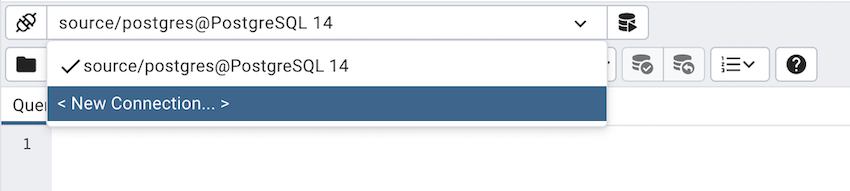

* Now select server, database, user, and role to connect and click on the 'Save' button.

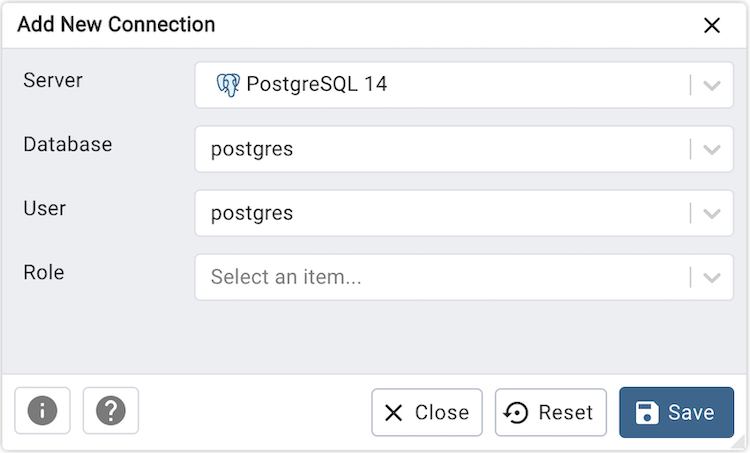

* A newly created connection will now get listed in the options.
* To connect, select the newly created connection from the dropdown list.

Macros
******

Query Tool Macros enable you to execute pre-defined SQL queries with a single key press. Pre-defined queries can contain the placeholder $SELECTION$. Upon macro execution, the placeholder will be replaced with the currently selected text in the Query Editor pane of the Query Tool.

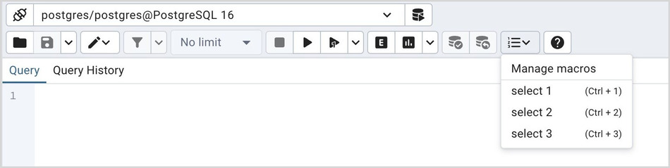

To create a macro, select the *Manage Macros* option from the *Macros* menu on the *Query Tool*. Select the key you wish to use, enter the name of the macro, and the query, optionally including the selection placeholder, and then click the *Save* button to store the macro.

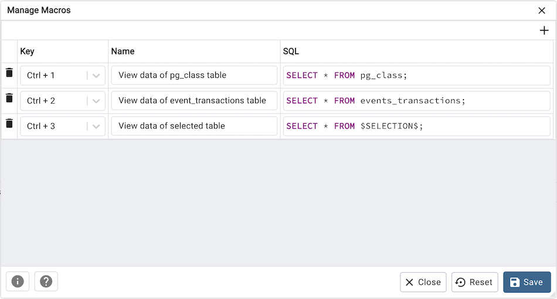

To delete a macro, select the macro on the *Manage Macros* dialogue, and then click the *Delete* button.
The server will prompt you for confirmation to delete the macro.

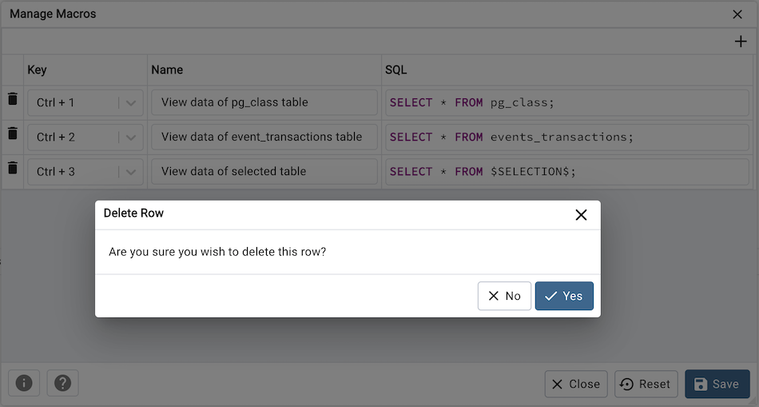

To execute a macro, simply select the appropriate shortcut keys, or select it from the *Macros* menu.

