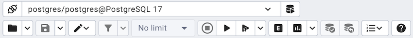

.. _query_tool_toolbar:

***************************
`Query Tool Toolbar`:index:
***************************

The *Query Tool* toolbar uses context-sensitive icons that provide shortcuts to
frequently performed tasks. If an icon is highlighted, the option is enabled;
if the icon is grayed-out, the task is disabled.

.. note:: The :ref:`Query Tool <query_tool>` and
    :ref:`View/Edit Data <editgrid>` tools are actually different operating
    modes of the same tool. Some controls will be disabled in either mode.

Hover over an icon in pgAdmin to display a tooltip that describes the icon's
functionality.

File Options
************

.. table::
   :class: longtable
   :widths: 1 4 1

   +----------------------+---------------------------------------------------------------------------------------------------+----------------+
   | Icon                 | Behavior                                                                                          | Shortcut       |
   +======================+===================================================================================================+================+
   | *Open File*          | Click the *Open File* icon to display a previously saved query in the SQL Editor.                 | Accesskey + O  |
   +----------------------+---------------------------------------------------------------------------------------------------+----------------+
   | *Save File*          | Click the *Save* icon to perform a quick-save of a previously saved query, or to access the       | Accesskey + S  |
   |                      | *Save* menu:                                                                                      |                |
   |                      |                                                                                                   |                |
   |                      |  * Select *Save* to save the selected content of the SQL Editor panel in a  file.                 |                |
   |                      |                                                                                                   |                |
   |                      |  * Select *Save As* to open a new browser dialog and specify a new location to which to save the  |                |
   |                      |    selected content of the SQL Editor panel.                                                      |                |
   +----------------------+---------------------------------------------------------------------------------------------------+----------------+

Editing Options
***************

.. table::
   :class: longtable
   :widths: 1 4 1

   +----------------------+---------------------------------------------------------------------------------------------------+----------------+
   | Icon                 | Behavior                                                                                          | Shortcut       |
   +======================+===================================================================================================+================+
   | *Save Data Changes*  | Click the *Save Data Changes* icon to save data changes (insert, update, or delete) in the Data   | F6             |
   |                      | Output Panel to the server.                                                                       |                |
   +----------------------+---------------------------------------------------------------------------------------------------+----------------+
   | *Find*               | Use the *Find* menu to search, replace, or navigate the code displayed in the SQL Editor:         |                |
   |                      +---------------------------------------------------------------------------------------------------+----------------+
   |                      | Select *Find* to provide a search target, and search the SQL Editor contents.                     | Cmd+F          |
   |                      +---------------------------------------------------------------------------------------------------+----------------+
   |                      | Select *Find next* to locate the next occurrence of the search target.                            | Cmd+G          |
   |                      +---------------------------------------------------------------------------------------------------+----------------+
   |                      | Select *Find previous* to move to the last occurrence of the search target.                       | Cmd+Shift+G    |
   |                      +---------------------------------------------------------------------------------------------------+----------------+
   |                      | Select *Persistent find* to identify all occurrences of the search target within the editor.      |                |
   |                      +---------------------------------------------------------------------------------------------------+----------------+
   |                      | Select *Replace* to locate and replace (with prompting) individual occurrences of the target.     | Cmd+Shift+F    |
   |                      +---------------------------------------------------------------------------------------------------+----------------+
   |                      | Select *Replace all* to locate and replace all occurrences of the target within the editor.       |                |
   |                      +---------------------------------------------------------------------------------------------------+----------------+
   |                      | Select *Jump* to navigate to the next occurrence of the search target.                            | Alt+G          |
   +----------------------+---------------------------------------------------------------------------------------------------+----------------+
   | *Copy*               | Click the *Copy* icon to copy the content with or without header:                                 |  Accesskey + C |
   |                      |                                                                                                   |                |
   |                      |  * Click the *Copy* icon to copy the content that is currently highlighted in the Data Output     |                |
   |                      |     panel.                                                                                        |                |
   |                      |                                                                                                   |                |
   |                      |  *  Click *Copy with headers* to copy the highlighted content along with the header.              |                |
   +----------------------+---------------------------------------------------------------------------------------------------+----------------+
   | *Paste*              | Click the *Paste* icon to paste a previously copied row into a new row.                           | Accesskey + P  |
   +----------------------+---------------------------------------------------------------------------------------------------+----------------+
   | *Delete*             | Click the *Delete* icon to mark the selected rows for deletion. These marked rows get deleted     |Accesskey + D   |
   |                      | when you click the *Save Data Changes* icon.                                                      |                |
   +----------------------+---------------------------------------------------------------------------------------------------+----------------+
   | *Edit*               | Use options on the *Edit* menu to access text editing tools; the options operate on the text      |                |
   |                      | displayed in the SQL Editor panel when in Query Tool mode:                                        |                |
   |                      +---------------------------------------------------------------------------------------------------+----------------+
   |                      | Select *Indent Selection* to indent the currently selected text.                                  | Tab            |
   |                      +---------------------------------------------------------------------------------------------------+----------------+
   |                      | Select *Unindent Selection* to remove indentation from the currently selected text.               | Shift+Tab      |
   |                      +---------------------------------------------------------------------------------------------------+----------------+
   |                      | Select *Inline Comment Selection* to enclose any lines that contain the selection in SQL style    | Cmd+/          |
   |                      | comment notation.                                                                                 |                |
   |                      +---------------------------------------------------------------------------------------------------+----------------+
   |                      | Select *Inline Uncomment Selection* to remove SQL style comment notation from the selected line.  | Cmd+.          |
   |                      +---------------------------------------------------------------------------------------------------+----------------+
   |                      | Select *Block Comment* to enclose all lines that contain the selection in C style comment         | Shift+Cmd+/    |
   |                      | notation.  This option acts as a toggle.                                                          |                |
   |                      +---------------------------------------------------------------------------------------------------+----------------+
   |                      | Select *Format SQL* to format the selected SQL or all the SQL if none is selected                 | Shift+Cmd+K    |
   +----------------------+---------------------------------------------------------------------------------------------------+----------------+

View/Edit Data Resultset Control
********************************

.. table::
   :class: longtable
   :widths: 1 4 1

   +----------------------+---------------------------------------------------------------------------------------------------+----------------+
   | Icon                 | Behavior                                                                                          | Shortcut       |
   +======================+===================================================================================================+================+
   | *Filter*             | Click the *Filter* icon to set filtering and sorting criteria for the data when in View/Edit data | Accesskey + F  |
   |                      | mode. Click the down arrow to access other filtering and sorting options:                         |                |
   |                      |                                                                                                   |                |
   |                      |  * Click *Sort/Filter* to open the sorting and filtering dialogue. In the *SQL Filter*, you can   |                |
   |                      |    enter a SQL query as filtering criteria. In *Data Sorting*, you can select the column and      |                |
   |                      |    specify the order for sorting.                                                                 |                |
   |                      |                                                                                                   |                |
   |                      |  * Click *Filter by Selection* to show only the rows containing the values in the selected cells. |                |
   |                      |                                                                                                   |                |
   |                      |  * Click *Exclude by Selection* to show only the rows that do not contain the values in the       |                |
   |                      |    selected cells.                                                                                |                |
   |                      |                                                                                                   |                |
   |                      |  * Click *Remove Sort/Filter* to remove any previously selected sort or filtering options.        |                |
   +----------------------+---------------------------------------------------------------------------------------------------+----------------+
   | Limit Selector       | Select a value in the *Limit Selector* to limit the size of the dataset to a number of rows.      | Accesskey + R  |
   +----------------------+---------------------------------------------------------------------------------------------------+----------------+
   | *Stop*               | Click the *Stop* icon to cancel the execution of the currently running query.                     | Accesskey + Q  |
   +----------------------+---------------------------------------------------------------------------------------------------+----------------+

Query Execution
***************

.. table::
   :class: longtable
   :widths: 1 4 1

   +----------------------+---------------------------------------------------------------------------------------------------+----------------+
   | Icon                 | Behavior                                                                                          | Shortcut       |
   +======================+===================================================================================================+================+
   | *Execute/Refresh*    | Click the *Execute/Refresh* icon to either execute or refresh the query highlighted in the SQL    | F5             |
   |                      | editor panel. Click the down arrow to access other execution options:                             |                |
   |                      |                                                                                                   |                |
   |                      |  * Add a check next to *Auto-Rollback* to instruct the server to automatically roll back a        |                |
   |                      |    transaction if an error occurs during the transaction.                                         |                |
   |                      |                                                                                                   |                |
   |                      |  * Add a check next to *Auto-Commit* to instruct the server to automatically commit each          |                |
   |                      |    transaction.  Any changes made by the transaction will be visible to others, and               |                |
   |                      |    durable in the event of a crash.                                                               |                |
   +----------------------+---------------------------------------------------------------------------------------------------+----------------+
   | *Explain*            | Click the *Explain* icon to view an explanation plan for the current query. The result of the     | F7             |
   |                      | EXPLAIN is displayed graphically on the *Explain* tab of the output panel, and in text            |                |
   |                      | form on the *Data Output* tab.                                                                    |                |
   +----------------------+---------------------------------------------------------------------------------------------------+----------------+
   | *Explain analyze*    | Click the *Explain analyze* icon to invoke an EXPLAIN ANALYZE command on the current query.       | Shift+F7       |
   |                      |                                                                                                   |                |
   |                      | Navigate through the *Explain Options* menu to select options for the EXPLAIN command:            |                |
   |                      |                                                                                                   |                |
   |                      |  * Select *Verbose* to display additional information regarding the query plan.                   |                |
   |                      |                                                                                                   |                |
   |                      |  * Select *Costs* to include information on the estimated startup and total cost of each          |                |
   |                      |    plan node, as well as the estimated number of rows and the estimated width of each             |                |
   |                      |    row.                                                                                           |                |
   |                      |                                                                                                   |                |
   |                      |  * Select *Buffers* to include information on buffer usage.                                       |                |
   |                      |                                                                                                   |                |
   |                      |  * Select *Timing* to include information about the startup time and the amount of time           |                |
   |                      |    spent in each node of the query.                                                               |                |
   |                      |                                                                                                   |                |
   |                      |  * Select *Summary* to include the summary information about the query plan.                      |                |
   +----------------------+---------------------------------------------------------------------------------------------------+----------------+
   | *Commit*             | Click the *Commit* icon to commit the transaction.                                                | Shift+CTRL+M   |
   +----------------------+---------------------------------------------------------------------------------------------------+----------------+
   | *Rollback*           | Click the *Rollback* icon to rollback the transaction.                                            | Shift+CTRL+R   |
   +----------------------+---------------------------------------------------------------------------------------------------+----------------+
   | *Clear*              | Use options on the *Clear* drop-down menu to erase display contents:                              | Accesskey + L  |
   |                      |                                                                                                   |                |
   |                      |  * Select *Clear Query Window* to erase the content of the SQL Editor panel.                      |                |
   |                      |                                                                                                   |                |
   |                      |  * Select *Clear History* to erase the content of the *History* tab.                              |                |
   +----------------------+---------------------------------------------------------------------------------------------------+----------------+
   | *Save results to*    | Click the Save results to file icon to save the result set of the current query as a delimited    | F8             |
   |  *file*              | text file (CSV, if the field separator is set to a comma). This button will only be enabled when  |                |
   |                      | a query has been executed and there are results in the data grid. You can specify the CSV/TXT     |                |
   |                      | settings in the Preference Dialogue under SQL Editor -> CSV/TXT output.                           |                |
   +----------------------+---------------------------------------------------------------------------------------------------+----------------+
   | *Macros*             | Click the *Macros* icon to manage the macros. You can create, edit or clear the macros through    |                |
   |                      | the *Manage Macros* option.                                                                       |                |
   +----------------------+---------------------------------------------------------------------------------------------------+----------------+
