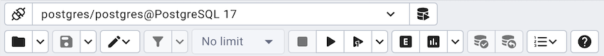
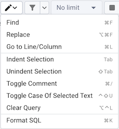

.. _query_tool_toolbar:

***************************
`Query Tool Toolbar`:index:
***************************

The *Query Tool* toolbar uses context-sensitive icons that provide shortcuts to
frequently performed tasks. If an icon is highlighted, the option is enabled;
if the icon is grayed-out, the task is disabled.

.. note:: The :ref:`Query Tool <query_tool>` and
    :ref:`View/Edit Data <editgrid>` tools are actually different operating
    modes of the same tool. Some controls will be disabled in either mode.

Hover over an icon in pgAdmin to display a tooltip that describes the icon's
functionality.

File Options
************

.. table::
   :class: longtable
   :widths: 1 4 1

   +----------------------+---------------------------------------------------------------------------------------------------+----------------+
   | Icon                 | Behavior                                                                                          | Shortcut       |
   +======================+===================================================================================================+================+
   | *Open File*          | Click the *Open File* icon to display a previously saved query in the same tab of the SQL Editor. |                |
   |                      | To open the file in a new tab, select *Open in a new tab?* option from the dropdown.              | Cmd/Ctrl + O   |
   +----------------------+---------------------------------------------------------------------------------------------------+----------------+
   | *Save File*          | Click the *Save* icon to perform a quick-save of a previously saved query, or to access the       | Cmd/Ctrl + S   |
   |                      | *Save* menu:                                                                                      |                |
   |                      |                                                                                                   |                |
   |                      |  * Select *Save* to save the selected content of the SQL Editor panel in a  file.                 |                |
   |                      |                                                                                                   |                |
   |                      |  * Select *Save As* to open a new browser dialog and specify a new location to which to save the  |                |
   |                      |    selected content of the SQL Editor panel.                                                      |                |
   +----------------------+---------------------------------------------------------------------------------------------------+----------------+

Filter/Limit Options
********************

.. table::
   :class: longtable
   :widths: 1 4 1

   +----------------------+---------------------------------------------------------------------------------------------------+----------------+
   | Icon                 | Behavior                                                                                          | Shortcut       |
   +======================+===================================================================================================+================+
   | *Filter*             | Click the *Filter* icon to set filtering and sorting criteria for the data when in *View/Edit data| Option/Alt + F |
   |                      | mode*. Click the down arrow to access other filtering and sorting options:                        |                |
   |                      |                                                                                                   |                |
   |                      |  * In the *SQL Filter*, you can enter a SQL query as filtering criteria.                          |                |
   |                      |    In *Data Sorting*, you can select the column and specify the order for sorting.                |                |
   |                      |                                                                                                   |                |
   |                      |  * Click *Filter by Selection* to show only the rows containing the values in the selected cells. |                |
   |                      |                                                                                                   |                |
   |                      |  * Click *Exclude by Selection* to show only the rows that do not contain the values in the       |                |
   |                      |    selected cells.                                                                                |                |
   |                      |                                                                                                   |                |
   |                      |  * Click *Remove Sort/Filter* to remove any previously selected sort or filtering options.        |                |
   +----------------------+---------------------------------------------------------------------------------------------------+----------------+
   | Limit Selector       | Select a value in the *Limit Selector* to limit the size of the dataset to a number of rows.      | Option/Alt + R |
   +----------------------+---------------------------------------------------------------------------------------------------+----------------+

Query Editing Options
*********************

.. table::
   :class: longtable
   :widths: 1 4 1

   +----------------------+---------------------------------------------------------------------------------------------------+-----------------------+
   | Icon                 | Behavior                                                                                          | Shortcut              |
   +======================+===================================================================================================+=======================+
   | *Edit*               | Use the *Edit* menu to search, replace, or navigate the code displayed in the SQL Editor:         | Option/Alt + Shift + N|
   |                      +---------------------------------------------------------------------------------------------------+-----------------------+
   |                      | Select *Find* to provide a search target, and search the SQL Editor contents.                     | Cmd/Ctrl + F          |
   |                      +---------------------------------------------------------------------------------------------------+-----------------------+
   |                      | Select *Replace* to locate and replace (with prompting) individual occurrences of the target.     | Option + Cmd + F (MAC)|
   |                      |                                                                                                   | Ctrl + Shift + F      |
   |                      |                                                                                                   | (Others)              |
   |                      +---------------------------------------------------------------------------------------------------+-----------------------+
   |                      | Select *Go to Line/Column* to go to specified line number and column position                     | Cmd/Ctrl + L          |
   |                      +---------------------------------------------------------------------------------------------------+-----------------------+
   |                      | Select *Indent Selection* to indent the currently selected text.                                  | Tab                   |
   |                      +---------------------------------------------------------------------------------------------------+-----------------------+
   |                      | Select *Unindent Selection* to remove indentation from the currently selected text.               | Shift + Tab           |
   |                      +---------------------------------------------------------------------------------------------------+-----------------------+
   |                      | Select *Toggle Comment* to comment/uncomment any lines that contain the selection in SQL style.   | Cmd/Ctrl + /          |
   |                      +---------------------------------------------------------------------------------------------------+-----------------------+
   |                      | Select *Clear Query* to clear the query editor window.                                            | Option/Alt + Ctrl + L |
   |                      +---------------------------------------------------------------------------------------------------+-----------------------+
   |                      | Select *Format SQL* to format the selected SQL or all the SQL if none is selected                 | Cmd/Ctrl + K          |
   +----------------------+---------------------------------------------------------------------------------------------------+-----------------------+

Query Execution
***************

.. table::
   :class: longtable
   :widths: 1 4 1

   +----------------------+---------------------------------------------------------------------------------------------------+----------------+
   | Icon                 | Behavior                                                                                          | Shortcut       |
   +======================+===================================================================================================+================+
   | *Stop*               | Click the *Stop* icon to cancel the execution of the currently running query.                     |Option + Shift +|
   |                      |                                                                                                   |Q               |
   +----------------------+---------------------------------------------------------------------------------------------------+----------------+
   | *Execute script*     | Click the *Execute script* icon to either execute or refresh the query highlighted in the SQL     | F5             |
   |                      | editor panel. Click the down arrow to access other execution options:                             |                |
   |                      |                                                                                                   |                |
   |                      |  * Add a check next to *Auto rollback on error?* to instruct the server to automatically roll back|                |
   |                      |    a transaction if an error occurs during the transaction.                                       |                |
   |                      |                                                                                                   |                |
   |                      |  * Add a check next to *Auto commit?* to instruct the server to automatically commit each         |                |
   |                      |    transaction.  Any changes made by the transaction will be visible to others, and               |                |
   |                      |    durable in the event of a crash.                                                               |                |
   +----------------------+---------------------------------------------------------------------------------------------------+----------------+
   | *Execute query*      | Click the *Execute query* icon to either execute the query where the cursor is present or         | Option+F5 (MAC)|
   |                      | refresh the query highlighted in the SQL editor panel.                                            | Alt+F5 (Others)|
   +----------------------+---------------------------------------------------------------------------------------------------+----------------+
   | *Explain*            | Click the *Explain* icon to view an explanation plan for the current query. The result of the     | F7             |
   |                      | EXPLAIN is displayed graphically on the *Explain* tab of the output panel, and in text            |                |
   |                      | form on the *Data Output* tab.                                                                    |                |
   +----------------------+---------------------------------------------------------------------------------------------------+----------------+
   | *Explain analyze*    | Click the *Explain analyze* icon to invoke an EXPLAIN ANALYZE command on the current query.       | Shift + F7     |
   |                      |                                                                                                   |                |
   |                      | Navigate through the *Explain Options* menu to select options for the EXPLAIN command:            |                |
   |                      |                                                                                                   |                |
   |                      |  * Select *Verbose* to display additional information regarding the query plan.                   |                |
   |                      |                                                                                                   |                |
   |                      |  * Select *Costs* to include information on the estimated startup and total cost of each          |                |
   |                      |    plan node, as well as the estimated number of rows and the estimated width of each             |                |
   |                      |    row.                                                                                           |                |
   |                      |                                                                                                   |                |
   |                      |  * Select *Buffers* to include information on buffer usage.                                       |                |
   |                      |                                                                                                   |                |
   |                      |  * Select *Timing* to include information about the startup time and the amount of time           |                |
   |                      |    spent in each node of the query.                                                               |                |
   |                      |                                                                                                   |                |
   |                      |  * Select *Summary* to include the summary information about the query plan.                      |                |
   |                      |                                                                                                   |                |
   |                      |  * Select *Settings* to include the information on the configuration parameters.                  |                |
   |                      |                                                                                                   |                |
   |                      |  * Select *Wal* to include the information on WAL record generation.                              |                |
   +----------------------+---------------------------------------------------------------------------------------------------+----------------+
   | *Commit*             | Click the *Commit* icon to commit the transaction.                                                |Shift + Ctrl + M|
   +----------------------+---------------------------------------------------------------------------------------------------+----------------+
   | *Rollback*           | Click the *Rollback* icon to rollback the transaction.                                            |Shift + Ctrl + R|
   +----------------------+---------------------------------------------------------------------------------------------------+----------------+
   | *Macros*             | Click the *Macros* icon to manage the macros. You can create, edit or clear the macros through    |                |
   |                      | the *Manage Macros* option.                                                                       |                |
   +----------------------+---------------------------------------------------------------------------------------------------+----------------+

Data Editing Options
********************

.. image:: images/query_data_editing.png
    :alt: Query tool data editing options
    :align: center

.. table::
   :class: longtable
   :widths: 1 4 1

   +----------------------+---------------------------------------------------------------------------------------------------+----------------+
   | Icon                 | Behavior                                                                                          | Shortcut       |
   +======================+===================================================================================================+================+
   | *Add row*            | Click the *Add row* icon to add a new row                                                         |                |
   +----------------------+---------------------------------------------------------------------------------------------------+----------------+
   | *Copy*               | Click the *Copy* icon to copy the content with or without header:                                 | Cmd/Ctrl + C   |
   |                      |                                                                                                   |                |
   |                      |  * Click the *Copy* icon to copy the content that is currently highlighted in the Data Output     |                |
   |                      |     panel.                                                                                        |                |
   |                      |                                                                                                   |                |
   |                      |  *  Click *Copy with headers* to copy the highlighted content along with the header.              |                |
   +----------------------+---------------------------------------------------------------------------------------------------+----------------+
   | *Paste*              | Click the *Paste* icon to paste a previously copied row with or without serial/identity values:   | Option/Alt +   |
   |                      |                                                                                                   | Shift + P      |
   |                      |                                                                                                   |                |
   |                      |  * Click the *Paste* icon to paste a previously copied row into a new row.                        |                |
   |                      |                                                                                                   |                |
   |                      |  * Click the *Paste with SERIAL/IDENTITY values?* if you want to paste the copied column values   |                |
   |                      |    in the serial/identity columns.                                                                |                |
   |                      |                                                                                                   |                |
   |                      | Note that copied row having *Bytea* datatype cell will be pasted as *Null*.                       |                |
   +----------------------+---------------------------------------------------------------------------------------------------+----------------+
   | *Delete*             | Click the *Delete* icon to mark the selected rows for deletion. These marked rows get deleted     | Option/Alt +   |
   |                      |                                                                                                   | Shift + D      |
   |                      | when you click the *Save Data Changes* icon.                                                      |                |
   +----------------------+---------------------------------------------------------------------------------------------------+----------------+
   | *Save Data Changes*  | Click the *Save Data Changes* icon to save data changes (insert, update, or delete) in the Data   | F6             |
   |                      | Output Panel to the server.                                                                       |                |
   +----------------------+---------------------------------------------------------------------------------------------------+----------------+
   | *Save results to*    | Click the Save results to file icon to save the result set of the current query as a delimited    | F8             |
   | *file*               | text file (CSV, if the field separator is set to a comma). This button will only be enabled when  |                |
   |                      | a query has been executed and there are results in the data grid. You can specify the CSV/TXT     |                |
   |                      | settings in the Preference Dialogue under SQL Editor -> CSV/TXT output.                           |                |
   +----------------------+---------------------------------------------------------------------------------------------------+----------------+
   | Graph Visualiser     | Use the Graph Visualiser button to generate graphs of the query results.                          |                |
   +----------------------+---------------------------------------------------------------------------------------------------+----------------+
   | SQL                  | Use the SQL button to check the current query that gave the data.                                 |                |
   +----------------------+---------------------------------------------------------------------------------------------------+----------------+

Pagination Options
********************

.. image:: images/query_data_pagination.png
    :alt: Query tool data pagination options
    :align: center

.. table::
   :class: longtable
   :widths: 1 4 1

   +----------------------+---------------------------------------------------------------------------------------------------+----------------+
   | Icon                 | Behavior                                                                                          | Shortcut       |
   +======================+===================================================================================================+================+
   | *Rows Range*         | Show the current row numbers visible in the data grid.                                            |                |
   +----------------------+---------------------------------------------------------------------------------------------------+----------------+
   | *Edit Range*         | Click to open the from and to rows range inputs to allow setting them.                            |                |
   +----------------------+---------------------------------------------------------------------------------------------------+----------------+
   | *Page No*            | Enter the page no you want to jump to out of total shown next to this input                       |                |
   +----------------------+---------------------------------------------------------------------------------------------------+----------------+
   | *First Page*         | Click to go to the first page.                                                                    |                |
   +----------------------+---------------------------------------------------------------------------------------------------+----------------+
   | *Previous Page*      | Click to go to the previous page.                                                                 |                |
   +----------------------+---------------------------------------------------------------------------------------------------+----------------+
   | *Next Page*          | Click to go to the next page.                                                                     |                |
   +----------------------+---------------------------------------------------------------------------------------------------+----------------+
   | *Last Page*          | Click to go to the last page.                                                                     |                |
   +----------------------+---------------------------------------------------------------------------------------------------+----------------+

.. image:: images/query_data_pagination_edit.png
    :alt: Query tool data pagination options
    :align: center

One can click the edit range button to open rows range editor:

* From and to range should be between 1 and total rows.
* The range can be applied by clicking the *Apply* button or by pressing enter in the range inputs.
* Once the range is applied, pgAdmin will recalculate the rows per page. The pagination will then behave based on the new rows per page.
* It may be possible that on pressing next page button, the new rows range is not next to manually enterred range.

Status Bar
**********

.. image:: images/query_status_bar.png
    :alt: Query tool status bar
    :align: center

The status bar shows the following information:

* **Total rows**: The total number of rows returned by the query.
* **Query complete**: The time is taken by the query to complete.
* **Rows selected**: The number of rows selected in the data output panel.
* **Changes staged**: This information shows the number of rows added, deleted, and updated.
* **LF/CRLF**: It shows the end of line sequence to be used for the editor. When opening an empty editor, it will be decided based on OS.
  And when opening an existing file, it will be based on file end of lines. One can change the EOL by clicking on any of the options.
* **Ln**: In the Query tab, it is the line number at which the cursor is positioned.
* **Col**: In the Query tab, it is the column number at which the cursor is positioned
