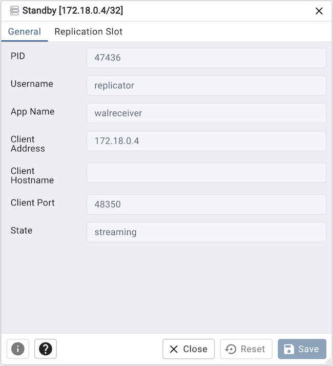
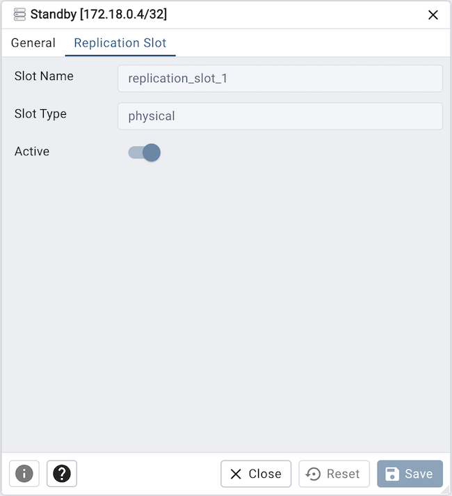

.. _replica_nodes_dialog:

****************************
`Replica Node Dialog`:index:
****************************

Use The *Replica Node* dialog to view a standby instance being replicated
using log based streaming replication. Streaming replication allows a standby
server to stay more up-to-date than is possible with file-based log shipping.
The standby connects to the primary, which streams WAL records to the standby as
they're generated, without waiting for the WAL file to be filled.

The *Replica Node* dialog organizes the information through the following tabs:
*General*, *Replication Slot*

* The *PID* field is the process ID of a WAL sender process.
* The *Username* field is the name of the user logged into this WAL sender process.
* The *App Name* field is the name of the application that is connected to this WAL sender.
* The *Client Address* field is the IP address of the client connected to this WAL sender.
  If this field is null, it indicates that the client is connected via a Unix socket on the server machine.
* The *Client Hostname* field is the host name of the connected client, as reported by a reverse DNS lookup
  of client_addr.This field will only be non-null for IP connections, and only when log_hostname is enabled.
* The *Client Port* field is the TCP port number that the client is using for communication with
  this WAL sender, or -1 if a Unix socket is used.
* The *State* field is the current WAL sender state.

Click the *Replication Slot* tab to continue.

* The *Slot Name* field is a unique, cluster-wide identifier for the replication slot.
* The *Slot Type* field is the slot type - physical or logical
* The *Active* field is True if this slot is currently actively being used.

Other buttons:

* Click the *Info* button (i) to access online help.
* Click the *Save* button to save work.
* Click the *Close* button to exit without saving work.
* Click the *Reset* button to restore configuration parameters.
