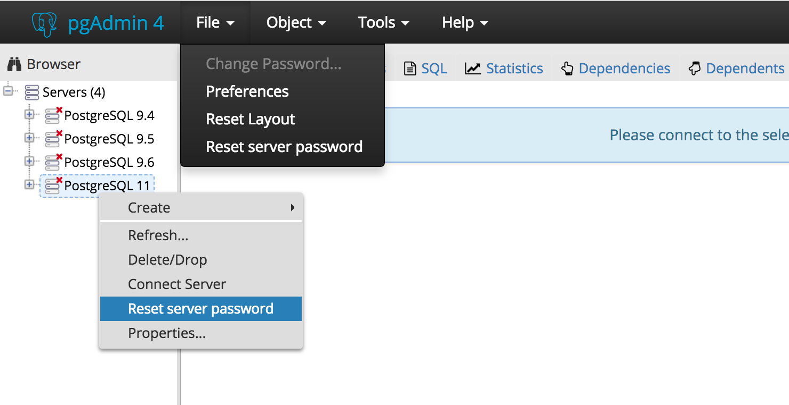

.. _reset_passwords:

************************
`Reset Passwords`:index:
************************

Use *Reset server password* functionality to reset the saved password for the database server.

*Reset server password* shows in the context menu for the selected server as well as under the *File* menu on the top menu bar.

**Note:** It will be enabled/visible when the password for the selected database server is already saved.