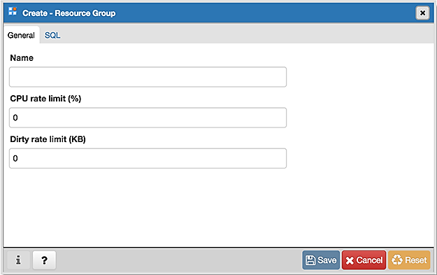
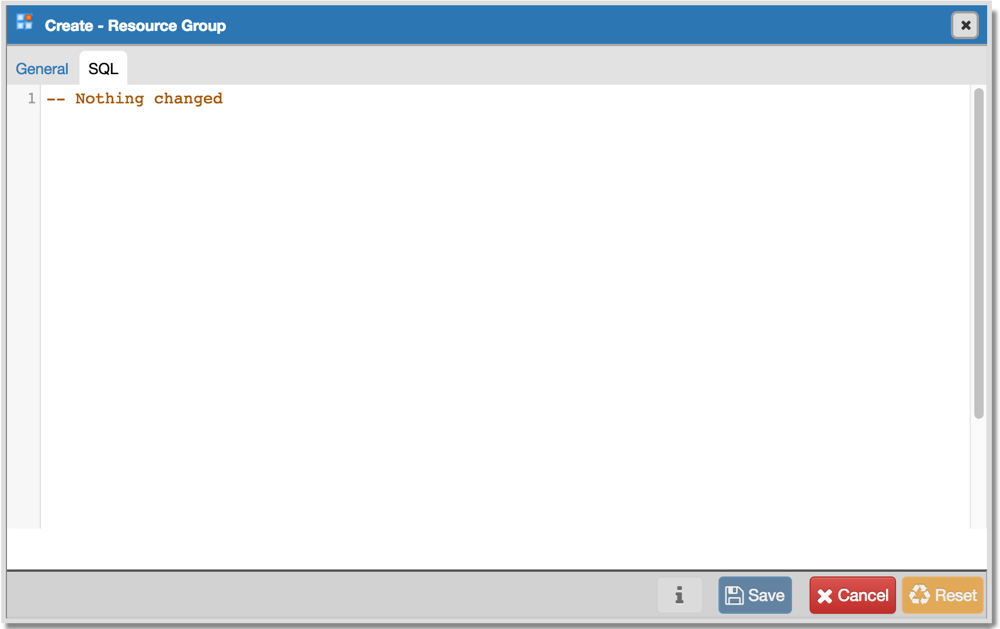

.. _resource_group_dialog:

*************************
The Resource Group Dialog
*************************

Use the *Resource Group* dialog to create a resource group and set values for its resources. A resource group is a named, global group on which various resource usage limits can be defined. The resource group is accessible from all databases in the cluster. To use the *Resource Group* dialog, you must have superuser privileges.  Please note that resource groups are supported when connected to EDB Postgres Advanced Server; for more information about using resource groups, please see the EDB Postgres Advanced Server Guide, available at:

   http://www.enterprisedb.com/

The *Resource Group* dialog organizes the development of a resource group through the *General* dialog tab. The *SQL* tab displays the SQL code generated by dialog selections. 

Use the fields in the *General* tab to specify resource group parameters:

* Use the *Group Name* field to add a descriptive name for the resource group. This name will be displayed in the *pgAdmin* tree control.
* Use the *CPU Rate Limit (%)* field to set the value of the CPU rate limit resource type assigned to the resource group. The valid range for a CPU rate limit is from 0 to 1.67772e+07. The default value is 0.
* Use the *Dirty Rate Limit (KB)* field to set the value of the dirty rate limit resource type assigned to the resource group. The valid range for a dirty rate limit is from 0 to 1.67772e+07. The default value is 0.

Click the *SQL* tab to continue.

Your entries in the *Resource Group* dialog generate a SQL command (see an example below). Use the *SQL* tab for review; revisit the *General* tab to make any changes to the SQL command. 

**Example**

The following is an example of the sql command generated by selections made in the *Resource Group* dialog: 

The example creates a resource group named *acctg* that sets *cpu_rate_limit* to *2*, and *dirty_rate_limit* to *6144*.
 
* Click the *Info* button (i) to access online help. View context-sensitive help in the *Tabbed browser*, where a new tab displays the PostgreSQL core documentation.
* Click the *Save* button to save work.
* Click the *Cancel* button to exit without saving work.
* Click the *Reset* button to restore configuration parameters.

