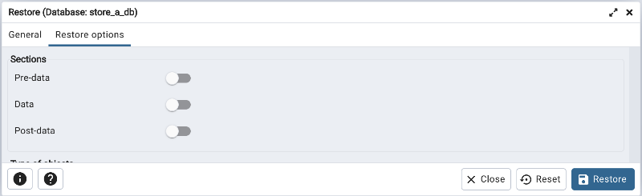
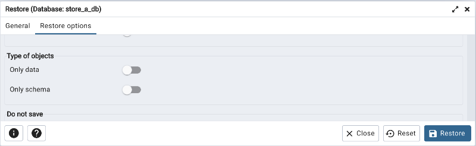
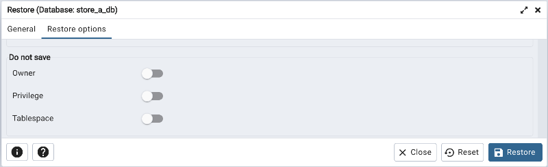
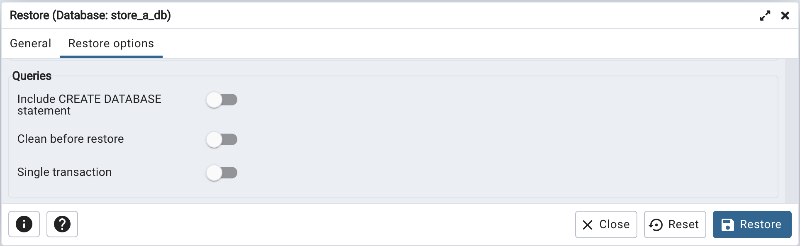
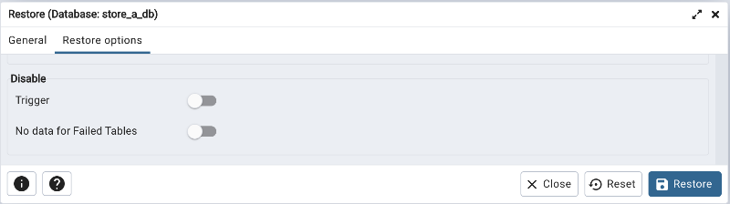
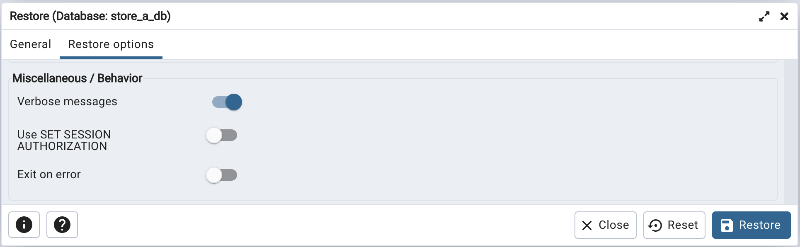
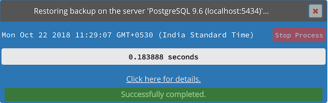
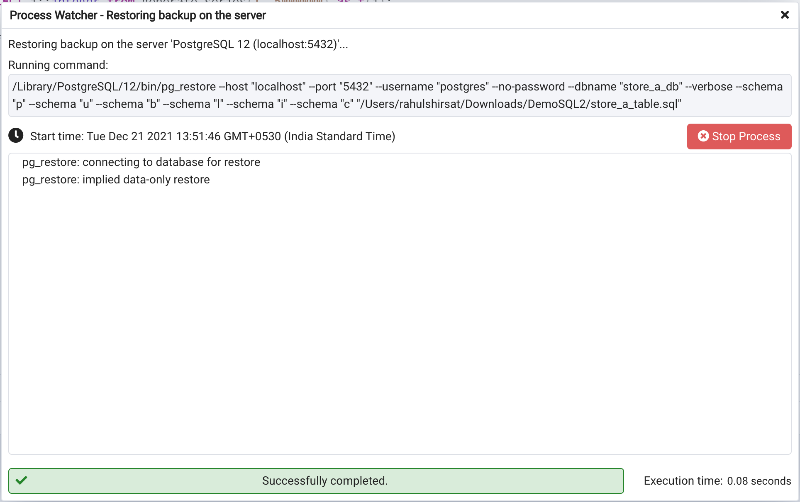

.. _restore_dialog:

***********************
`Restore Dialog`:index:
***********************

The *Restore* dialog provides an easy way to use a Custom, tar, or Directory format backup taken with the pgAdmin *Backup* dialog to recreate a database or database object.  The *Backup* dialog invokes options of the pg_dump client utility; the *Restore* dialog invokes options of the pg_restore client utility.

You can use the *Query Tool* to play back the script created during a plain-text backup made with the *Backup* dialog.  For more information about backing up or restoring, please refer to the documentation for `pg_dump <https://www.postgresql.org/docs/9.5/static/app-pgdump.html>`_ or `pg_restore <https://www.postgresql.org/docs/9.5/static/app-pgrestore.html>`_.

.. image:: images/restore_general.png
    :alt: Restore dialog general tab

Use the fields on the *General* tab to specify general information about the restore process:

* Use the drop-down listbox in the *Format* field to select the format of your backup file.

   * Select *Custom or tar* to restore from a custom archive file to create a copy of the backed-up object.
   * Select *Directory* to restore from a compressed directory-format archive.

* Enter the complete path to the backup file in the *Filename* field.  Optionally, select the *Browser* icon (ellipsis) to the right to navigate into a directory and select the file that contains the archive.
* Use the *Number of Jobs* field to specify if pg_restore should use multiple (concurrent) jobs to process the restore.  Each job uses a separate connection to the server.
* Use the drop-down listbox next to *Rolename* to specify the role that will be used to authenticate with the server during the restore process.

Click the *Restore options* tab to continue. Use the fields on the *Restore options* tab to specify options that correspond to *pg_restore* options.

* Use the switches in the **Sections** box to specify the content that will be restored:

   * Move the switch next to *Pre-data* to the *Yes* position to restore all data definition items not included in the data or post-data item lists.
   * Move the switch next to *Data* to the *Yes* position to restore actual table data, large-object contents, and sequence values.
   * Move the switch next to *Post-data* to the *Yes* position to restore definitions of indexes, triggers, rules, and constraints (other than validated check constraints).

* Use the switches in the **Type of objects** box to specify the objects that will be restored:

   * Move the switch next to *Only data* to the *Yes* position to limit the restoration to data.
   * Move the switch next to *Only schema* to limit the restoration to schema-level database objects.

* Use the switches in the **Do not save** box to specify which objects will not be restored:

   * Move the switch next to *Owner* to the *Yes* position to exclude commands that set object ownership.
   * Move the switch next to *Privilege* to the *Yes* position to exclude commands that create access privileges.
   * Move the switch next to *Tablespace* to the *Yes* position to exclude tablespaces.

* Use the switches in the **Queries** box to specify the type of statements that should be included in the restore:

   * Move the switch next to *Include CREATE DATABASE statement* to the *Yes* position to include a command that creates a new database before performing the restore.
   * Move the switch next to *Clean before restore* to the *Yes* position to drop each existing database object (and data) before restoring.
   * Move the switch next to *Single transaction* to the *Yes* position to execute the restore as a single transaction (that is, wrap the emitted commands in *BEGIN/COMMIT*). This ensures that either all the commands complete successfully, or no changes are applied. This option implies *--exit-on-error*.

* Use the switches in the **Disable** box to specify the type of statements that should be excluded from the restore:

   * Move the switch next to *Trigger* (active when creating a data-only restore) to the *Yes* position to include commands that will disable triggers on the target table while the data is being loaded.
   * Move the switch next to *No data for Failed Tables* to the *Yes* position to ignore data that fails a trigger.

* Use the switches in the **Miscellaneous/Behavior** box to specify miscellaneous restore options:

   * Move the switch next to *Verbose messages* to the *No* position to instruct *pg_restore* to exclude verbose messages.
   * Move the switch next to *Use SET SESSION AUTHORIZATION* to the *Yes* position to include a statement that will use a SET SESSION AUTHORIZATION command to determine object ownership (instead of an ALTER OWNER command).

   * Move the switch next to *Exit on error* to the *Yes* position to instruct *pg_restore* to exit restore if there is an error in sending SQL commands. The default is to continue and to display a count of errors at the end of the restore.

When you’ve specified the details that will be incorporated into the pg_restore command, click the *Restore* button to start the process, or click the *Cancel* button to exit without saving your work. A popup will confirm if the restore is successful.

Click *Click here for details* on the popup to launch the *Process Watcher*. The *Process Watcher* logs all the activity associated with the restore, and provides additional information for troubleshooting should the restore command encounter problems.

