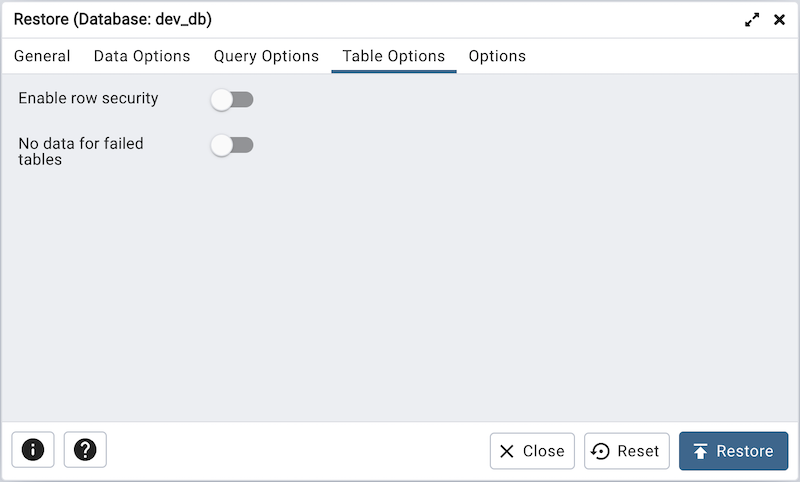

.. _restore_dialog:

***********************
`Restore Dialog`:index:
***********************

The *Restore* dialog provides an easy way to use a Custom, tar, or Directory
format backup taken with the pgAdmin *Backup* dialog to recreate a database or
database object.  The *Backup* dialog invokes options of the pg_dump client
utility; the *Restore* dialog invokes options of the pg_restore client utility.

You can use the *Query Tool* to play back the script created during a plain-text
backup made with the *Backup* dialog.  For more information about backing up or
restoring, please refer to the documentation for
`pg_dump <https://www.postgresql.org/docs/current/app-pgdump.html>`_ or
`pg_restore <https://www.postgresql.org/docs/current/app-pgrestore.html>`_.

.. image:: images/restore_general.png
    :alt: Restore dialog general tab
    :align: center

Use the fields on the *General* tab to specify general information about the
restore process:

* Use the drop-down listbox in the *Format* field to select the format of your
  backup file.

   * Select *Custom or tar* to restore from a custom archive file to create a
     copy of the backed-up object.
   * Select *Directory* to restore from a compressed directory-format archive.

* Enter the complete path to the backup file in the *Filename* field.
  Optionally, select the *Browse* icon (ellipsis) to the right to navigate
  into a directory and select the file that contains the archive.
* Use the *Number of Jobs* field to specify if pg_restore should use multiple
  (concurrent) jobs to process the restore.  Each job uses a separate connection
  to the server.
* Use the drop-down listbox next to *Rolename* to specify the role that will be
  used to authenticate with the server during the restore process.

Click the *Data Options* tab to continue. Use the fields in the *Data Options*
tab to provide options related to data or pgAdmin objects that correspond to *pg_restore*.

.. image:: images/restore_sections.png
    :alt: Restore dialog options section
    :align: center

* Move switches in the **Sections** field box to specify the content that will be
  restored:

   * Move the switch next to *Pre-data* towards right position to restore all
     data definition items not included in the data or post-data item lists.

   * Move the switch next to *Data* towards right position to restore actual
     table data, large-object contents, and sequence values.

   * Move the switch next to *Post-data* towards right position position to restore
     definitions of indexes, triggers, rules, and constraints (other than
     validated check constraints).

.. image:: images/restore_objects.png
    :alt: Restore dialog sections section
    :align: center

* Move switches in the **Type of objects** field box to specify the objects that
  will be restored:

   * Move the switch next to *Only data* towards right position to limit the
     restoration to data.

   * Move the switch next to *Only schema* to limit the restoration to
     schema-level database objects.

.. image:: images/restore_do_not_save.png
    :alt: Restore dialog do not save section
    :align: center

* Move switches in the **Do not save** box to specify which objects will not
  be restored:

   * Move the switch next to *Owner* towards right position to exclude commands
     that set object ownership.

   * Move the switch next to *Privileges* towards right position to exclude
     commands that create access privileges.

   * Move the switch next to *Tablespaces* towards right position to exclude
     tablespaces.

   * Move the switch next to *Comments* towards right position to exclude
     commands that set the comments. **Note:** This option is visible only for
     database server greater than or equal to 11.

   * Move the switch next to *Publications* towards right position to exclude
     publications.

   * Move the switch next to *Subscriptions* towards right position to exclude
     subscriptions.

   * Move the switch next to *Security labels* towards right position to exclude
     Security labels.

   * Move the switch next to *Table access methods* towards right position to exclude
     Table access methods. **Note:** This option is visible only for
     database server greater than or equal to 15.

.. image:: images/restore_queries.png
    :alt: Restore dialog queries section
    :align: center

Click the *Query Options* tab to continue. Use these additional fields to specify
the type of statements that should be included in the restore:

   * Move the switch next to *Include CREATE DATABASE statement* towards right position
     to include a command that creates a new database before performing the restore.

   * Move the switch next to *Clean before restore* towards right position to
     drop each existing database object (and data) before restoring.

   * Move the switch next to *Include IF EXISTS clause* towards right
     position to add an IF EXISTS clause to drop databases and other objects.
     This option is not valid unless *Clean before restore* is also set.

   * Move the switch next to *Single transaction* towards right position to
     execute the restore as a single transaction (that is, wrap the emitted
     commands in *BEGIN/COMMIT*). This ensures that either all the commands
     complete successfully, or no changes are applied. This option implies
     *--exit-on-error*.

Click the *Table Options* tab to continue. Use the fields in the *Table Options*
tab related to tables that should be included in the backup.

   * Move the switch next to *Enable row security* towards right position to
     set row_security to on instead, allowing the user to dump the parts of the
     contents of the table that they have access to. This option is relevant
     only when dumping the contents of a table which has row security.

   * Move the switch next to *No data for failed tables* towards right position
     to ignore data that fails a trigger.

Click the *Options* tab to continue. Use the fields in the *Options*
tab to provide other restore options.

.. image:: images/restore_miscellaneous.png
    :alt: Restore dialog miscellaneous section
    :align: center

* Move switches in the **Disable** box to specify the type of statements that
  should be excluded from the restore:

   * Move the switch next to *Triggers* (active when creating a data-only
     restore) towards right position to include commands that will disable
     triggers on the target table while the data is being loaded.

* Move switches in the **Miscellaneous/Behavior** box to specify
  miscellaneous restore options:

   * Move the switch next to *Verbose messages* towards left to instruct
     *pg_restore* to exclude verbose messages.

   * Move the switch next to *Use SET SESSION AUTHORIZATION* towards right position
     to include a statement that will use a SET SESSION AUTHORIZATION
     command to determine object ownership (instead of an ALTER OWNER command).

   * Move the switch next to *Exit on error* towards right position to instruct
     *pg_restore* to exit restore if there is an error in sending SQL commands.
     The default is to continue and to display a count of errors at the end of
     the restore.

   * Use the *Exclude schema* field to not dump schemas whose name matches
     pattern.

When you’ve specified the details that will be incorporated into the pg_restore
command, click the *Restore* button to start the process, or click the *Cancel*
button to exit without saving your work. A popup will confirm if the restore is
successful.

pgAdmin will run the restore process in background. You can view all the background
process with there running status and logs on the :ref:`Processes <processes>`
tab
