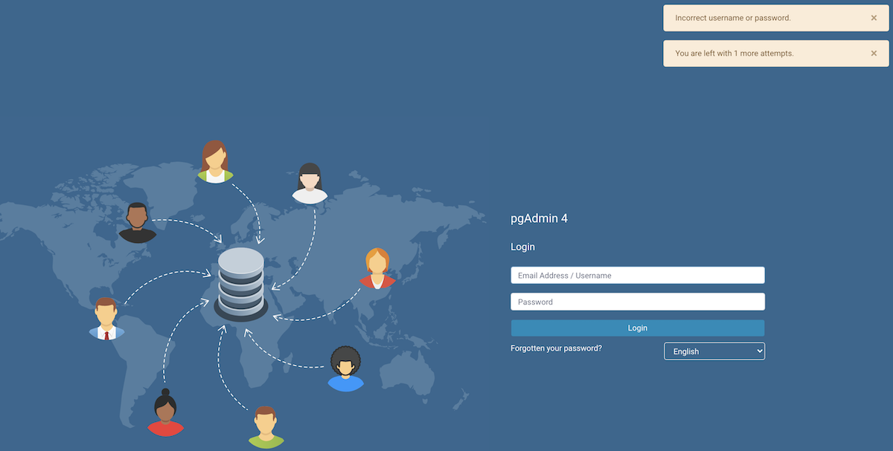

.. _restore_locked_user:

*****************************
`Lock/Restore Account`:index:
*****************************

Account locking/unlocking via user management dialog:

An admin can lock and unlock user from the user management dialog. This allows the admin to lock or restore
the user when there are several failed login attempts. This page guides you through configuring per-user
locking/restoring. For more details visit :ref:`User management <user_management>`.

.. csv-table::
   :header: "**Parameter**", "**Description**"
   :class: longtable
   :widths: 35, 55

    "MAX_LOGIN_ATTEMPTS", "Which sets the number of failed login that
   are allowed. If this value is exceeded, the account is locked and can be reset by an administrator.
   By setting the variable to the value zero this feature is deactivated."

When Administrator itself gets locked, following steps may be considered to restore it:

- Increase MAX_LOGIN_ATTEMPTS, and try to successfully login to restore the account.

OR

By updating configuration database

SQLite DB (pgAdmin4.db):

* Locate the pgAdmin4.db file and open it using any DB Browser (or DB Browser for SQLite)
* After opening the DB file, head towards 'Execute SQL' section.
* Run below query -

*UPDATE USER SET LOCKED = false, LOGIN_ATTEMPTS = 0 WHERE USERNAME = <YOUR_EMAIL_ID>*

External database:

* Connect to the database.
* Run below query -

*UPDATE USER SET LOCKED = false, LOGIN_ATTEMPTS = 0 WHERE USERNAME = <YOUR_EMAIL_ID>*

* Make sure the query changes are committed.

Account locking by failed login attempts:

pgAdmin application is configured to lock a user account when a number of consecutive failed login attempts are
exceeded.

MAX_LOGIN_ATTEMPTS is defaulted to 3 unsuccessful login attempts, after which the account would be locked.

The only way to restore the user account is by contacting the Administrator and ask to unlock it.
