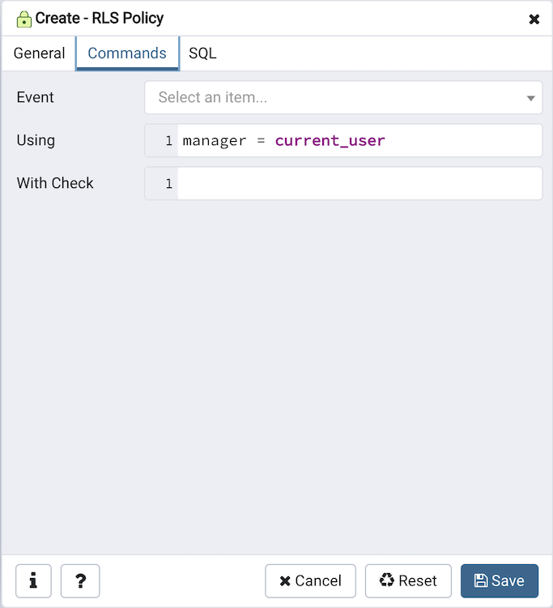
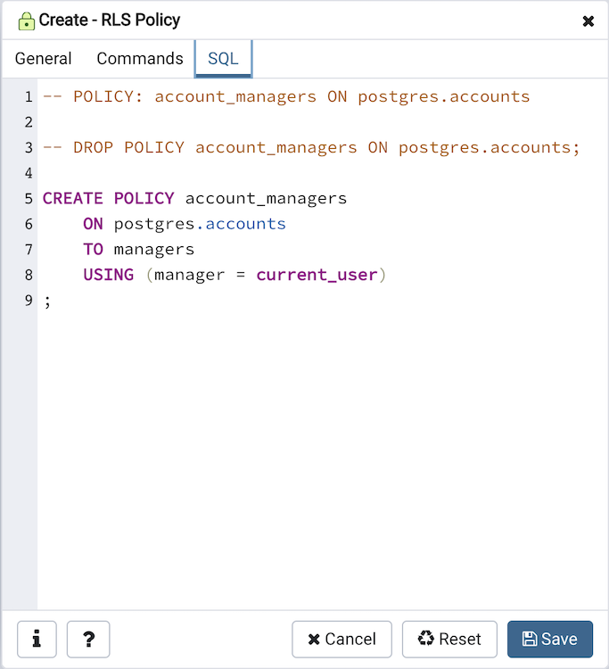

.. _rls_policy_dialog:

**************************
`RLS Policy Dialog`:index:
**************************

Use the *RLS Policy* dialog to Create a Row Level Security Policy.

.. note::

   If the Row Level Security is enabled at table level and no policy is created then by default *Deny Policy* is applied. That means, no rows are visible or can be modified for that table.

The *RLS Policy* dialog creates a Row Level Security Policy through the following dialog tabs: *General*, and *Commands*. The *SQL* tab displays the SQL code generated by dialog selections.

.. image:: images/rls_policy_general_tab.png
    :alt: RLS Policy General Tab
    :align: center

Use the fields in the *General* tab to define the RLS Policy:

* Use the *Name* field to add a descriptive name for the RLS Policy. The name will be displayed in the *pgAdmin* tree control.
* Use the drop-down listbox next to *Role* to select the Role to which the RLS Policy is to be applied.
* Use the drop-down listbox next to *Type* to select the type of the policy.

Click the *Commands* tab to continue.

Use the fields in the *Commands* tab to define the RLS Policy:

* Use the drop-down listbox next to *Event* to select the command to which policy applies. Valid options are ALL, SELECT, INSERT, UPDATE, and DELETE. Default is ALL.
* Use the *Using* field to add a SQL conditional expression returning boolean. This expression will be added to queries that refer to the table if row level security is enabled.
* Use the *With check* field to add a SQL conditional expression returning boolean. This expression will be used in INSERT and UPDATE queries against the table if row level security is enabled.

Click the *SQL* tab to continue.

Your entries in the *RLS Policy* dialog generate a SQL command (see an example
below). Use the *SQL* tab for review; revisit or switch tabs to make any
changes to the SQL command.

Example
*******

The following is an example of the sql command generated by user selections in
the *RLS Policy* dialog:

The example shown demonstrates creating a RLS Policy named *account_managers* that applies the Row Level Security on the *accounts* table.

* Click the *Info* button (i) to access online help.
* Click the *Save* button to save work.
* Click the *Cancel* button to exit without saving work.
* Click the *Reset* button to restore configuration parameters.
