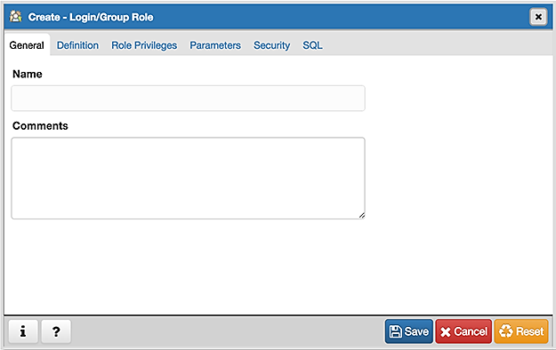
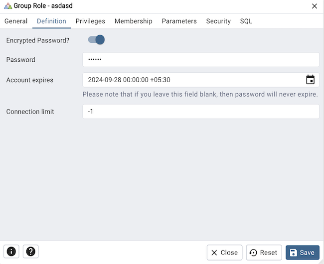
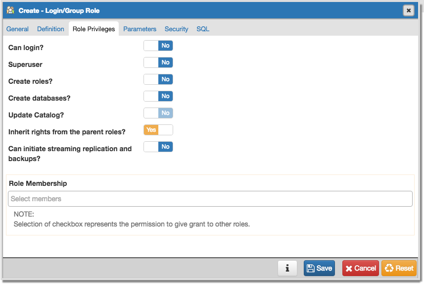
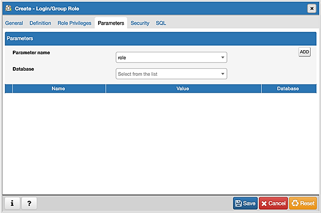
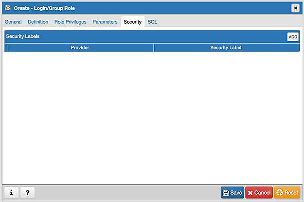
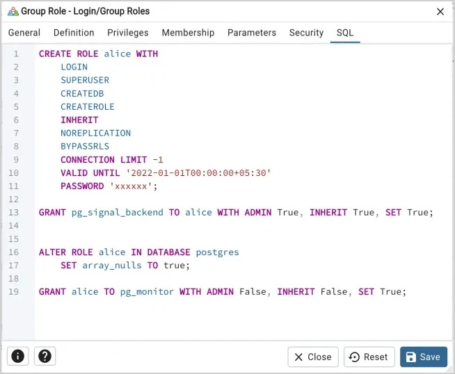

***********
Role Dialog
***********

A role may be an individual user (with or without login privileges) or a group of users. Note that roles defined at the cluster level are shared by all databases in the cluster. For more information about creating roles, please see the PostgreSQL core documentation available at:
 
   http://www.postgresql.org/docs/9.5/static/sql-createrole.html

The *Role* dialog organizes the creation of roles through the following dialog tabs: *General*, *Definition*, *Role Privileges*, *Parameters*, and *Security*. The *SQL* tab displays the SQL code generated by dialog selections.

Use the fields in the *General* tab to identify the role.

* Use the *Name* field to provide the name of the role. The name will be displayed in the *pgAdmin* tree control. 
* Provide a note about the role in the *Comments* field. 

Click the *Definition* tab to continue.

Use the *Definition* tab to set a password and configure connection rules:

* Provide a password that will be associated with the role in the *Password* field. 
* Provide an expiration date for the password in the *Account Expires* field (the role does not expire).  Provide the date in a mm/dd/yyyy format. The expiration date is not enforced when a user logs in with a non-password-based authentication method.
* If the role is a login role, specify how many concurrent connections the role can make in the *Connection Limit* field. The default value (*-1*) allows unlimited connections.

Click the *Role Privileges* tab to continue.

Use the *Role Privileges* tab to grant privileges to the role.

* Move the *Can login?* switch to the *Yes* position if the role has login privileges. The default value is *No*.  
* Move the *Superuser* switch to the *Yes* position if the role is a superuser within the database. The default value is *No*.
* Move the *Create roles?* switch to the *Yes* position to specify whether a role is permitted to create roles. A role with this privilege can alter and drop roles. The default value is *No*.
* Move the *Create databases* switch to the *Yes* position to control whether a role can create databases. The default value is *No*.
* The *Update catalogs?* switch is disabled until the role is given superuser privileges. Move the *Update catalogs?* switch to the *No* position to control whether a role can update catalogs. The default value is *Yes*.
* Move the *Inherit rights from the parent roles?* switch to the *No* position if a role does not inherit privileges. The default value is *Yes*.
* Move the *Can initiate streaming replication and backups?* switch to the *Yes* position to control whether a role can initiate streaming replication or put the system in and out of backup mode. The default value is *No*.
* Specify members of the role in the *Role Membership* field by checking the checkbox to the right of the role name. Membership conveys the privileges granted to a role to each of its members. 

Click the *Parameters* tab to continue.

Use the fields on the *Parameters* tab to set session defaults for a selected configuration parameter when the user is connected to a specified database. This tab invokes the ALTER ROLE... SET configuration_parameter syntax.

* Use the drop-down listbox next to *Parameter name* to select a parameter.
* Use the drop-down listbox next to *Database* to select a database.

Click *Add* after the above selections to create a parameter. Use the *Value* field to specify a value for the parameter.

Click *Add* to specify each additional parameter; to discard a parameter, click the trash icon to the left of the row and confirm deletion in the *Delete Row* popup.

Click the *Security* tab to continue. 

Use the *Security* tab to define security labels applied to the role. Click *Add* to add each security label selection. 

* Specify a security label provider in the *Provider* field. The named provider must be loaded and must consent to the proposed labeling operation.
* Specify a a security label in the *Security Label* field. The meaning of a given label is at the discretion of the label provider. PostgreSQL places no restrictions on whether or how a label provider must interpret security labels; it merely provides a mechanism for storing them. 

To discard a security label, click the trash icon to the left of the row and confirm deletion in the *Delete Row* popup.

For more information about using security labels, please see the PostgreSQL Core documentation available at:

   http://www.postgresql.org/docs/current/static/sql-security-label.html

Click the *SQL* tab to continue.

Your entries in the *Role* dialog generate a SQL command; you can review the command on the *SQL* pane.
 
* Click the *Info* button (i) to access online help. 
* Click the *Save* button to save work.
* Click the *Cancel* button to exit without saving work.
* Click the *Reset* button to restore configuration parameters.

Example
=======

The following is an example of the sql command generated by user selections in the *Role dialog*:

.. image:: images/role_sql_example.png

The example creates a login role named *alice*; the role is limited to 3 connections to the server at any given time.  When EDB auditing is enabled, any transactions written to the audit log by alice will include a tag that states *acctg - payroll*.

