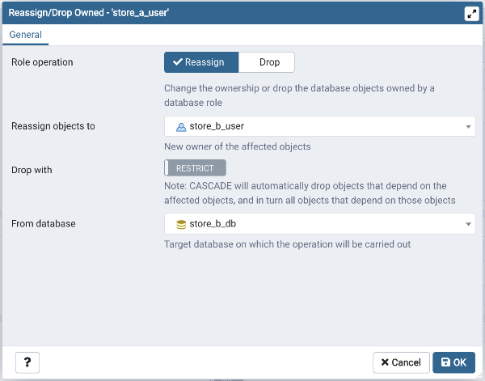
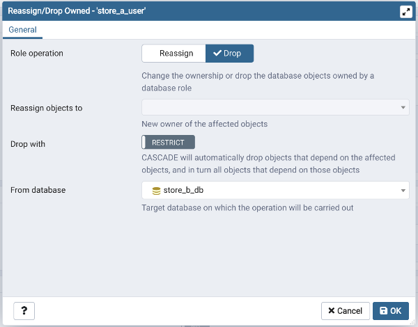

.. _role_reassign_dialog:

**************************************
`Role Reassign/Drop Own Dialog`:index:
**************************************

Use the *Role Reassign/Drop Own* dialog to change the ownership of database objects owned
by a database role. This dialog instructs the system to change the ownership of database
objects owned by any of the *old_roles* to *new_role*.

The *Role Reassign/Drop Own* dialog organizes the Reassign & Drop role through General tab.

* Use the *Role operation* field to provide Reassign option.
* Provide a new role in the *Reassign Objects to* field; The ownership of all the objects within the selected database,
  and of all shared objects (databases, tablespaces), owned by the *old_role* will be reassigned to *new_role*.
* Provide a database on which the reassignment is to be carried out.

The above example demonstrates reassigning *old_role* to *new_role*.

Removing database objects owned by a database role.

* Use the *Role operation* field to provide Drop option.
* Use the *Drop with* field to provide CASCADE option, RESTRICT is default.
* Provide a database on which the drop of objects is to be carried out.

The above examples demonstrates drop owned by *role*.

* Click the *Help* button (?) to access online help.
* Click the *OK* button to save work.
* Click the *Cancel* button to exit without saving work.
