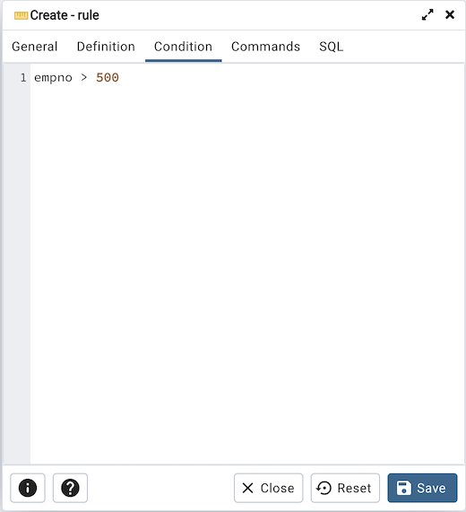
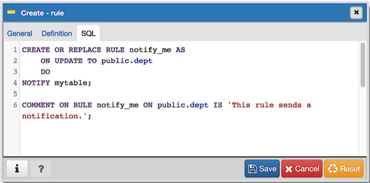

.. _rule_dialog:

********************
`Rule Dialog`:index:
********************

Use the *Rule* dialog to define or modify a rule for a specified table or view.
A PostgreSQL rule allows you to define an additional action that will be
performed when a SELECT, INSERT, UPDATE, or DELETE is performed against a table.

The *Rule* dialog organizes the development of a rule through the *General*,
*Definition*, *Condition*, *Commands* tabs. The *SQL* tab displays the SQL code
generated by dialog selections.

.. image:: images/rule_general.png
    :alt: Rule dialog general tab
    :align: center

Use the fields in the *General* tab to identify the rule:

* Use the *Name* field to add a descriptive name for the rule. The name will be
  displayed in the *pgAdmin* tree control. Multiple rules on the same table are
  applied in alphabetical name order.
* Store notes about the rule in the *Comment* field.

Click the *Definition* tab to continue.

.. image:: images/rule_definition.png
    :alt: Rule dialog definition tab
    :align: center

Use the fields in the *Definition* tab to write parameters:

* Click inside the *Event* field to select the type of event that will invoke
  the rule; event may be *Select*, *Insert*, *Update*, or *Delete*.
* Move the *Do Instead* switch to *Yes* indicate that the commands should be
  executed instead of the original command; if Do Instead specifies *No*, the
  rule will be invoked in addition to the original command.

Click the *Condition* tab to continue.

Specify a SQL conditional expression that returns a boolean value in the editor.

Click the *Commands* tab to continue.

.. image:: images/rule_commands.png
    :alt: Rule dialog commands tab
    :align: center

Provide a command in the editor that defines the action performed by the rule.

Click the *SQL* tab to continue.

Your entries in the *Rule* dialog generate a SQL command (see an example below).
Use the *SQL* tab for review; revisit or switch tabs to make any changes to the
SQL command.

Example
*******

The following is an example of the sql command generated by user selections in
the *Rule* dialog:

The example sends a notification when an UPDATE executes against a table.

* Click the *Info* button (i) to access online help.
* Click the *Save* button to save work.
* Click the *Cancel* button to exit without saving work.
* Click the *Reset* button to restore configuration parameters.