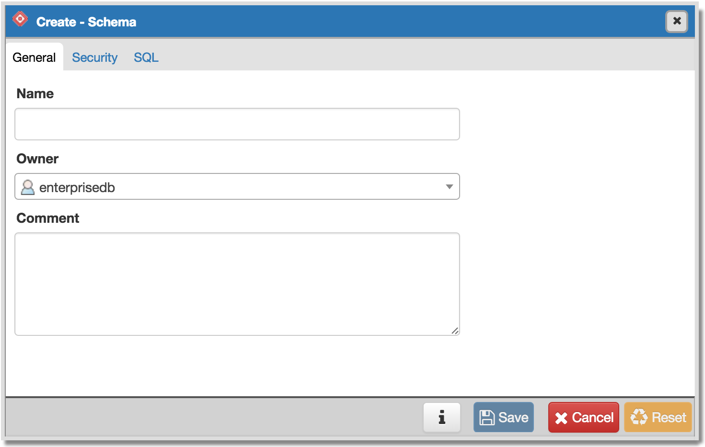
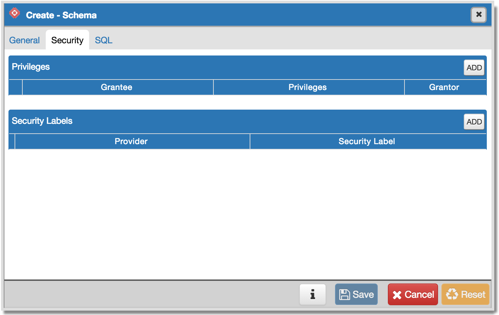
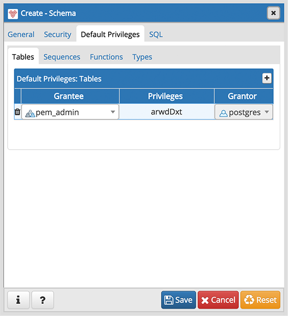
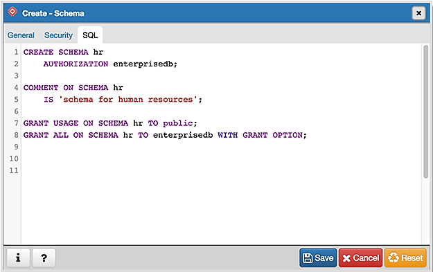

.. _schema_dialog:

**********************
`Schema Dialog`:index:
**********************

Use the *Schema* dialog to define a schema. A schema is the organizational
workhorse of a database, similar to directories or namespaces. To create a
schema, you must be a database superuser or have the CREATE privilege.

The *Schema* dialog organizes the development of schema through the following
dialog tabs: *General* and *Security*. The *SQL* tab displays the SQL code
generated by dialog selections.

Use the fields on the *General* tab to identify the schema.

* Use the *Name* field to add a descriptive name for the schema. The name will
  be displayed in the *pgAdmin* tree control.
* Select the owner of the schema from the drop-down listbox in the *Owner*
  field.
* Store notes about the schema in the *Comment* field.

Click the *Security* tab to continue.

Use the *Security* tab to assign privileges and security labels for the schema.

Click the *Add* icon (+) to assign a set of privileges in the *Privileges*
panel:

* Select the name of the role from the drop-down listbox in the *Grantee* field.
* Click inside the *Privileges* field. Check the boxes to the left of one or
  more privileges to grant the selected privileges to the specified user.
* The current user, who is the default grantor for granting the privilege, is displayed in the *Grantor* field.

Click the *Add* icon (+) to assign additional sets of privileges; to discard a
privilege, click the trash icon to the left of the row and confirm deletion in
the *Delete Row* popup.

Click the *Add* icon (+) to assign a security label in the *Security Labels*
panel:

* Specify a security label provider in the *Provider* field. The named provider
  must be loaded and must consent to the proposed labeling operation.
* Specify a a security label in the *Security Label* field. The meaning of a
  given label is at the discretion of the label provider. PostgreSQL places no
  restrictions on whether or how a label provider must interpret security
  labels; it merely provides a mechanism for storing them.

Click the *Add* icon (+) to assign additional security labels; to discard a
security label, click the trash icon to the left of the row and confirm deletion
in the *Delete Row* popup.

Click the *Default Privileges* tab to continue.

Use the *Default Privileges* tab to grant privileges for tables, sequences,
functions and types. Use the tabs nested inside the *Default Privileges* tab to
specify the database object and click the *Add* icon (+) to assign a set of
privileges:

* Select the name of a role that will be granted privileges in the schema from
  the drop-down listbox in the *Grantee* field.
* Click inside the *Privileges* field. Check the boxes to the left of one or
  more privileges to grant the selected privileges to the specified user.
* The current user, who is the default grantor for granting the privilege, is displayed in the *Grantor* field.

Click the *SQL* tab to continue.

Your entries in the *Schema* dialog generate a SQL command (see an example
below). Use the *SQL* tab for review; revisit or switch tabs to make any
changes to the SQL command.

Example
*******

The following is an example of the sql command generated by selections made in
the *Schema* dialog:

The example creates a schema named hr; the command grants *USAGE* privileges to
*public* and assigns the ability to grant privileges to *alice*.

* Click the *Info* button (i) to access online help.
* Click the *Save* button to save work.
* Click the *Close* button to exit without saving work.
* Click the *Reset* button to restore configuration parameters.
