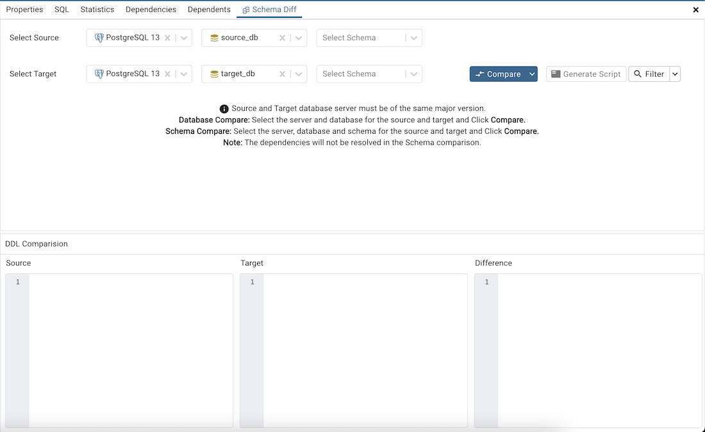
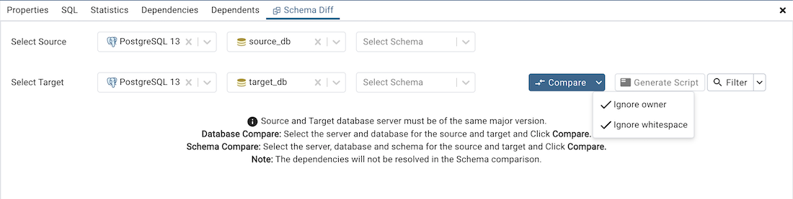
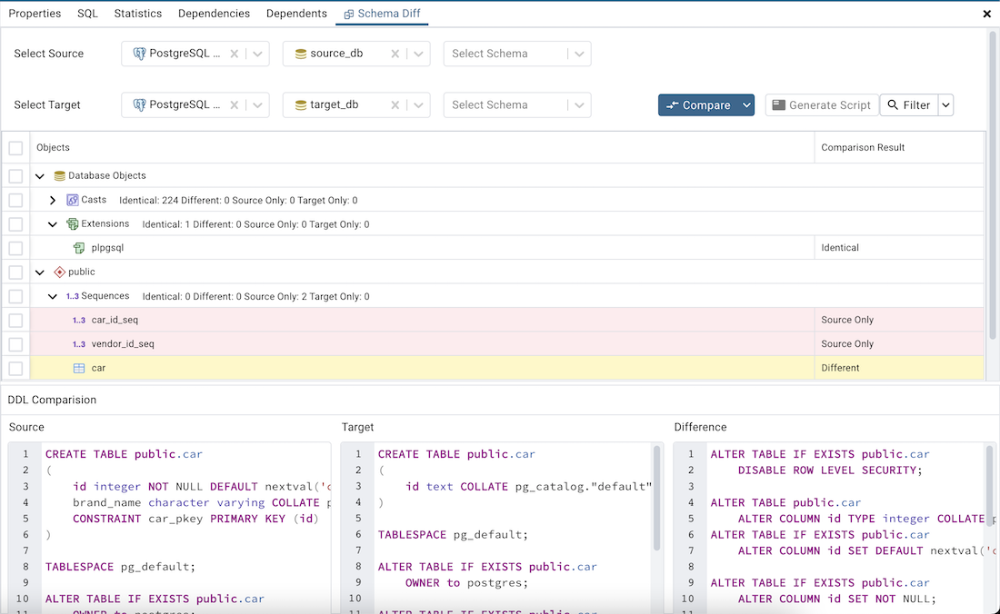
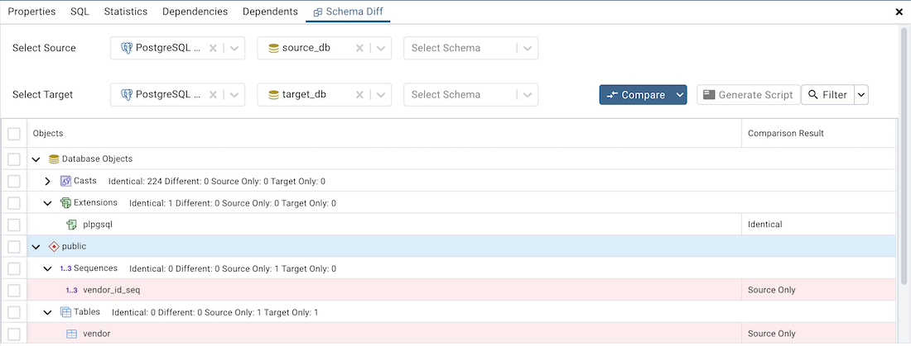
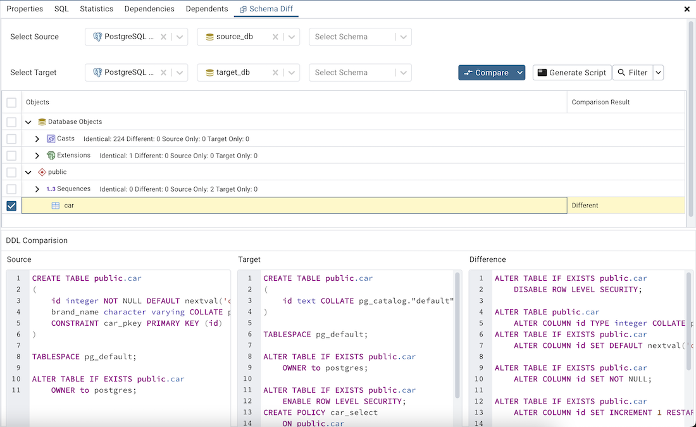
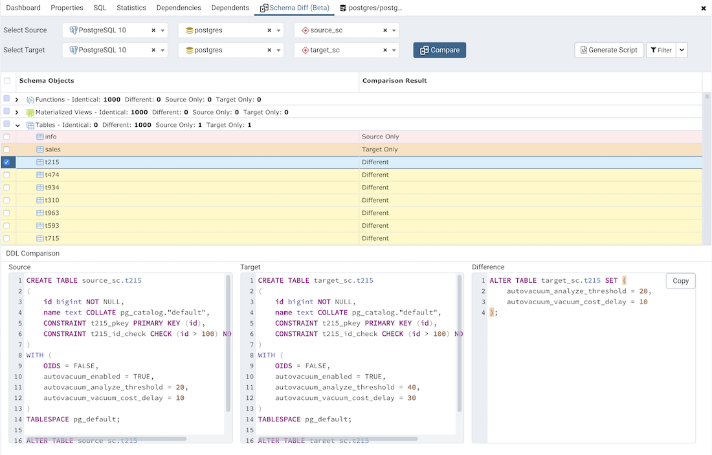
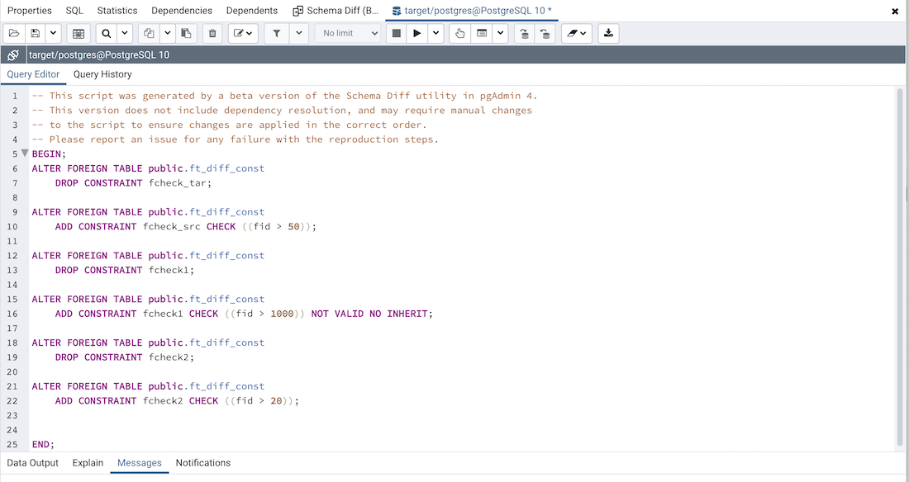

.. _schema_diff_feature:

********************
`Schema Diff`:index:
********************

**Schema Diff** is a feature that allows you to compare schema objects between
two database schemas. Use the *Tools* menu to access Schema Diff.

The Schema Diff feature allows you to:

 * Compare and synchronize the database schemas (from source to target).

 * Visualize the differences between database schemas.

 * List the differences in SQL statement for target schema objects.

 * Generate synchronization scripts.

**Note** - The source and target databases must be of the same major
version.

Click on *Schema Diff* under the *Tools* menu to open a selection panel. Choose
the source and target servers, databases, and schemas that will be
compared. After selecting the objects, click on the *Compare* button.

You can open multiple copies of *Schema Diff* in individual tabs
simultaneously. To close a copy of Schema Diff, click the *X* in the
upper-right hand corner of the tab bar.

Use the :ref:`Preferences <preferences>` dialog to specify if *Schema Diff*
should open in a new browser tab. Set *Open in new browser tab* option to true.

The *Schema Diff* panel is divided into two panels; an Object Comparison panel
and a DDL Comparison panel.

The Schema Diff Object Comparison Panel
========================================

In the object comparison panel, you can select the source and target servers
of the same major version, databases, and schemas to be compared. You can
select any server listed under the browser tree whether it is connected or
disconnected. If you select a server that is not connected then it will
prompt you for the password before using the server.

Next, select the databases that will be compared. The databases can be the
same or different (and within the same server or from different servers).

Lastly, select the source and target schemas which will be compared.

After you select servers, databases, and schemas, click on the
*Compare* button to obtain the *Comparison Result*.

Use the drop-down lists of Functions, Materialized Views, Tables,
Trigger Functions, Procedures, and Views to view the DDL statements of
all the schema objects.

In the upper-right hand corner of the object comparison panel is a *Filter*
option that you can use to filter the schema objects based on the
following comparison criteria:

 * Identical – If the object is found in both schemas with the same SQL statement, then the comparison result is identical.

 * Different – If the object is found in both schemas but have different SQL statements, then the comparison result is different.

 * Source Only – If the object is found in source schema only and not in target schema, then the comparison result is source only.

 * Target Only – If the object is found in target schema only and not in source schema, then the comparison result is target only.

Click on any of the schema objects in the object comparison panel to
display the DDL Statements of that object in the DDL Comparison panel.

Schema Diff DDL Comparison Panel
================================

The *DDL Comparison* panel displays three columns:

* The first column displays the DDL statement of the object from the source schema.

* The second column displays the DDL statement of the object from the target schema.

* The third column displays the difference in the SQL statement of the target schema object.

You can review the DDL statements of all the schema objects to
check for the differences in the SQL statements.

Also, you can generate the SQL script of the differences found in the
target schema object based on the SQL statement of the source schema
object. To generate the script, select the checkboxes of the schema
objects in the object comparison panel and then click on the *Generate Script*
button in the upper-right hand corner of the object comparison panel.

Select the schema objects and click on the *Generate Script*
button to open the *Query Tool* in a new tab, with the difference
in the SQL statement displayed in the *Query Editor*.

If you have clicked on the schema object to check the difference
generated in the *DDL Comparison* Panel, and you have not selected the
checkbox of the schema object, PEM will open the *Query Tool* in a new
tab, with the differences in the SQL statements displayed in the *Query Editor*.

You can also use the *Copy* button to copy the difference generated in
the *DDL Comparison* panel.

Apply the SQL Statement in the target schema to synchronize the schemas.
