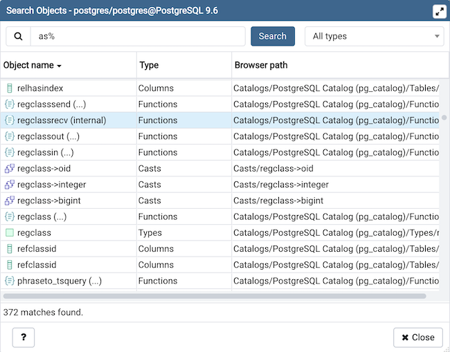

.. _search_objects:

***********************
`Search objects`:index:
***********************

With this dialog, you can search for almost any kind of objects in a
database.

You can access it by right clicking a database or any of its child nodes
and select "Search objects". You can also access it by hitting the
shortcut (default ALT+SHIFT+S).

The minimum pattern length are 3 characters. The search performed is
non-casesensitive and will find all objets whose name contains the pattern.
You can only search for object names currently. Examples are: abc,
%ab%, ab%c, %%%, etc.

The result is presented in the grid with object name, object type and
the object path in the :ref:`object explorer <tree_control>`. You can double
click on a result row to select the object in the
:ref:`object explorer <tree_control>`. If the object is greyed out, this means that you
have not enabled those object types in the :ref:`preferences <preferences>`,
so you can't double click on it. You can click on the ellipsis appended to
the function and procedure names to see their arguments.

You can filter based on a particular object type by selecting one from the
object type dropdown. If the search button is hit when one of the object type
is selected then only those types will be fetch from the database.
An object type will not be visible in the dropdown if the database server
does not support it or if it is not enabled from the
:ref:`preferences <preferences>`.