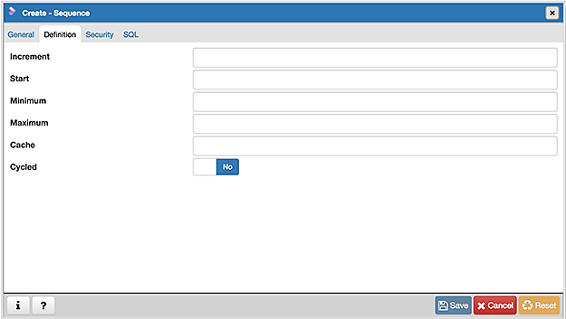
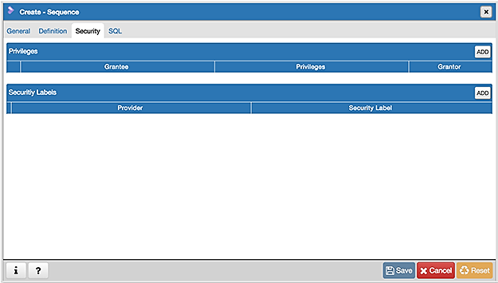
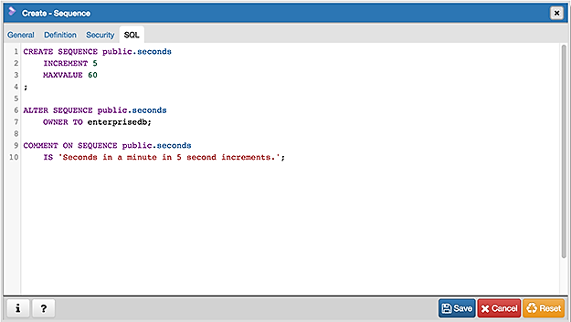

.. _sequence_dialog:

************************
`Sequence Dialog`:index:
************************

Use the *Sequence* dialog to create a sequence.  A sequence generates unique
values in a sequential order (not necessarily contiguous).

The *Sequence* dialog organizes the development of a sequence through the
following dialog tabs: *General*, *Definition*, and *Security*. The *SQL* tab
displays the SQL code generated by dialog selections.

.. image:: images/sequence_general.png
    :alt: Sequence dialog general tab
    :align: center

Use the fields in the *General* tab to identify a sequence:

* Use the *Name* field to add a descriptive name for the sequence. The name will
  be displayed in the *pgAdmin* tree control.  The sequence name must be
  distinct from the name of any other sequence, table, index, view, or foreign
  table in the same schema.
* Use the drop-down listbox next to *Owner* to select the name of the role that
  will own the sequence.
* Use the drop-down listbox next to *Schema* to select the schema in which the
  sequence will reside.
* Store notes about the sequence in the *Comment* field.

Click the *Definition* tab to continue.

Use the fields in the *Definition* tab to define the sequence:

* Use the *Increment* field to specify which value is added to the current
  sequence value to create a new value.
* Provide a value in the *Start* field to specify the beginning value of the
  sequence. The default starting value is MINVALUE for ascending sequences and
  MAXVALUE for descending ones.
* Provide a value in the *Minimum* field to specify the minimum value a sequence
  can generate. If this clause is not supplied or NO MINVALUE is specified,
  then defaults will be used. The defaults are 1 and -263-1 for ascending and
  descending sequences, respectively.
* Provide a value in the *Maximum* field to specify the maximum value for the
  sequence. If this clause is not supplied or NO MAXVALUE is specified, then
  default values will be used. The defaults are 263-1 and -1 for ascending and
  descending sequences, respectively.
* Provide a value in the *Cache* field to specify how many sequence numbers are
  to be preallocated and stored in memory for faster access. The minimum value
  is 1 (only one value can be generated at a time, i.e., no cache), and this is
  also the default.
* Move the *Cycled* switch to the *Yes* position to allow the sequence to wrap
  around when the MAXVALUE or the MINVALUE has been reached by an ascending or
  descending sequence respectively. If the limit is reached, the next number
  generated will be the MINVALUE or MAXVALUE, respectively. The default is *No*.

Click the *Security* tab to continue.

Use the *Security* tab to assign privileges and define security labels for the
sequence.

Use the *Privileges* panel to assign privileges. Click the *Add* icon (+) to
set privileges:

* Select the name of a role that will be granted privileges from the drop-down
  listbox in the *Grantee* field.
* Click inside the *Privileges* field. Check the boxes to the left of one or
  more privileges to grant the selected privilege to the specified user.
* The current user, who is the default grantor for granting the privilege, is displayed in the *Grantor* field.

Click the *Add* icon (+) to assign additional privileges; to discard a
privilege, click the trash icon to the left of the row and confirm deletion in
the *Delete Row* popup.

Use the *Security Labels* panel to define security labels applied to the
sequence. Click the *Add* icon (+) to add each security label selection:

* Specify a security label provider in the *Provider* field. The named provider
  must be loaded and must consent to the proposed labeling operation.
* Specify a a security label in the *Security Label* field. The meaning of a
  given label is at the discretion of the label provider. PostgreSQL places no
  restrictions on whether or how a label provider must interpret security
  labels; it merely provides a mechanism for storing them.

Click the *Add* icon (+) to assign additional security labels; to discard a
security label, click the trash icon to the left of the row and confirm deletion
in the *Delete Row* popup.

Click the *SQL* tab to continue.

Your entries in the *Sequence* dialog generate a generate a SQL command (see an
example below). Use the *SQL* tab for review; revisit or switch tabs to make any
changes to the SQL command.

Example
*******

The following is an example of the sql command generated by user selections in
the *Sequence* dialog:

The example shown demonstrates a sequence named *seconds*. The sequence will
increase in *5* second increments, and stop when it reaches a maximum value
equal of *60*.

* Click the *Info* button (i) to access online help.
* Click the *Save* button to save work.
* Click the *Cancel* button to exit without saving work.
* Click the *Reset* button to restore configuration parameters.
