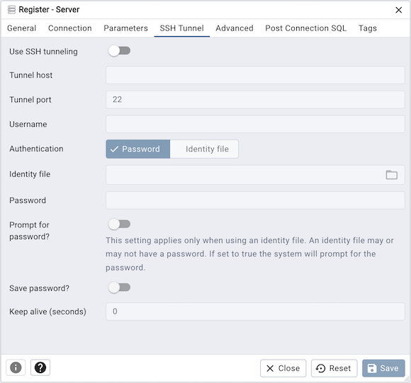

.. _server_dialog:

**********************
`Server Dialog`:index:
**********************

Use the *Server* dialog to describe a connection to a server. Note: you must
ensure that the pg_hba.conf file of the server from which you are connecting
allows connections from the host of the client.

Use the fields in the *General* tab to identify the server:

* Use the *Name* field to add a descriptive name for the server; the name
  specified will be displayed in the *Object Explorer*.

* Use the drop-down list box in the *Server group* field to select the parent
  node for the server; the server will be displayed in the *Object Explorer*
  control within the specified group.

* Use the color-picker in the *Background* field to specify the background
  color for the server.

* Use the color-picker in the *Foreground* field to specify the foreground
  color for the server.

* If the *Connect now?* checkbox is checked, the client will attempt a
  connection to the server upon completion of the dialog; this is the default

* If the *Shared?* switch is moved to *Yes* then that server can be
  shared with all the other users. This option is available only to admin users.
  For more information on users see :ref:`User Management Dialog <user_management>`.
  Users can access the shared servers with some restrictions - the following
  operations on shared servers are not permitted:

    * Delete the server
    * Rename the server
    * Rename the group server
    * Change of host, port, and maintenance database

  Please note that once the server is shared, it's icon is changed in the
  object explorer.

* Provide a comment about the server in the *Comments* field.

Click the *Connection* tab to continue.

.. image:: images/server_connection.png
    :alt: Server dialog connection tab
    :align: center

Use the fields in the *Connection* tab to configure a connection:

* Specify the IP address of the server host, or the fully qualified domain
  name in the *Host name/address* field. If you provide a unix domain socket,
  the directory name must begin with a "/".
* Enter the listener port number of the server host in the *Port* field. The
  default is *5432*.
* Use the *Maintenance database* field to specify the name of the initial
  database to which the client will connect. If you will be using pgAgent or
  adminpack objects, the pgAgent schema and adminpack objects should be
  installed on that database.
* Use the *Username* field to specify the name of a role that will be used when
  authenticating with the server.
* When *Kerberos authentication?* is set to *True*, pgAdmin will try to connect
  the PostgreSQL server using Kerberos authentication.
* Use the *Password* field to provide a password that will be supplied when
  authenticating with the server.
* Check the box next to *Save password?* to instruct pgAdmin to save the
  password for future use. Use
  :ref:`Clear Saved Password <clear_saved_passwords>` to remove the saved
  password.
* Use the *Role* field to specify the name of a role that has privileges that
  will be conveyed to the client after authentication with the server. This
  selection allows you to connect as one role, and then assume the permissions
  of this specified role after the connection is established. Note that the
  connecting role must be a member of the role specified.
* Use the *Service* field to specify the service name. For more information,
  see
  `Section 33.16 of the Postgres documentation <https://www.postgresql.org/docs/current/libpq-pgservice.html>`_.

Click the *Parameters* tab to continue.

Use the fields in the *Parameters* tab to configure a connection:

Click on the *+* button to add a new parameter. Some of the parameters are:

* *Host address* using this field to specify the host IP address may save time
  by avoiding a DNS lookup on connection, but it may be useful to specify both
  a host name and address when using Kerberos, GSSAPI, or SSPI authentication
  methods, as well as for verify-full SSL certificate verification.
* *Password File* field to specify the location of a password file
  (.pgpass). A .pgpass file allows a user to login without providing a password
  when they connect.  For more information, see
  `Section 33.15 of the Postgres documentation <https://www.postgresql.org/docs/current/libpq-pgpass.html>`_.
* *Connection timeout* field to specify the maximum wait for connection,
  in seconds. Zero or not specified means wait indefinitely. It is not
  recommended to use a timeout of less than 2 seconds. By default it is set to
  10 seconds.
* *SSL mode* field to select the type of SSL connection the server should use.
  For more information about using SSL encryption, see
  `Section 33.18 of the Postgres documentation <https://www.postgresql.org/docs/current/libpq-ssl.html>`_.

If pgAdmin is installed in Server mode (the default mode), you can use the
platform-specific File manager dialog to upload files that support SSL
encryption to the server.  To access the File manager dialog, click the
icon that is located to the right of each of the following fields.

* *Client certificate* field to specify the file containing the client
  SSL certificate.  This file will replace the default
  *~/.postgresql/postgresql.crt* if pgAdmin is installed in Desktop mode, and
  *<STORAGE_DIR>/<USERNAME>/.postgresql/postgresql.crt* if pgAdmin is installed
  in Web mode. This parameter is ignored if an SSL connection is not made.
* *Client certificate key* field to specify the file containing the
  secret key used for the client certificate.  This file will replace the
  default *~/.postgresql/postgresql.key* if pgAdmin is installed in Desktop
  mode, and *<STORAGE_DIR>/<USERNAME>/.postgresql/postgresql.key* if pgAdmin
  is installed in Web mode. This parameter is ignored if an SSL connection is
  not made.
* *Root certificate* field to specify the file containing the SSL
  certificate authority.  This file will replace the default
  *~/.postgresql/root.crt*. This parameter is ignored if an SSL connection is
  not made.
* *Certificate revocation list* field to specify the file containing
  the SSL certificate revocation list.  This list will replace the default list,
  found in *~/.postgresql/root.crl*. This parameter is ignored if an SSL
  connection is not made.
* *SSL compression?* is set to *True*, data sent over SSL connections will
  be compressed.  The default value is *False* (compression is disabled). This
  parameter is ignored if an SSL connection is not made.

.. warning:: In Server mode, certificates, private keys, and the revocation list
    are stored in the per-user file storage area on the server, which is owned
    by the user account under which the pgAdmin server process is run. This
    means that administrators of the server may be able to access those files;
    appropriate caution should be taken before choosing to use this feature.

Click the *SSH Tunnel* tab to continue.

Use the fields in the *SSH Tunnel* tab to configure SSH Tunneling:

You can use the "SSH Tunnel" tab to connect pgAdmin (through an intermediary
proxy host) to a server that resides on a network to which the client may
not be able to connect directly.

* Set "Use SSH tunneling" to *Yes* to specify that pgAdmin should use an SSH
  tunnel when connecting to the specified server.
* Specify the name or IP address of the SSH host (through which client
  connections will be forwarded) in the *Tunnel host* field.
* Specify the port of the SSH host (through which client connections will be
  forwarded) in the *Tunnel port* field.
* Specify the name of a user with login privileges for the SSH host in the
  *Username* field.
* Specify the type of authentication that will be used when connecting to the
  SSH host in the *Authentication* field:

    * Select the *Password* option to specify that pgAdmin will use a password
      for authentication to the SSH host. This is the default.
    * Select the *Identity file* to specify that pgAdmin will use a private key
      file when connecting.

* If the SSH host is expecting a private key file for authentication, use the
  *Identity file* field to specify the location of the key file.
* If the SSH host is expecting a password of the user name or an identity file
  if being used, use the *Password* field to specify the password.
* Check the box next to *Save password?* to instruct pgAdmin to save the
  password for future use. Use
  :ref:`Clear SSH Tunnel Password <clear_saved_passwords>` to remove the saved
  password.

Click the *Advanced* tab to continue.

.. image:: images/server_advanced.png
    :alt: Server dialog advanced tab
    :align: center

Use the fields in the *Advanced* tab to configure a connection:

* Use the *DB restriction* field to provide a SQL restriction that will be used
  against the pg_database table to limit the databases that you see. For
  example, you might enter: *live_db test_db* so that only live_db and test_db
  are shown in the pgAdmin browser. Separate entries with a comma or tab as you
  type.
* Use the *Password exec command* field to specify a shell command to be executed
  to retrieve a password to be used for SQL authentication. The ``stdout`` of the
  command will be used as the SQL password. This may be useful when the password
  should be generated as a transient authorization token instead of providing a
  password when connecting in `PAM authentication <https://www.postgresql.org/docs/current/auth-pam.html>`_ scenarios.
* Use the *Password exec expiration* field to specify a maximum age, in seconds,
  of the password generated with a *Password exec command*. If not specified,
  the password will not expire until your pgAdmin session does.
  Zero means the command will be executed for each new connection or reconnection that is made.
  If the generated password is not valid indefinitely, set this value to slightly before it will expire.

.. note:: The password file option is only supported when pgAdmin is using libpq
    v10.0 or later to connect to the server.

.. note:: The Password exec option is only supported when pgAdmin is run in desktop mode.

* Click the *Save* button to save your work.
* Click the *Close* button to exit without saving your work.
* Click the *Reset* button to return the values specified on the Server dialog
  to their original condition.

.. toctree::

    clear_saved_passwords
