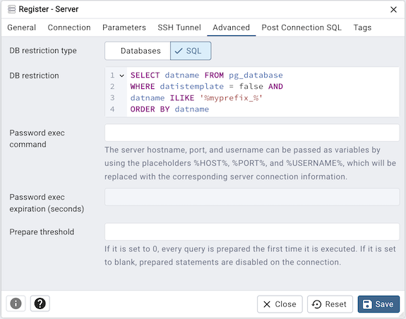

.. _server_dialog:

*****************
The Server Dialog
*****************

Use the *Server* dialog to describe a connection to a server. Note: you must ensure the pg_hba.conf file of the server
from which you are connecting allows connections from the host of the client.

The *Server* dialog organizes the connection of a server through the following dialog tabs: *General*, and *Connection*.

.. image:: images/server_general.png

Use the fields in the *General* tab to identify the server:

* Use the *Name* field to add a descriptive name for the server; the name specified will be displayed in the *pgAdmin*
  tree control of the client.
* Use the drop-down list box in the *Server group* field to specify the *pgAdmin* tree control parent node for the server.
* Uncheck the checkbox next to *Connect now?* to instruct pgAdmin not to attempt a connection upon completion of the
  dialog. The default enables connection.
* Provide a comment about the server in the *Comments* field.

Click the *Connection* tab to continue.

Use the fields in the *Connection* tab to configure a connection:

* Specify the IP address of the server host, or the fully qualified domain name in the *Host name/address* field. On
  Unix based systems, the address field may be left blank to use the default PostgreSQL Unix Domain Socket on the local
  machine, or may be set to an alternate path containing a PostgreSQL socket. If you enter a path, the path must begin
  with a "/".
* Enter the listener port number of the server host in the *Port* field. The default is *5432*.
* Use the *Maintenance database* field to specify the name of the initial database to which the client will connect.
  If you will be using pgAgent or adminpack objects, the pgAgent schema and adminpack objects should be installed on that
  database.
* Use the *User name* field to specify the name of a role that will be used when authenticating with the server.
* Use the *Password* field to provide a password that will be supplied when authenticating with the server.
* Check the box next to *Save password* to instruct pgAdmin to save the password for future use.
* Use the *Role* field to specify the name of a role that has privileges that will be conveyed to the client after
  authentication with the server. This selection allows you to connect as one role, and then assume the permissions of
  this specified role after the connection is established. Note that the connecting role must be a member of the role
  specified.

Click the *SSL* tab to continue.

.. image:: images/server_ssl.png

Use the fields in the *SSL* tab to configure a SSL:

* Use the drop-down list box in the SSL field to select the type of SSL connection the server should use. For more
  information about using SSL encryption, see Section 31.18 of the Postgres documentation:

   http://www.postgresql.org/docs/9.5/static/libpq-ssl.html

* Specify the file containing the name of the client SSL certificate, replacing the default *~/.postgresql/postgresql.crt*
  in case of Desktop mode and *<STORAGE_DIR>/<USERNAME>/.postgresql/postgresql.crt* in case of Web mode. This parameter
  is ignored if an SSL connection is not made.
* Specify the file containing the secret key used for the client certificate, replacing the default *~/.postgresql/postgresql.key*
  in case of Desktop mode and *<STORAGE_DIR>/<USERNAME>/.postgresql/postgresql.key* in case of Web mode. This parameter
  is ignored if an SSL connection is not made.
* Specify the file containing the SSL certificate authority, replacing the default *~/.postgresql/root.crt*. This
  parameter is ignored if an SSL connection is not made.
* Specify the file containing the SSL certificate revocation list, replacing the default *~/.postgresql/root.crl*. This
  parameter is ignored if an SSL connection is not made.
* If set to True, data sent over SSL connections will be compressed else compression will be disabled, The default
  is *False*. This parameter is ignored if an SSL connection is not made, see Section 32.1.2 of the Postgres documentation
  for more details:

In Server mode, files can be uploaded to the server using the File chooser dialog.

   https://www.postgresql.org/docs/9.6/static/libpq-connect.html

*WARNING:* In Server mode, certificates, private keys and the revocation list are stored in the per-user file storage
area on the server, which is owned by the user account under which the pgAdmin server process is run. This means that
administrators of the server may be able to access those files, so appropriate caution should be taken before choosing
to use this feature.

Click the *Advanced* tab to continue.

Use the fields in the *Advanced* tab to configure a connection:

* Specify the IP address of the server host. Using this field to specify the host IP address will avoid a DNS lookup on
  connection, however it may be useful to specify both a host name and address when using Kerberos, GSSAPI, or SSPI
  authentication methods, as well as for verify-full SSL certificate verification
* The DB restriction field allows you to enter an SQL restriction that will be used against the pg_database table to
  limit the databases that you see. For example, you might enter: *live_db test_db* so that only live_db and test_db are
  shown in the pgAdmin browser. Separate entries with a comma or tab as you type.
* Specify the password file which allow user to login without providing password, see Section 33.15 of the Postgres documentation:

   https://www.postgresql.org/docs/current/static/libpq-pgpass.html

*NOTE:* The password file option is only supported when pgAdmin is using libpq v10.0 or later to connect to the server.

* Click the *Save* button to save work.
* Click the *Cancel* button to exit without saving work.
* Click the *Reset* button to restore configuration parameters.
