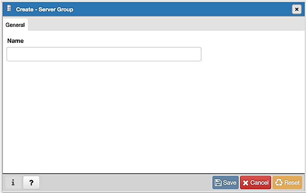

*******************
Server Group Dialog
*******************

Use the *Server Group* dialog to add a new server group. Assign servers to server groups to simplify management of multiple servers. Server groups are displayed as part of the client tree control.

Use the *Name* field on the *Server Group* dialog to specify a name that will identify the server group in the pgAdmin tree control.

* Click the *Info* button (i) to access online help. 
* Click the *Save* button to save work.
* Click the *Cancel* button to exit without saving work.
* Click the *Reset* button to restore configuration parameters.

To create server connections in a server group, right click on the named server group and select the *Create* option to open the *Server dialog*.

