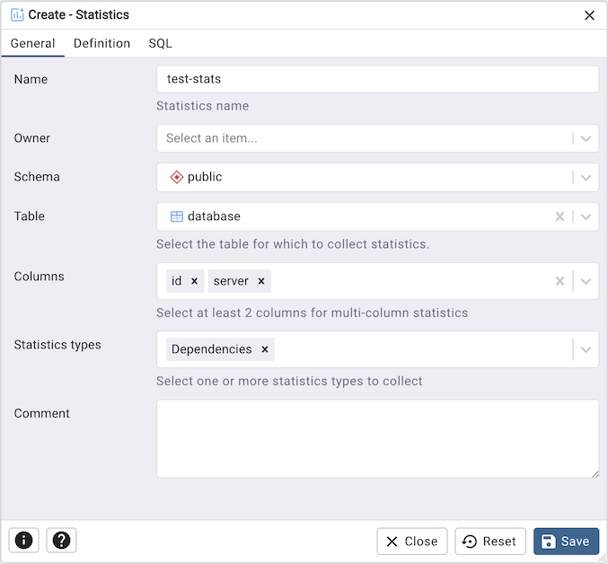
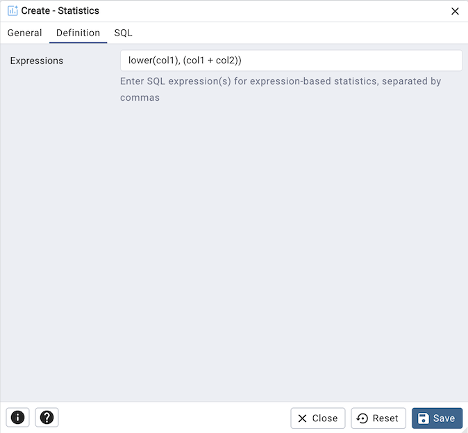
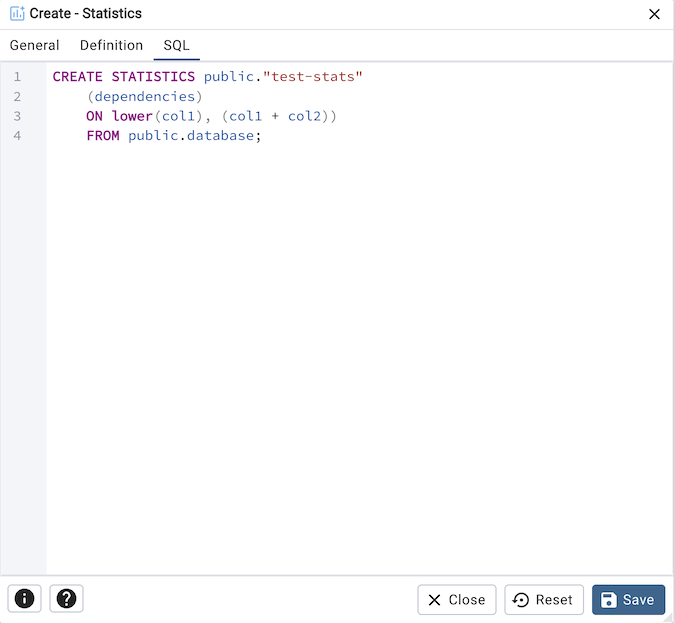

.. _statistics_dialog:

**************************
`Statistics Dialog`:index:
**************************

Use the *Statistics* dialog to define extended statistics on one or more columns
(or expressions) of a table. Extended statistics let PostgreSQL collect
correlation data across columns that can significantly improve query-plan
estimates for queries that filter or group by multiple columns.

Extended statistics require PostgreSQL 14 or later.

The *Statistics* dialog organizes options across the *General* and *Definition*
tabs. The *SQL* tab displays the SQL command generated by your selections.

Use the fields in the *General* tab to identify the statistics object:

* Use the *Name* field to enter a descriptive name. On PostgreSQL 16 and later,
  the name is optional — PostgreSQL will auto-generate one if left blank.
* Use the *Owner* field to select the role that will own the statistics object.
* Use the *Schema* field to select the schema in which the statistics object
  will reside.
* Use the *Comment* field to store an optional note about the statistics object.

Click the *Definition* tab to continue.

Use the fields in the *Definition* tab to describe the statistics:

* Use the *Table* field to select the table on which the statistics will be
  collected. The list is filtered to tables in the selected schema.
* Use the *Columns* field to select two or more columns. Hold *Ctrl* (or *Cmd*
  on macOS) to select multiple columns. At least two columns are required when
  collecting column-based statistics.
* Use the *Expressions* field to enter one or more SQL expressions separated by
  commas (e.g. ``lower(col1), (col1 + col2)``). Specify expressions instead of
  columns when you want statistics on derived values.
* Use the *Statistics types* field to choose which kinds of extended statistics
  to collect:

  * *N-distinct* — estimates the number of distinct value combinations across
    the selected columns or expressions.
  * *Dependencies* — detects functional dependencies between columns, improving
    estimates for queries with correlated ``WHERE`` clauses.
  * *MCV (Most Common Values)* — records the most common combinations of values,
    available on PostgreSQL 12 and later.

Click the *SQL* tab to continue.

Your entries in the *Statistics* dialog generate a SQL command (see an example
below). Use the *SQL* tab for review; revisit or switch tabs to make any changes.

Example
*******

The following is an example of the SQL command generated by user selections in
the *Statistics* dialog:

* Click the *Info* button (i) to access online help.
* Click the *Save* button to save work.
* Click the *Close* button to exit without saving work.
* Click the *Reset* button to restore configuration parameters.
