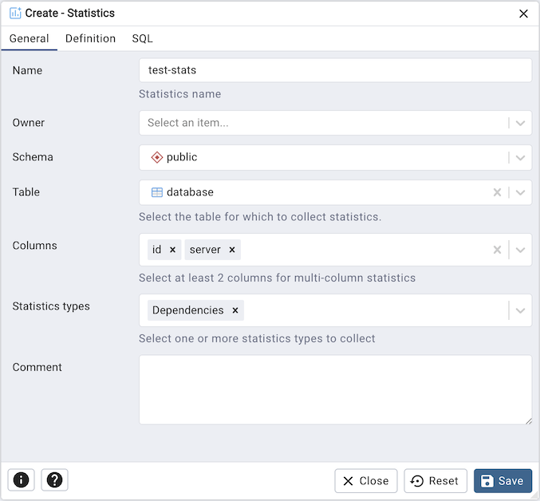
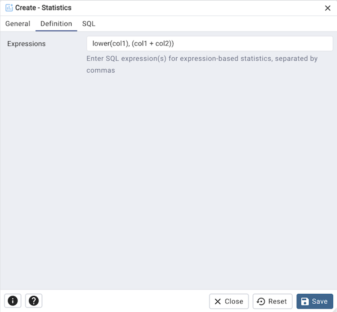
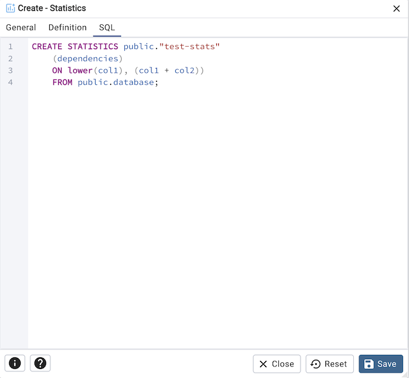

.. _statistics_dialog:

**************************
`Statistics Dialog`:index:
**************************

Use the *Statistics* dialog to define extended statistics on one or more columns
(or expressions) of a table. Extended statistics let PostgreSQL collect
correlation data across columns that can significantly improve query-plan
estimates for queries that filter or group by multiple columns.

Extended statistics require PostgreSQL 14 or later.

The *Statistics* dialog organizes options across the *General* and *Definition*
tabs. The *SQL* tab displays the SQL command generated by your selections.

Use the fields in the *General* tab to describe the statistics object:

* Use the *Name* field to enter a descriptive name. On PostgreSQL 16 and later
  the name is optional, and the server will generate one from the table and the
  columns or expressions if you leave it blank.
* Use the *Owner* field to select the role that will own the statistics object.
* Use the *Schema* field to select the schema in which the statistics object
  will reside.
* Use the *Table* field to select the table on which the statistics will be
  collected. The list is filtered to tables in the selected schema.
* Use the *Columns* field to select two or more columns. Hold *Ctrl* (or *Cmd*
  on macOS) to select multiple columns. At least two columns are required when
  collecting column based statistics, although a single column is enough when
  it is combined with an expression.
* Use the *Statistics types* field to choose which kinds of extended statistics
  to collect:

  * *N-distinct*, which estimates the number of distinct value combinations
    across the selected columns or expressions.
  * *Dependencies*, which detects functional dependencies between columns,
    improving estimates for queries with correlated ``WHERE`` clauses.
  * *MCV (Most Common Values)*, which records the most common combinations of
    values.

* Use the *Comment* field to store an optional note about the statistics object.

Click the *Definition* tab to continue.

* Use the *Expressions* field to enter one or more SQL expressions separated by
  commas (for example ``lower(col1), (col1 + col2)``). Each expression must be
  enclosed in parentheses unless it is a function call, and the list is passed
  to the server exactly as you enter it, so an expression may itself contain
  commas. Expressions may be given instead of columns, or alongside them when
  you want statistics over a mixture of the two.

When you open the dialog on an existing statistics object, the *Properties*
view also reports the statistics target and, for superusers, the values that
``ANALYZE`` has collected. Those values are held in
``pg_catalog.pg_statistic_ext_data``, which only a superuser may read, so the
*Computed Statistics* group is hidden for everybody else.

Click the *SQL* tab to continue.

Your entries in the *Statistics* dialog generate a SQL command (see an example
below). Use the *SQL* tab for review; revisit or switch tabs to make any changes.

Example
*******

The following is an example of the SQL command generated by user selections in
the *Statistics* dialog:

* Click the *Info* button (i) to access online help.
* Click the *Save* button to save work.
* Click the *Close* button to exit without saving work.
* Click the *Reset* button to restore configuration parameters.
