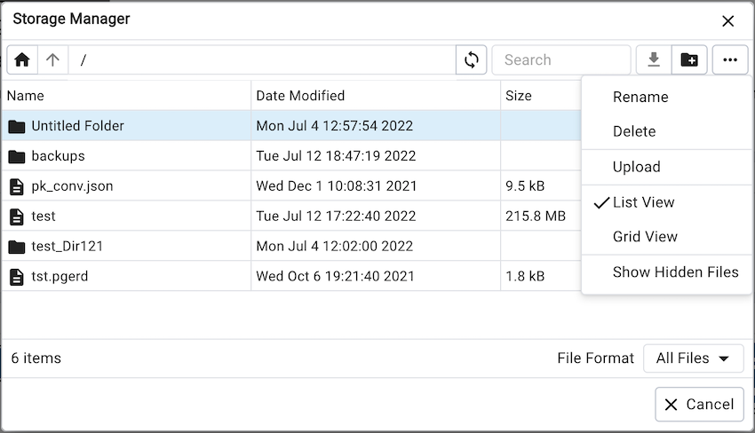
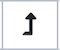
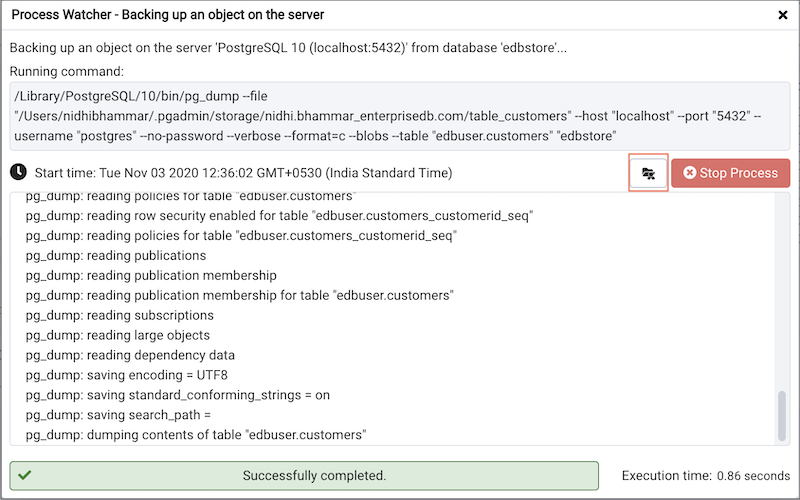

.. _storage_manager:

************************
`Storage Manager`:index:
************************

*Storage Manager* is a feature that helps you manage your systems storage device. You can use *Storage Manager* to:

* Download, upload, or manage operating system files. To use this feature, *pgAdmin* must be running in *Server Mode* on your client machine.
* Download *backup* or *export* files (custom, tar and plain text format) on a client machine.
* Download *export* dump files of tables.

You can access *Storage Manager* from the *Tools* Menu.

Use icons on the top of the *Storage Manager* window to manage storage:

Use the ``Home`` icon |home| to return to the home directory.

Use the ``Up Arrow`` icon |uparrow| to return to the previous directory.

Use the ``Refresh`` icon |refresh| to display the most-recent files available.

.. |refresh| image:: images/refresh.png

Select the ``Download`` icon |download| to download the selected file.

Select the ``Delete`` icon |delete| to delete the selected file or folder.

Select the ``Edit`` icon |edit|  to rename a file or folder.

.. |edit| image:: images/edit.png

Use the ``Upload`` icon |upload| to upload a file.

Use the ``New Folder`` icon |folder| to add a new folder.

.. |folder| image:: images/folder.png

Use the ``Grid View`` icon |gridview| to display all the files and folders in a grid view.

Use the ``Table View`` icon |tableview| to display all the files and folders in a list view.

Click on the check box next to *Show hidden files and folders* at the bottom of the window to view hidden files and folders.

Use the *Format* drop down list to select the format of the files to be displayed; choose from *sql*, *csv*, or *All Files*.

You can also download backup files through *Storage Manager* at the successful completion of the backups taken through :ref:`Backup Dialog <backup_dialog>`, :ref:`Backup Global Dialog <backup_globals_dialog>`, or :ref:`Backup Server Dialog <backup_server_dialog>`.

At the successful completion of a backup, click on the icon to open the current backup file in *Storage Manager* on the *process watcher* window.

