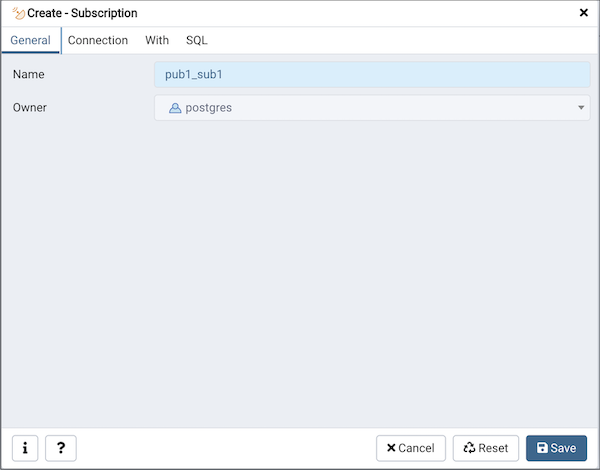
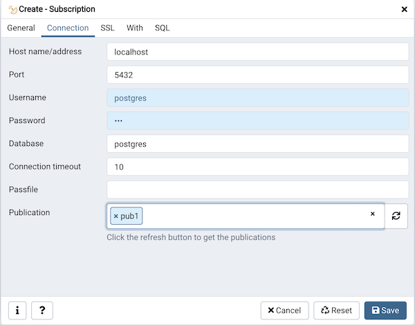
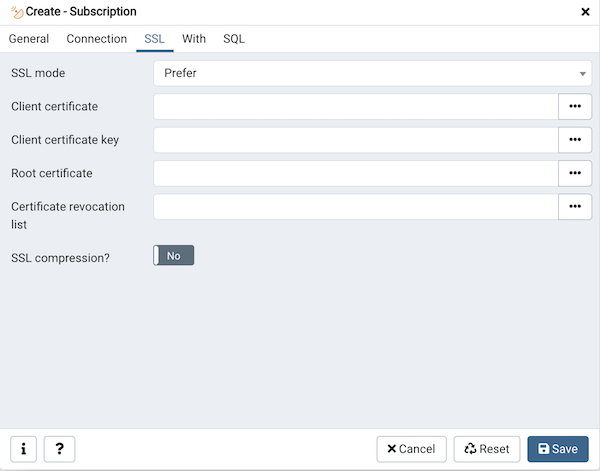
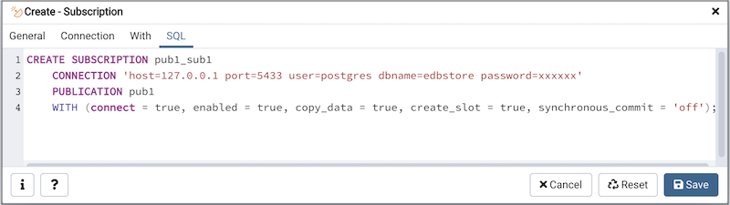

.. subscription_dialog:

****************************
`Subscription Dialog`:index:
****************************

Use the *Subscription* dialog to create a subscription. A subscription defines the connection to another database and set of publications (one or more) to which it wants to subscribe.

The *subscription* dialog organizes the development of a subscription through the following dialog tabs: *General*, *Connection* and *With*. The *SQL* tab displays the SQL code generated by dialog selections.

Use the fields in the *General* tab to identify the subscription:

* Use the *Name* field to add a descriptive name for the subscription. The name will be displayed in the *pgAdmin* tree control.
* The *Owner* field takes the name of the user automatically as current connected user. You can change the owner after creating subscription using alter subscription. Please note that owner of the subscription has superuser privileges.

Click the *Connection* tab to continue.

Use the *Connection* tab to define the connection string to the publisher:

* Use the *Host name/address* field to provide the valid hostname or ip address of the publication.
* Use the *Port* field to provide port number to connect at Postgres Server in which publication is residing.
* Use the *Username* field to provide the name of the user to connect to the publication.
* Use the *Password* to provide the password of the user.
* Use the *Database* field to connect to the database in which publication is residing.
* Use the *Connection timeout* field to specify the maximum wait for connection, in seconds. Zero or not specified means wait indefinetly. It is not recommended to use a timeout of less than 2 seconds.
* Use the *Passfile* field to specify the location of a password file (.pgpass). A .pgpass file allows a user to login without providing a password when they connect.  For more information, see `Section 33.15 of the Postgres documentation <https://www.postgresql.org/docs/current/libpq-pgpass.html>`_.
* Use the *Publication* field to specify the publication name on the publishers to subscribe to. Click on the refresh button at the end to load the names of the existing publications and then select from the list. You can also write the name of the known publication in the field.

Click the *SSL* tab to continue.

Use the fields in the *SSL* tab to configure SSL:

* Use the drop-down list box in the *SSL* field to select the type of SSL
  connection the server should use. For more information about using SSL
  encryption, see
  `Section 33.18 of the Postgres documentation <https://www.postgresql.org/docs/current/libpq-ssl.html>`_.

If pgAdmin is installed in Server mode (the default mode), you can use the
platform-specific File manager dialog to upload files that support SSL
encryption to the server.  To access the File manager dialog, click the
icon that is located to the right of each of the following fields.

* Use the *Client certificate* field to specify the file containing the client
  SSL certificate.  This file will replace the default
  *~/.postgresql/postgresql.crt* if pgAdmin is installed in Desktop mode, and
  *<STORAGE_DIR>/<USERNAME>/.postgresql/postgresql.crt* if pgAdmin is installed
  in Web mode. This parameter is ignored if an SSL connection is not made.
* Use the *Client certificate key* field to specify the file containing the
  secret key used for the client certificate.  This file will replace the
  default *~/.postgresql/postgresql.key* if pgAdmin is installed in Desktop
  mode, and *<STORAGE_DIR>/<USERNAME>/.postgresql/postgresql.key* if pgAdmin
  is installed in Web mode. This parameter is ignored if an SSL connection is
  not made.
* Use the *Root certificate* field to specify the file containing the SSL
  certificate authority.  This file will replace the default
  *~/.postgresql/root.crt*. This parameter is ignored if an SSL connection is
  not made.
* Use the *Certificate revocation list* field to specify the file containing
  the SSL certificate revocation list.  This list will replace the default list,
  found in *~/.postgresql/root.crl*. This parameter is ignored if an SSL
  connection is not made.
* When *SSL compression?* is set to *True*, data sent over SSL connections will
  be compressed.  The default value is *False* (compression is disabled).  This
  parameter is ignored if an SSL connection is not made.

.. warning:: In Server mode, certificates, private keys, and the revocation list
    are stored in the per-user file storage area on the server, which is owned
    by the user account under which the pgAdmin server process is run. This
    means that administrators of the server may be able to access those files;
    appropriate caution should be taken before choosing to use this feature.

Click the *With* tab to continue.

.. image:: images/subscription_with.png
    :alt: Subscription dialog with tab
    :align: center

Use the *With* tab to define some parameters for a subscription:

* The *Copy data?* switch specifies whether the existing data in the publications that are being subscribed to should be copied once the replication starts. By default it is set to *Yes*.
* The *Create slot?* switch specifies whether the command should create the replication slot on the publisher. By default it is set to *Yes*. Please note: if your publisher and subscriber both are inside same PostgreSQL server then is is set to *No* by default.
* The *Enabled?* switch specifies whether the subscription should be actively replicating, or whether it should be just setup but not started yet. By default it is set to *Yes*.
* The *Connect?* specifies whether the CREATE SUBSCRIPTION should connect to the publisher at all. By default, it is set to *Yes*. Setting this to *No* will change default values of enabled, create_slot and copy_data to *No*.
* Use the *Slot Name* field to specify the name of the replication slot to use. By default, it uses the name of the subscription for the slot name.
* Use the *Synchronous commit* field to override the synchronous_commit setting. By default, it is set to *off*. It is safe to use off for logical replication: If the subscriber loses transactions because of missing synchronization, the data will be sent again from the publisher.

Click the *SQL* tab to continue.

Your entries in the *Subscription* dialog generate a SQL command (see an example below). Use the *SQL* tab for review; revisit or switch tabs to make any changes to the SQL command.

**Example**

The following is an example of the sql command generated by user selections in
the *Subscription* dialog:

The example creates a subscription named *sub1* that is owned by *postgres*. It will replicate the data from the publication *pub1*.

* Click the *Info* button (i) to access online help.
* Click the *Save* button to save work.
* Click the *Close* button to exit without saving work.
* Click the *Reset* button to restore all the default settings.
